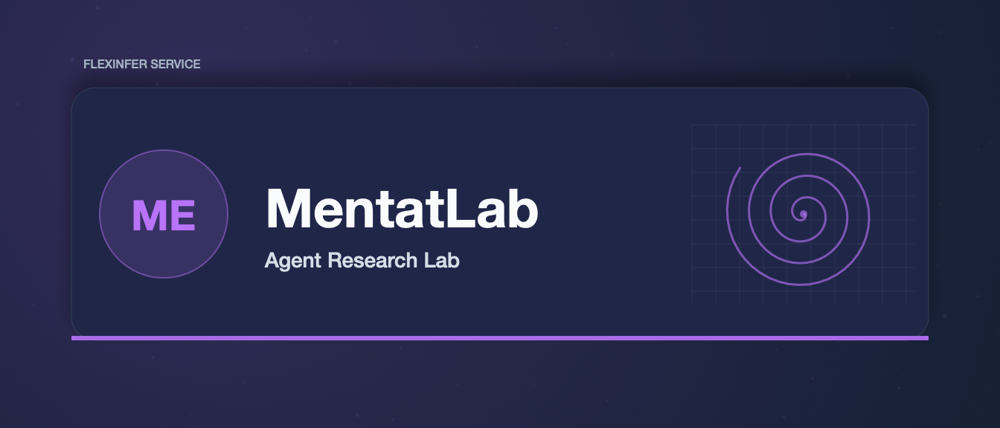

# MentatLab

MentatLab is a research platform for developing and testing advanced AI agents. It provides a mission control interface for monitoring agent activities, a graph-based execution engine, and a set of tools for building complex agent workflows.

## Features

- **Mission Control UI**: Real-time visualization of agent networks, streaming logs, and performance metrics.
- **Graph Engine**: Define and execute complex agent workflows as DAGs.
- **Kubernetes Integration**: Scalable execution of agents as K8s pods.
- **Go Backend**: High-performance services for gateway and orchestration.
- **Cyberpunk Aesthetic**: Immersive, sci-fi inspired interface.

## Architecture

The system consists of the following components:

- **Frontend**: React application with Vite, Tailwind CSS, and React Flow.
- **Gateway**: Go-based service for WebSocket handling and API proxying.
- **Orchestrator**: Go-based service for graph execution and agent management.
- **Redis**: Message broker for real-time events and state storage.

## Getting Started

### Prerequisites

- Docker & Kubernetes (k3s recommended)
- Go 1.23+
- Node.js 18+

### Development

1.  **Start Services**:

    ```bash
    # Start Redis
    docker run -d -p 6379:6379 redis

    # Start Orchestrator
    cd services/orchestrator-go
    go run main.go

    # Start Gateway
    cd services/gateway-go
    go run main.go
    ```

2.  **Start Frontend**:

    ```bash
    cd services/frontend
    npm install
    npm run dev
    ```

3.  **Access UI**:
    Open [http://localhost:5173](http://localhost:5173) in your browser.

## Deployment

Use the provided deployment script to deploy to a Kubernetes cluster:

```bash
./k8s/deploy.sh --namespace mentatlab
```

## Configuration

Environment variables can be used to configure the services:

- `PORT`: Service port (default: 8080/7070)
- `REDIS_URL`: Redis connection string (default: redis:6379)
- `ORCHESTRATOR_BASE_URL`: URL of the orchestrator service (gateway only)

## License

MIT
