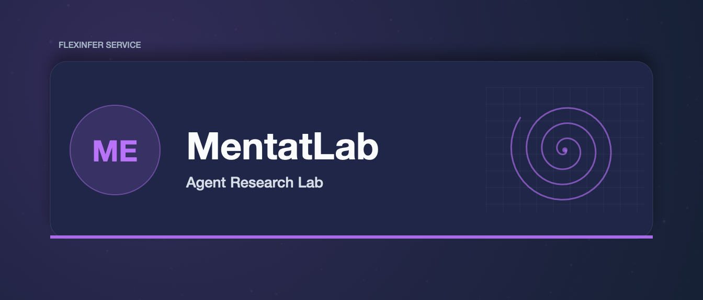

# MentatLab

MentatLab is an AI agent orchestration platform with a Mission Control interface for building, monitoring, and executing agent workflows as DAGs.

## Features

- **Mission Control UI**: Visual canvas for building workflows, real-time event streaming, and performance metrics
- **DAG Engine**: Execute agent workflows with conditionals, forEach loops, and data flow between nodes
- **Kubernetes Integration**: Run agents as K8s pods with job watching, retries, and CronJob support
- **Go Backend**: High-performance gateway and orchestrator services
- **Agent Contract**: Simple stdin/stdout NDJSON protocol for agents in any language

## Architecture

```
Browser → Gateway (Go, :8080) → Orchestrator (Go, :7070) → Agents
               ↓                        ↓
             Redis ←───────────────────┘
```

- **Frontend**: React + ReactFlow canvas, Zustand state, Tailwind CSS (Vite)
- **Gateway**: API proxy + WebSocket hub for real-time events
- **Orchestrator**: DAG scheduler, agent registry, flow store, run management
- **Redis**: Message broker and state storage

## Quick Start

### Docker Compose (recommended)

```bash
docker-compose up
```

Services start at:
- Redis: localhost:6379
- Frontend: http://localhost:5173
- Gateway: http://localhost:8080
- Orchestrator: http://localhost:7070

### Manual Development

```bash
# Terminal 1: Redis
docker run -d --name mentatlab-redis -p 6379:6379 redis:7-alpine

# Terminal 2: Orchestrator
cd services/orchestrator-go && go run ./cmd/orchestrator/

# Terminal 3: Gateway
cd services/gateway-go && go run main.go

# Terminal 4: Frontend
cd services/frontend && npm install && npm run dev
```

Open http://localhost:5173 in your browser.

## Creating Agents

Scaffold a new agent using `mentatctl`:

```bash
cd cli/mentatctl
python main.py agent create --template python --name my-agent
```

Templates available: `python`, `nodejs`, `rust`, `go`

Agents communicate via stdin/stdout NDJSON. See [docs/agent-sdk.md](docs/agent-sdk.md) for the full contract.

## Example Flows

Pre-built flows in `examples/`:

| Flow | Description |
|------|-------------|
| `hello_chat.json` | Prompt → LLM → Console |
| `conditional_routing.json` | Classify input and route to different agents |
| `foreach_batch.json` | Process a collection of items in parallel |
| `data_pipeline.json` | Multi-stage pipeline with parallel enrichment |

## Deployment

GitOps via Flux CD to K3s. Manifests in `k8s/`.

```bash
./k8s/deploy.sh --namespace mentatlab
```

## Configuration

| Variable | Service | Default | Description |
|----------|---------|---------|-------------|
| `PORT` | Both | 8080/7070 | Service port |
| `REDIS_URL` | Both | redis:6379 | Redis connection |
| `ORCHESTRATOR_BASE_URL` | Gateway | http://localhost:7070 | Orchestrator URL |
| `ORCH_RUNSTORE` | Orchestrator | memory | Run storage backend (memory/redis) |
| `TRACING_ENABLED` | Both | false | Enable OpenTelemetry tracing |
| `OTLP_ENDPOINT` | Both | — | OTLP collector endpoint |

## Documentation

- [Agent SDK](docs/agent-sdk.md) — Agent contract, event protocol, SDK reference
- [Architecture](docs/architecture.md) — System design and component overview
- [CI/CD Setup](docs/ci-cd-setup.md) — Pipeline configuration
- [Local Development](docs/local-development-guide.md) — Development environment setup
- [ROADMAP](ROADMAP.md) — Current milestones and progress

## License

MIT
