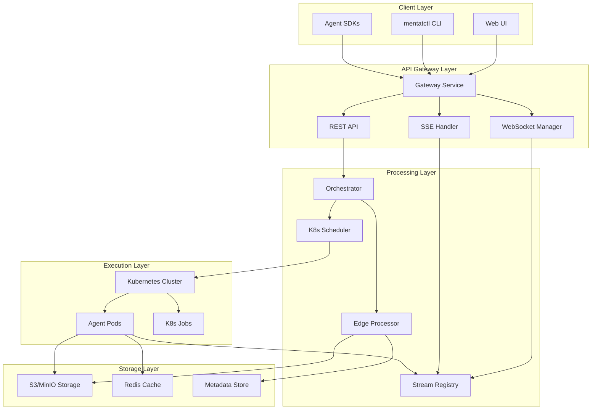
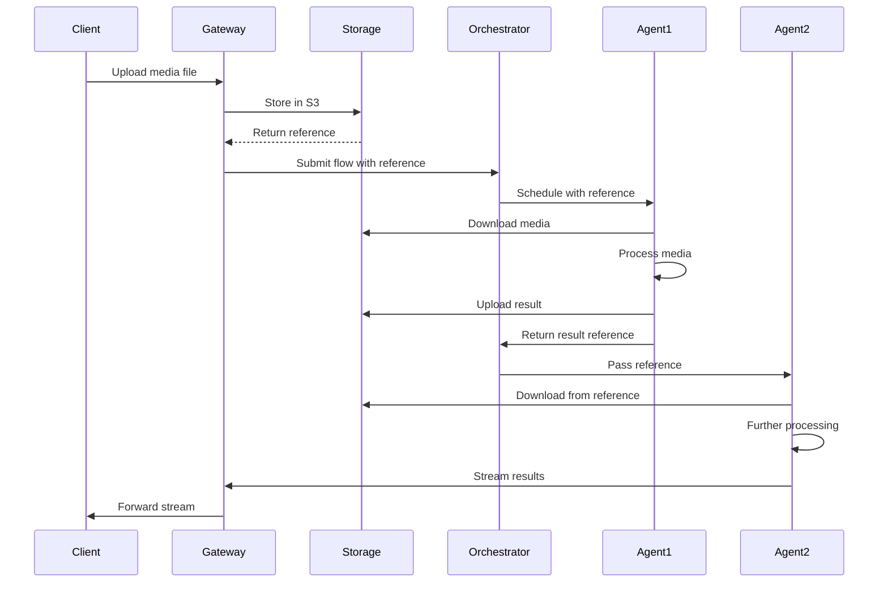
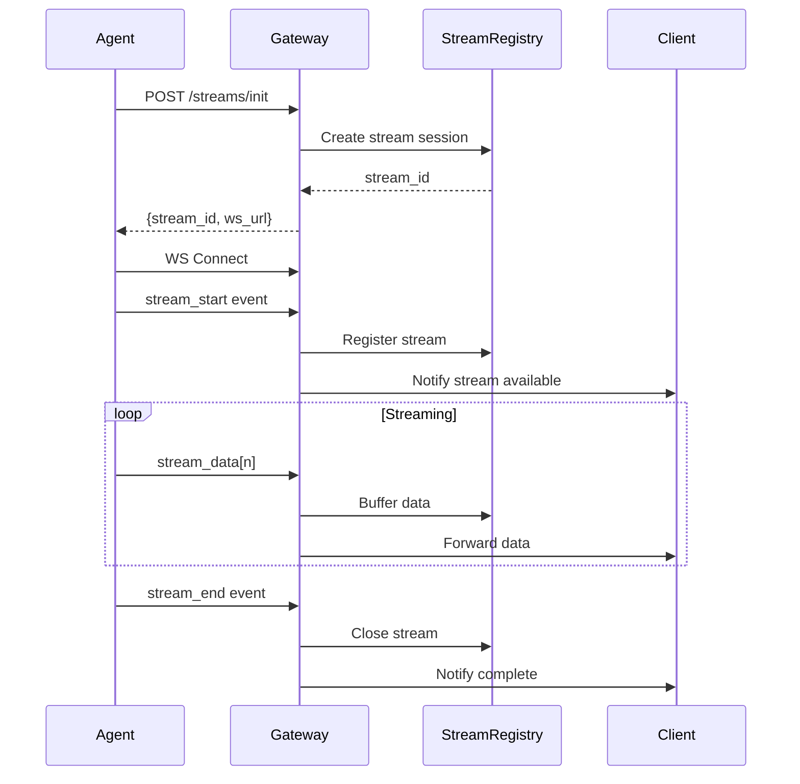

# Beta Milestone Technical Architecture
## Multimodal System Design



## Data Flow Architecture

### Multimodal Data Flow



### Streaming Data Flow



## Component Architecture

### 1. Enhanced Gateway Service

```python
# services/gateway/app/architecture.py
class MultimodalGateway:
    """
    Enhanced gateway with multimodal support
    """
    components = {
        "routers": [
            "router_flows",      # Existing
            "router_agents",     # Existing  
            "router_streaming",  # NEW
            "router_storage"     # NEW
        ],
        "managers": [
            "ConnectionManager",        # Sprint 5
            "StreamingConnectionManager", # NEW
            "StorageManager"            # NEW
        ],
        "middleware": [
            "ValidationMiddleware",  # Sprint 5
            "AuthMiddleware",       # Sprint 5
            "MultimodalMiddleware"  # NEW
        ]
    }
```

### 2. Multimodal Edge Processor

```python
class EdgeProcessorArchitecture:
    """
    Handles data flow between agents
    """
    def __init__(self):
        self.processors = {
            "text": TextProcessor(),      # Existing
            "json": JsonProcessor(),      # Existing
            "binary": BinaryProcessor(),  # Existing
            "image": ImageProcessor(),    # NEW
            "audio": AudioProcessor(),    # NEW
            "video": VideoProcessor(),    # NEW
            "stream": StreamProcessor()   # NEW
        }
    
    async def process(self, edge: Edge, data: Any) -> Any:
        processor = self.processors[edge.source_pin.type]
        return await processor.process(data)
```

### 3. Storage Architecture

```yaml
storage_architecture:
  primary:
    type: "S3-compatible"
    implementation: "MinIO"
    buckets:
      - name: "mentatlab-media"
        lifecycle:
          expiration: "7d"
          transition: "archive after 24h"
      - name: "mentatlab-temp"
        lifecycle:
          expiration: "1h"
  
  cache:
    type: "Redis"
    purpose:
      - "Reference metadata"
      - "Stream buffers"
      - "Temporary data"
    ttl:
      metadata: "1h"
      buffers: "5m"
      temp: "10m"
  
  cdn:
    type: "CloudFront-compatible"
    locations: ["us-east", "us-west", "eu-central"]
    cache_control:
      images: "public, max-age=3600"
      audio: "public, max-age=1800"
      video: "public, max-age=7200"
```

### 4. Resource Management

```python
class ResourceArchitecture:
    """
    Dynamic resource allocation for multimodal workloads
    """
    profiles = {
        "text_processing": {
            "cpu": "500m",
            "memory": "1Gi",
            "ephemeral": "1Gi"
        },
        "image_processing": {
            "cpu": "2000m",
            "memory": "4Gi",
            "ephemeral": "10Gi",
            "gpu": False
        },
        "audio_processing": {
            "cpu": "1000m",
            "memory": "2Gi",
            "ephemeral": "5Gi",
            "gpu": False
        },
        "video_processing": {
            "cpu": "4000m",
            "memory": "8Gi",
            "ephemeral": "50Gi",
            "gpu": True,
            "gpu_type": "nvidia.com/gpu",
            "gpu_count": 1
        }
    }
    
    def calculate_resources(self, agent_type: str, 
                          input_metadata: dict) -> dict:
        base = self.profiles[agent_type].copy()
        
        # Scale based on input size
        if "size" in input_metadata:
            size_gb = input_metadata["size"] / (1024**3)
            if size_gb > 1:
                base["memory"] = f"{int(4 * size_gb)}Gi"
                base["ephemeral"] = f"{int(10 * size_gb)}Gi"
        
        return base
```

## Integration Points

### 1. Sprint 5 K8s Integration

```python
# Extending Sprint 5 K8s scheduler
class MultimodalK8sIntegration:
    def extend_job_spec(self, job_spec: V1JobSpec, 
                       agent_manifest: dict) -> V1JobSpec:
        # Add ephemeral storage volumes
        if self.needs_ephemeral_storage(agent_manifest):
            job_spec = self.add_ephemeral_volume(job_spec)
        
        # Add GPU resources
        if self.needs_gpu(agent_manifest):
            job_spec = self.add_gpu_resources(job_spec)
        
        # Add S3 credentials
        job_spec = self.add_storage_credentials(job_spec)
        
        return job_spec
```

### 2. SDK v1.0 Extensions

```python
# Backward compatible SDK extensions
from mentatlab.sdk import Agent  # Sprint 5 base

class MultimodalAgent(Agent):
    """Extended agent with multimodal support"""
    
    # All existing functionality preserved
    def process(self, inputs: dict) -> dict:
        # Original text processing
        return super().process(inputs)
    
    # New multimodal methods
    async def process_media(self, media_ref: dict) -> Any:
        """Download and process media files"""
        pass
    
    async def stream_output(self, pin: str, 
                          data: AsyncIterator) -> None:
        """Stream data to output pin"""
        pass
```

### 3. Manifest Validation Extensions

```python
# Extending Sprint 5 validation
class MultimodalValidator(ManifestValidator):
    def __init__(self):
        super().__init__()
        self.add_rules([
            MultimodalPinRule(),
            MetadataValidationRule(),
            ResourceProfileRule(),
            StreamingCapabilityRule()
        ])
    
    def validate_multimodal_pin(self, pin: dict) -> bool:
        if pin["type"] in ["audio", "image", "video"]:
            return "metadata" in pin
        return True
```

## Security Architecture

### 1. Content Validation

```python
class SecurityArchitecture:
    def __init__(self):
        self.validators = {
            "mime_type": MimeTypeValidator(),
            "file_size": FileSizeValidator(),
            "content_scan": MalwareScanner(),
            "metadata": MetadataValidator()
        }
    
    async def validate_upload(self, file_data: bytes,
                            declared_type: str) -> bool:
        for validator in self.validators.values():
            if not await validator.validate(file_data, declared_type):
                return False
        return True
```

### 2. Access Control

```yaml
rbac_extensions:
  roles:
    multimodal_producer:
      permissions:
        - storage:upload
        - stream:create
        - agent:execute_multimodal
    
    multimodal_consumer:
      permissions:
        - storage:download
        - stream:subscribe
        - flow:view_results
  
  policies:
    storage_quota:
      per_user: "10GB"
      per_workspace: "100GB"
    
    streaming_limits:
      concurrent_streams: 10
      stream_duration: "1h"
```

## Performance Architecture

### 1. Caching Strategy

```yaml
cache_architecture:
  levels:
    L1_memory:
      type: "In-process cache"
      size: "100MB"
      ttl: "1m"
      
    L2_redis:
      type: "Redis cluster"
      size: "10GB"
      ttl: "1h"
      
    L3_cdn:
      type: "CDN edge cache"
      size: "unlimited"
      ttl: "24h"
  
  strategies:
    media_files:
      - Check L3 CDN first
      - Fallback to S3
      - Cache in L2 for repeat access
    
    metadata:
      - L1 for hot data
      - L2 for warm data
      - Database for cold data
```

### 2. Streaming Optimization

```python
class StreamingOptimization:
    def __init__(self):
        self.buffer_sizes = {
            "audio": 8192,      # 8KB chunks
            "video": 65536,     # 64KB chunks
            "text": 1024        # 1KB chunks
        }
        
        self.compression = {
            "audio": "opus",
            "video": "h264",
            "text": "gzip"
        }
    
    def optimize_stream(self, stream_type: str, 
                       bandwidth: int) -> dict:
        return {
            "buffer_size": self.buffer_sizes[stream_type],
            "compression": self.compression[stream_type],
            "adaptive_bitrate": bandwidth < 1_000_000
        }
```

## Monitoring Architecture

```yaml
monitoring:
  metrics:
    multimodal:
      - upload_size_bytes
      - processing_duration_seconds
      - storage_usage_bytes
      - reference_cache_hit_ratio
    
    streaming:
      - stream_latency_milliseconds
      - active_streams_count
      - stream_bandwidth_bytes
      - stream_error_rate
  
  dashboards:
    - name: "Multimodal Overview"
      panels:
        - "Upload/Download Rates"
        - "Processing Times by Type"
        - "Storage Utilization"
        - "Active Agents by Type"
    
    - name: "Streaming Performance"
      panels:
        - "Stream Latency Distribution"
        - "Active Streams"
        - "Bandwidth Usage"
        - "Error Rates"
  
  alerts:
    - name: "High Storage Usage"
      condition: "storage_usage > 80%"
      severity: "warning"
    
    - name: "Streaming Latency"
      condition: "p99_latency > 200ms"
      severity: "critical"
```

---

**Document Version:** 1.0  
**Created:** August 2, 2025  
**Architecture Review:** Required before Phase 1 completion