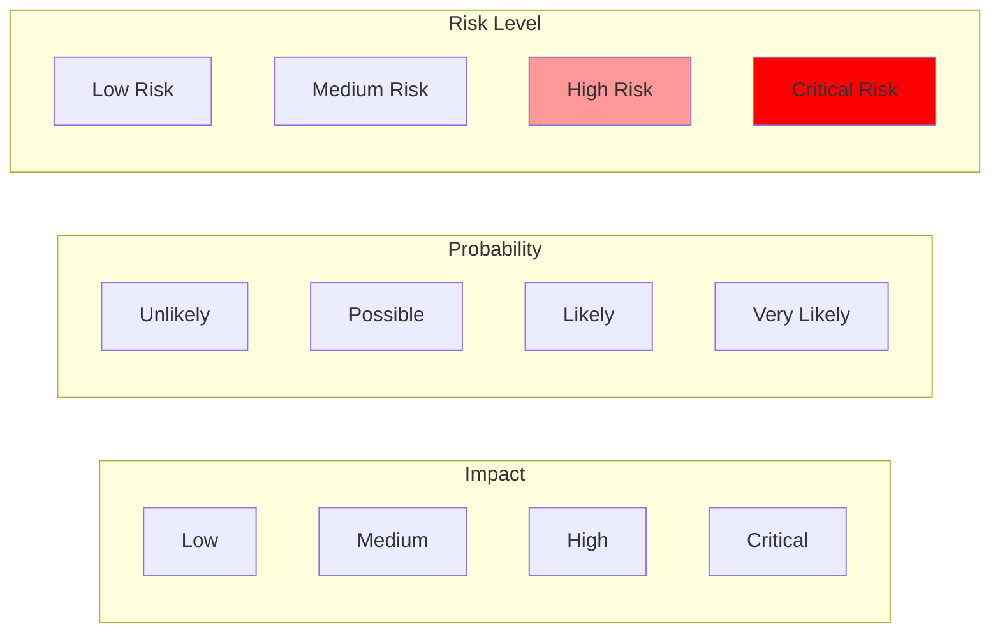
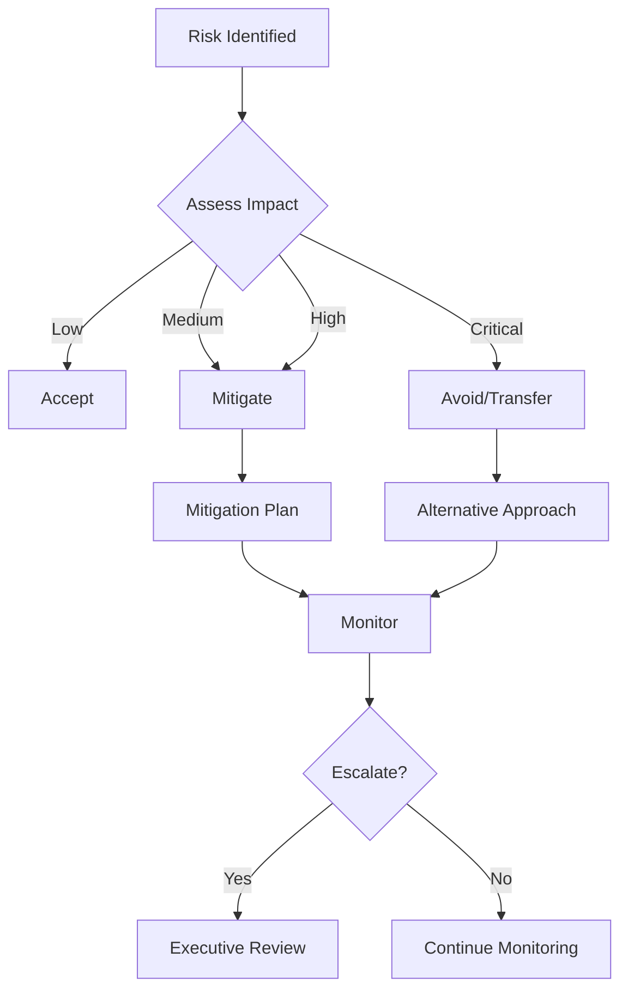
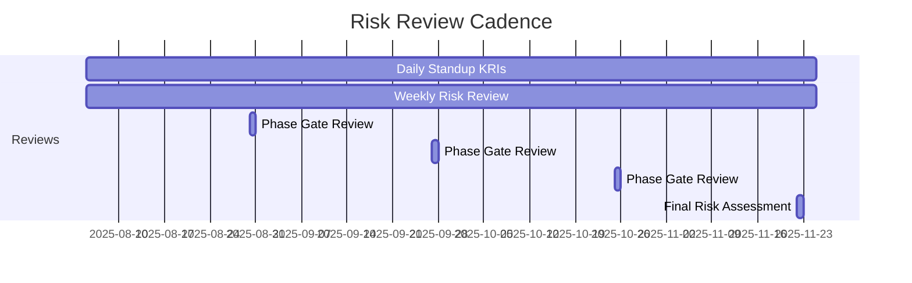

# Beta Milestone Risk Assessment & Mitigation Plan

## Risk Matrix Overview



## Critical Technical Risks

### 1. Storage System Performance

**Risk ID:** BETA-R001  
**Category:** Infrastructure  
**Probability:** Likely  
**Impact:** Critical  
**Risk Score:** 12/16 (High)

**Description:**  
S3-compatible storage may not meet latency requirements for real-time multimodal processing, especially for video streams exceeding 100MB.

**Indicators:**
- Upload/download times > 5 seconds for large files
- Storage API timeout errors
- Queue buildup in edge processor

**Mitigation Strategy:**
```yaml
primary_mitigation:
  - Deploy MinIO clusters in each availability zone
  - Implement multi-tier caching with Redis
  - Use CDN for frequently accessed content
  - Pre-warm cache for predictable workloads

fallback_options:
  - Direct file transfer for urgent processing
  - Temporary local storage on agent pods
  - Batch processing mode for large files
  - Reduced quality options for real-time needs
```

**Contingency Plan:**
1. Activate local storage mode (24h retention)
2. Notify users of degraded performance
3. Queue non-critical processing
4. Scale storage infrastructure

### 2. Streaming Scalability Limits

**Risk ID:** BETA-R002  
**Category:** Performance  
**Probability:** Possible  
**Impact:** High  
**Risk Score:** 9/16 (High)

**Description:**  
WebSocket infrastructure may not scale to 1000+ concurrent streams without significant latency degradation.

**Technical Details:**
```python
# Risk threshold calculation
risk_factors = {
    "concurrent_connections": 1000,
    "data_rate_per_stream": "1Mbps",
    "total_bandwidth": "1Gbps",
    "cpu_per_connection": "10m",
    "memory_per_connection": "50Mi"
}

infrastructure_limits = {
    "gateway_instances": 10,
    "max_connections_per_instance": 200,
    "total_capacity": 2000  # With headroom
}
```

**Mitigation Strategy:**
- Horizontal scaling with load balancer
- Connection pooling and multiplexing
- Adaptive bitrate streaming
- Regional edge servers

### 3. GPU Resource Contention

**Risk ID:** BETA-R003  
**Category:** Resources  
**Probability:** Likely  
**Impact:** Medium  
**Risk Score:** 8/16 (Medium)

**Description:**  
Limited GPU resources may create bottlenecks for video processing agents.

**Mitigation Strategy:**
```yaml
gpu_management:
  scheduling:
    - Priority queues for GPU jobs
    - Time-slicing for non-critical tasks
    - Preemption for high-priority work
  
  alternatives:
    - CPU-optimized models for fallback
    - Cloud GPU bursting capability
    - Batch processing during off-peak
  
  monitoring:
    - GPU utilization metrics
    - Queue depth alerts
    - Performance degradation tracking
```

## Operational Risks

### 4. Backward Compatibility Breaking

**Risk ID:** BETA-R004  
**Category:** Integration  
**Probability:** Possible  
**Impact:** Critical  
**Risk Score:** 10/16 (High)

**Description:**  
Schema changes or API modifications could break existing text-based agents.

**Prevention Measures:**
```python
# Compatibility testing framework
class CompatibilityValidator:
    def validate_schema_changes(self, old_schema, new_schema):
        # Ensure all old fields still exist
        # Verify type compatibility
        # Check default values
        
    def test_api_compatibility(self):
        # Run all v1.0 API tests
        # Verify response formats
        # Check error handling
```

**Mitigation Strategy:**
- Versioned APIs with deprecation notices
- Compatibility shim layers
- Extensive regression testing
- Gradual rollout with feature flags

### 5. Development Timeline Slippage

**Risk ID:** BETA-R005  
**Category:** Project  
**Probability:** Likely  
**Impact:** Medium  
**Risk Score:** 8/16 (Medium)

**Description:**  
Complex integration requirements may cause schedule delays.

**Early Warning Signs:**
- Sprint velocity below 80% of planned
- Increasing technical debt
- Blocked dependencies
- Resource conflicts

**Mitigation Strategy:**
```yaml
schedule_buffers:
  phase_1: "+1 week buffer"
  phase_2: "+1 week buffer"
  phase_3: "+2 weeks buffer"
  phase_4: "+1 week buffer"

acceleration_options:
  - Reduce initial agent examples
  - Defer optimization features
  - Parallel development tracks
  - Additional contractor resources
```

## Security Risks

### 6. Malicious File Upload

**Risk ID:** BETA-R006  
**Category:** Security  
**Probability:** Possible  
**Impact:** High  
**Risk Score:** 9/16 (High)

**Description:**  
Multimodal uploads could contain malware or exploits.

**Security Controls:**
```python
class FileSecurityScanner:
    def __init__(self):
        self.scanners = [
            AntivirusScanner(),
            MimeTypeValidator(),
            FileSizeValidator(),
            ContentAnalyzer()
        ]
    
    async def scan_file(self, file_data: bytes) -> ScanResult:
        for scanner in self.scanners:
            result = await scanner.scan(file_data)
            if not result.is_safe:
                return result
        return ScanResult(is_safe=True)
```

### 7. Storage Access Control

**Risk ID:** BETA-R007  
**Category:** Security  
**Probability:** Unlikely  
**Impact:** Critical  
**Risk Score:** 8/16 (Medium)

**Description:**  
Improper access controls could expose sensitive media files.

**Mitigation Strategy:**
- Signed URLs with expiration
- Workspace-level isolation
- Encryption at rest and in transit
- Access audit logging

## Business Risks

### 8. Infrastructure Cost Overrun

**Risk ID:** BETA-R008  
**Category:** Financial  
**Probability:** Possible  
**Impact:** Medium  
**Risk Score:** 6/16 (Medium)

**Cost Projections:**
```yaml
infrastructure_costs:
  storage:
    baseline: "$5,000/month"
    risk_factor: "3x with heavy video usage"
    
  bandwidth:
    baseline: "$3,000/month"
    risk_factor: "5x with streaming spike"
    
  compute:
    baseline: "$10,000/month"
    risk_factor: "2x with GPU instances"

mitigation:
  - Usage quotas per workspace
  - Tiered storage with lifecycle policies
  - Bandwidth optimization
  - Reserved instance pricing
```

## Risk Response Planning

### Response Strategies



### Escalation Matrix

| Risk Level | Initial Response | Escalation Time | Decision Authority |
|------------|-----------------|-----------------|-------------------|
| Low | Team Lead | 1 week | Tech Lead |
| Medium | Tech Lead | 3 days | Engineering Manager |
| High | Engineering Manager | 1 day | Director of Engineering |
| Critical | Director | Immediate | VP Engineering + Product |

## Monitoring & Early Warning System

### Key Risk Indicators (KRIs)

```yaml
technical_kris:
  storage_latency:
    green: "< 100ms"
    yellow: "100-500ms"
    red: "> 500ms"
    
  stream_success_rate:
    green: "> 99.9%"
    yellow: "99-99.9%"
    red: "< 99%"
    
  gpu_utilization:
    green: "< 70%"
    yellow: "70-90%"
    red: "> 90%"

operational_kris:
  sprint_velocity:
    green: "> 90%"
    yellow: "70-90%"
    red: "< 70%"
    
  regression_test_pass_rate:
    green: "100%"
    yellow: "95-99%"
    red: "< 95%"
```

### Risk Review Schedule



## Contingency Budget

```yaml
contingency_allocation:
  infrastructure:
    amount: "$50,000"
    triggers:
      - "Storage costs exceed 2x baseline"
      - "Emergency GPU scaling needed"
      
  development:
    amount: "4 contractor weeks"
    triggers:
      - "Critical path delay > 1 week"
      - "Security issue requiring immediate fix"
      
  timeline:
    amount: "2 weeks"
    triggers:
      - "Multiple high risks materialize"
      - "External dependency delays"
```

## Risk Communication Plan

### Stakeholder Communication

```yaml
communication_matrix:
  daily:
    audience: "Development Team"
    format: "KRI Dashboard"
    
  weekly:
    audience: "Engineering Management"
    format: "Risk Status Report"
    
  bi_weekly:
    audience: "Product & Executive"
    format: "Risk Summary with Mitigation Progress"
    
  on_demand:
    audience: "All Stakeholders"
    trigger: "Critical risk materialization"
    format: "Incident Report with Action Plan"
```

---

**Document Version:** 1.0  
**Created:** August 2, 2025  
**Risk Owner:** Director of Engineering  
**Next Review:** Week 2 of Implementation  
**Approval Required:** VP Engineering, VP Product