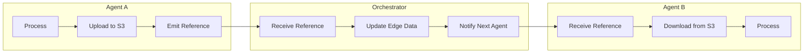
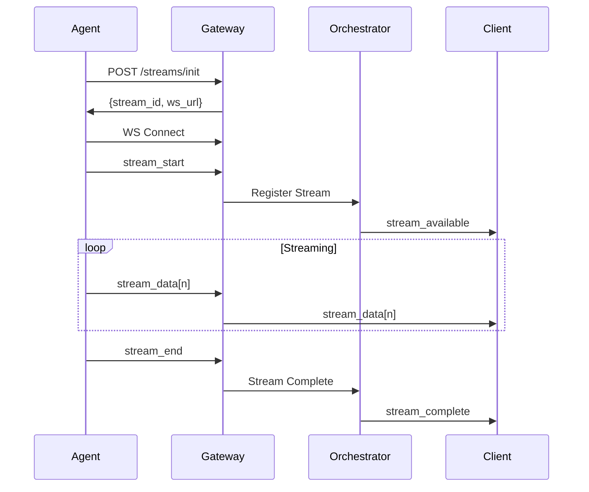

# MentatLab Beta Milestone Technical Specification
## Multimodal Support & Streaming Inference API

*Version: 1.0*  
*Date: August 1, 2025*  
*Timeline: Q3-Q4 2025*

---

## Executive Summary

This specification outlines the technical implementation for MentatLab's Beta milestone, focusing on two major features:
1. **Multimodal Support**: Extending the platform to handle audio (WAV), image (JPEG/PNG), and video streams
2. **Streaming Inference API**: Real-time data streaming between agents using WebSocket/SSE protocols

Building upon Sprint 5's foundation (K8s scheduling, manifest validation, SDK v1.0), this milestone will transform MentatLab from a text-only platform to a comprehensive multimodal AI orchestration system.

---

## 1. Multimodal Data Type Extensions

### 1.1 Pin Type Schema Extensions

Extend the current pin types in `schemas/agent.schema.json`:

```json
{
  "definitions": {
    "pin": {
      "type": "object",
      "required": ["name", "type"],
      "properties": {
        "name": {"type": "string"},
        "type": {
          "type": "string",
          "enum": [
            "string",
            "number", 
            "boolean",
            "json",
            "binary",
            "audio",      // NEW
            "image",      // NEW
            "video",      // NEW
            "stream"      // NEW
          ]
        },
        "metadata": {   // NEW
          "type": "object",
          "properties": {
            "mimeType": {"type": "string"},
            "encoding": {"type": "string"},
            "sampleRate": {"type": "integer"},
            "channels": {"type": "integer"},
            "width": {"type": "integer"},
            "height": {"type": "integer"},
            "fps": {"type": "number"},
            "duration": {"type": "number"}
          }
        }
      }
    }
  }
}
```

### 1.2 Data Storage Strategy

#### 1.2.1 Object Storage Integration
- **Primary Storage**: MinIO/S3-compatible object storage for multimedia files
- **Naming Convention**: `{workspace_id}/{flow_id}/{execution_id}/{node_id}/{pin_name}_{timestamp}.{ext}`
- **Metadata Storage**: Redis for quick access to file metadata and URLs

#### 1.2.2 Data Flow Architecture


#### 1.2.3 Reference Format
```json
{
  "type": "image",
  "ref": {
    "url": "s3://mentatlab-media/workspace123/flow456/exec789/node1/output_1234567890.jpg",
    "size": 2048576,
    "metadata": {
      "mimeType": "image/jpeg",
      "width": 1920,
      "height": 1080
    }
  }
}
```

---

## 2. Streaming Inference API Design

### 2.1 WebSocket Protocol Extensions

#### 2.1.1 Enhanced Message Types
```typescript
interface StreamMessage {
  event_type: 'stream_start' | 'stream_data' | 'stream_end' | 'stream_error';
  stream_id: string;
  node_id: string;
  pin_name: string;
  sequence: number;
  payload: {
    data?: any;
    metadata?: StreamMetadata;
    error?: ErrorInfo;
  };
  timestamp: string;
}

interface StreamMetadata {
  total_chunks?: number;
  chunk_index?: number;
  mime_type?: string;
  encoding?: string;
  compression?: string;
}
```

#### 2.1.2 Stream Lifecycle


### 2.2 Server-Sent Events (SSE) Support

For unidirectional streaming (agent → client):

```http
GET /api/v1/streams/{stream_id}
Accept: text/event-stream

HTTP/1.1 200 OK
Content-Type: text/event-stream
Cache-Control: no-cache
Connection: keep-alive

event: stream_start
data: {"stream_id": "abc123", "node_id": "llm1", "metadata": {...}}

event: stream_data
data: {"chunk": "Hello, ", "index": 0}

event: stream_data
data: {"chunk": "world!", "index": 1}

event: stream_end
data: {"total_chunks": 2, "duration": 1.5}
```

### 2.3 Gateway WebSocket Manager Enhancement

```python
# services/gateway/app/websockets.py enhancement
class StreamingConnectionManager(ConnectionManager):
    def __init__(self):
        super().__init__()
        self.stream_sessions: Dict[str, StreamSession] = {}
        self.stream_subscriptions: Dict[str, List[WebSocket]] = {}
    
    async def register_stream(self, stream_id: str, node_id: str, 
                            agent_connection: WebSocket):
        """Register a new streaming session"""
        session = StreamSession(
            stream_id=stream_id,
            node_id=node_id,
            agent_connection=agent_connection,
            created_at=datetime.utcnow()
        )
        self.stream_sessions[stream_id] = session
        
    async def subscribe_to_stream(self, stream_id: str, 
                                client_connection: WebSocket):
        """Subscribe a client to a stream"""
        if stream_id not in self.stream_subscriptions:
            self.stream_subscriptions[stream_id] = []
        self.stream_subscriptions[stream_id].append(client_connection)
        
    async def forward_stream_data(self, stream_id: str, data: dict):
        """Forward stream data to all subscribers"""
        if stream_id in self.stream_subscriptions:
            for client in self.stream_subscriptions[stream_id]:
                await self.send_to_client(client, data)
```

---

## 3. Container Resource Requirements

### 3.1 Resource Profiles

```yaml
# manifest.yaml extensions
resources:
  profiles:
    - name: "image_processing"
      cpu: "2"
      memory: "4Gi"
      gpu: false
      ephemeralStorage: "10Gi"
    
    - name: "video_processing"
      cpu: "4"
      memory: "8Gi"
      gpu: true
      gpuType: "nvidia.com/gpu"
      gpuCount: 1
      ephemeralStorage: "50Gi"
    
    - name: "audio_processing"
      cpu: "1"
      memory: "2Gi"
      gpu: false
      ephemeralStorage: "5Gi"
```

### 3.2 Dynamic Resource Allocation

```python
class ResourceCalculator:
    """Calculate resources based on input characteristics"""
    
    def calculate_video_resources(self, metadata: VideoMetadata) -> ResourceProfile:
        base_memory = 2 * 1024 * 1024 * 1024  # 2GB base
        
        # Scale by resolution and duration
        pixel_count = metadata.width * metadata.height
        memory_multiplier = pixel_count / (1920 * 1080)  # HD baseline
        duration_multiplier = metadata.duration / 60  # per minute
        
        required_memory = int(base_memory * memory_multiplier * duration_multiplier)
        
        # GPU needed for 4K+ or 60+ fps
        needs_gpu = pixel_count > 3840 * 2160 or metadata.fps > 60
        
        return ResourceProfile(
            memory=f"{required_memory // (1024**3)}Gi",
            gpu=needs_gpu,
            ephemeralStorage=f"{required_memory * 3 // (1024**3)}Gi"
        )
```

---

## 4. Multimodal Agent Examples

### 4.1 Image Processing Agent

```yaml
# agents/image-classifier/manifest.yaml
id: mentatlab.image-classifier
version: 0.1.0
image: harbor.lan/agents/image-classifier:0.1.0
runtime: python3.11
description: "Classify images using Vision Transformer models"
inputs:
  - name: image
    type: image
    metadata:
      mimeType: "image/jpeg,image/png"
      maxSize: "10MB"
outputs:
  - name: classification
    type: json
  - name: confidence
    type: number
longRunning: false
resources:
  profiles: ["image_processing"]
```

### 4.2 Audio Transcription Agent

```yaml
# agents/audio-transcriber/manifest.yaml
id: mentatlab.audio-transcriber
version: 0.1.0
image: harbor.lan/agents/audio-transcriber:0.1.0
runtime: python3.11
description: "Transcribe audio using Whisper models"
inputs:
  - name: audio
    type: audio
    metadata:
      mimeType: "audio/wav,audio/mp3"
      maxDuration: 300  # 5 minutes
  - name: language
    type: string
outputs:
  - name: transcript
    type: stream  # Streaming output
  - name: segments
    type: json
longRunning: true  # For streaming support
resources:
  profiles: ["audio_processing"]
```

### 4.3 Video Analysis Agent

```yaml
# agents/video-analyzer/manifest.yaml
id: mentatlab.video-analyzer
version: 0.1.0
image: harbor.lan/agents/video-analyzer:0.1.0
runtime: python3.11
description: "Analyze video content frame by frame"
inputs:
  - name: video
    type: video
    metadata:
      mimeType: "video/mp4"
      maxDuration: 600  # 10 minutes
  - name: analysis_type
    type: string
    enum: ["object_detection", "scene_classification", "activity_recognition"]
outputs:
  - name: analysis_stream
    type: stream
  - name: summary
    type: json
longRunning: true
resources:
  profiles: ["video_processing"]
```

---

## 5. Integration with Existing Systems

### 5.1 Pin System Extensions

```python
# services/gateway/app/models.py additions
class MultimodalPin(Pin):
    metadata: Optional[Dict[str, Any]] = None
    storage_ref: Optional[str] = None
    
    def validate_multimodal(self):
        """Validate multimodal-specific constraints"""
        if self.type in ["audio", "image", "video"]:
            if not self.metadata:
                raise ValueError(f"Metadata required for {self.type} pin")
            
            required_fields = {
                "audio": ["mimeType", "sampleRate"],
                "image": ["mimeType", "width", "height"],
                "video": ["mimeType", "width", "height", "fps"]
            }
            
            for field in required_fields.get(self.type, []):
                if field not in self.metadata:
                    raise ValueError(f"Missing required metadata field: {field}")
```

### 5.2 Edge Data Flow Enhancements

```python
# services/orchestrator/app/edge_processor.py
class MultimodalEdgeProcessor:
    def __init__(self, storage_client):
        self.storage = storage_client
        
    async def process_edge_data(self, edge: Edge, data: Any) -> Any:
        """Process edge data, handling multimodal references"""
        source_pin_type = self.get_pin_type(edge.from_node)
        
        if source_pin_type in ["audio", "image", "video"]:
            # Data should be a reference, not raw bytes
            if isinstance(data, dict) and "ref" in data:
                return await self.validate_and_forward_reference(data)
            else:
                # Upload raw data and create reference
                return await self.upload_and_create_reference(data, source_pin_type)
        
        # Handle streaming data
        elif source_pin_type == "stream":
            return await self.setup_stream_forwarding(edge, data)
        
        # Traditional data types
        return data
```

---

## 6. Performance Optimization

### 6.1 Caching Strategy

```yaml
# Redis cache structure
cache:
  multimedia:
    metadata: "mm:meta:{file_hash}"  # TTL: 1 hour
    thumbnails: "mm:thumb:{file_hash}"  # TTL: 24 hours
    processed: "mm:proc:{agent_id}:{input_hash}"  # TTL: 1 hour
  
  streams:
    buffers: "stream:buf:{stream_id}"  # TTL: 5 minutes
    metadata: "stream:meta:{stream_id}"  # TTL: 1 hour
```

### 6.2 Network Optimization

```python
class MultimodalNetworkOptimizer:
    def __init__(self):
        self.compression_thresholds = {
            "image": 1024 * 1024,  # 1MB
            "audio": 5 * 1024 * 1024,  # 5MB
            "video": 10 * 1024 * 1024  # 10MB
        }
    
    def optimize_transfer(self, data_type: str, size: int) -> TransferStrategy:
        if size > self.compression_thresholds.get(data_type, float('inf')):
            return TransferStrategy.CHUNKED_COMPRESSED
        elif size > 100 * 1024 * 1024:  # 100MB
            return TransferStrategy.MULTIPART_UPLOAD
        else:
            return TransferStrategy.DIRECT
```

---

## 7. Testing Strategy

### 7.1 Unit Tests

```python
# tests/test_multimodal_pins.py
class TestMultimodalPins:
    def test_image_pin_validation(self):
        pin = MultimodalPin(
            name="input_image",
            type="image",
            metadata={
                "mimeType": "image/jpeg",
                "width": 1920,
                "height": 1080
            }
        )
        assert pin.validate_multimodal() is None
    
    def test_streaming_pin_lifecycle(self):
        pin = StreamingPin(name="output", type="stream")
        stream_id = pin.init_stream()
        assert stream_id is not None
        
        # Test chunk sending
        for i in range(10):
            pin.send_chunk(f"chunk_{i}")
        
        pin.end_stream()
        assert pin.is_complete()
```

### 7.2 Integration Tests

```yaml
# tests/flows/multimodal_test.mlab
apiVersion: v1beta1
kind: Flow
meta:
  id: test.multimodal-integration
  name: "Multimodal Integration Test"
graph:
  nodes:
    - id: image_input
      type: test.image-generator
      outputs:
        image: "test_pattern.jpg"
    
    - id: classifier
      type: mentatlab.image-classifier
    
    - id: transcriber
      type: mentatlab.audio-transcriber
      params:
        streaming: true
    
    - id: console
      type: ui.stream-console
  
  edges:
    - from: image_input.image
      to: classifier.image
    - from: audio_input.audio
      to: transcriber.audio
    - from: transcriber.transcript
      to: console.stream
```

### 7.3 Performance Benchmarks

```python
# benchmarks/multimodal_performance.py
class MultimodalBenchmarks:
    benchmarks = {
        "image_processing": {
            "small": {"size": "640x480", "target_ms": 100},
            "medium": {"size": "1920x1080", "target_ms": 500},
            "large": {"size": "4096x2160", "target_ms": 2000}
        },
        "audio_streaming": {
            "latency": {"target_ms": 50},
            "throughput": {"target_mbps": 10}
        },
        "video_analysis": {
            "fps": {"target": 30},
            "latency": {"target_ms": 100}
        }
    }
```

---

## 8. Migration Path

### 8.1 Backward Compatibility

- All existing text-based agents continue to work unchanged
- New multimodal types are opt-in via manifest declaration
- Gradual migration path for existing agents to add multimodal support

### 8.2 Feature Flags

```python
# services/gateway/app/config.py
FEATURE_FLAGS = {
    "multimodal_support": {
        "enabled": os.getenv("ENABLE_MULTIMODAL", "false").lower() == "true",
        "allowed_types": ["audio", "image", "video", "stream"],
        "max_file_size": 100 * 1024 * 1024  # 100MB
    },
    "streaming_api": {
        "enabled": os.getenv("ENABLE_STREAMING", "false").lower() == "true",
        "protocols": ["websocket", "sse"],
        "max_concurrent_streams": 1000
    }
}
```

---

## 9. Security Considerations

### 9.1 Content Validation

```python
class MultimodalSecurityValidator:
    def __init__(self):
        self.mime_whitelist = {
            "image": ["image/jpeg", "image/png", "image/webp"],
            "audio": ["audio/wav", "audio/mp3", "audio/ogg"],
            "video": ["video/mp4", "video/webm"]
        }
        
    async def validate_upload(self, file_data: bytes, 
                            declared_type: str, 
                            declared_mime: str) -> bool:
        # Verify MIME type matches content
        detected_mime = magic.from_buffer(file_data, mime=True)
        if detected_mime != declared_mime:
            raise SecurityError("MIME type mismatch")
        
        # Check against whitelist
        if declared_mime not in self.mime_whitelist.get(declared_type, []):
            raise SecurityError("Unsupported MIME type")
        
        # Scan for malicious content
        return await self.scan_content(file_data)
```

### 9.2 Access Control

```yaml
# RBAC extensions for multimodal
roles:
  multimodal_producer:
    permissions:
      - upload:image
      - upload:audio
      - upload:video
      - create:stream
  
  multimodal_consumer:
    permissions:
      - read:image
      - read:audio
      - read:video
      - subscribe:stream
```

---

## 10. Monitoring and Observability

### 10.1 Metrics

```python
# Prometheus metrics
multimodal_upload_size_bytes = Histogram(
    'mentatlab_multimodal_upload_size_bytes',
    'Size of uploaded multimodal files',
    ['type', 'agent_id']
)

streaming_latency_ms = Histogram(
    'mentatlab_streaming_latency_milliseconds',
    'Latency of streaming data chunks',
    ['stream_id', 'node_id']
)

multimodal_processing_duration_seconds = Histogram(
    'mentatlab_multimodal_processing_seconds',
    'Time to process multimodal inputs',
    ['type', 'agent_id', 'operation']
)
```

### 10.2 Logging

```python
# Structured logging for multimodal operations
logger.info("multimodal_upload", {
    "event": "upload_complete",
    "type": "image",
    "size_bytes": 2048576,
    "mime_type": "image/jpeg",
    "storage_path": "s3://...",
    "upload_duration_ms": 150,
    "agent_id": "image-classifier",
    "flow_id": "demo-flow-123"
})
```

---

## 11. Documentation Updates

### 11.1 Agent Development Guide

- New section: "Building Multimodal Agents"
- Code examples for each media type
- Best practices for resource management
- Streaming API integration guide

### 11.2 API Documentation

- OpenAPI spec updates for multimodal endpoints
- WebSocket protocol documentation
- SSE endpoint specifications
- Example client implementations

---

## 12. Rollout Plan

### Phase 1: Foundation (Month 1)
- Implement schema extensions
- Set up object storage integration
- Basic multimodal pin support

### Phase 2: Streaming (Month 2)
- WebSocket protocol enhancements
- SSE endpoint implementation
- Stream management in orchestrator

### Phase 3: Agents (Month 3)
- Example multimodal agents
- Resource profile implementation
- Performance optimization

### Phase 4: Production (Month 4)
- Integration testing
- Performance benchmarking
- Documentation completion
- GA release

---

## 13. Success Metrics

### Technical Metrics
- **Latency**: < 100ms for stream initiation
- **Throughput**: > 100 Mbps for multimedia transfers
- **Reliability**: 99.9% uptime for streaming endpoints
- **Scalability**: Support 1000+ concurrent streams

### Business Metrics
- **Adoption**: 50+ multimodal agents created
- **Usage**: 10k+ multimodal flows executed/day
- **Performance**: 90% of operations within SLA

---

## Appendix A: Example Flow

```yaml
# examples/multimodal-demo.mlab
apiVersion: v1beta1
kind: Flow
meta:
  id: demo.multimodal-showcase
  name: "Multimodal AI Pipeline"
  description: "Process image, audio, and video with streaming output"
graph:
  nodes:
    - id: image_upload
      type: ui.file-upload
      params:
        accept: "image/*"
        maxSize: "10MB"
    
    - id: image_analyzer
      type: mentatlab.image-classifier
    
    - id: audio_input
      type: ui.audio-recorder
      params:
        maxDuration: 60
    
    - id: transcriber
      type: mentatlab.audio-transcriber
      params:
        streaming: true
        language: "auto"
    
    - id: video_upload
      type: ui.file-upload
      params:
        accept: "video/*"
        maxSize: "100MB"
    
    - id: video_processor
      type: mentatlab.video-analyzer
      params:
        analysis_type: "object_detection"
    
    - id: results_aggregator
      type: mentatlab.multimodal-aggregator
    
    - id: stream_display
      type: ui.stream-viewer
  
  edges:
    - from: image_upload.file
      to: image_analyzer.image
    
    - from: audio_input.audio
      to: transcriber.audio
    
    - from: video_upload.file
      to: video_processor.video
    
    - from: image_analyzer.classification
      to: results_aggregator.image_results
    
    - from: transcriber.transcript
      to: results_aggregator.audio_stream
    
    - from: video_processor.analysis_stream
      to: results_aggregator.video_stream
    
    - from: results_aggregator.combined_stream
      to: stream_display.input
```

---

## Appendix B: Reference Implementation

```python
# services/agents/multimodal-base/app/base.py
from abc import ABC, abstractmethod
import asyncio
from typing import AsyncIterator, Optional
import aiofiles
import httpx

class MultimodalAgent(ABC):
    """Base class for multimodal agents"""
    
    def __init__(self):
        self.storage_client = self._init_storage()
        self.stream_client = self._init_streaming()
    
    async def download_media(self, reference: dict) -> bytes:
        """Download media from storage reference"""
        url = reference["ref"]["url"]
        async with httpx.AsyncClient() as client:
            response = await client.get(url)
            return response.content
    
    async def upload_result(self, data: bytes, 
                          media_type: str,
                          metadata: dict) -> dict:
        """Upload result and return reference"""
        key = self._generate_storage_key(media_type)
        await self.storage_client.upload(key, data)
        
        return {
            "type": media_type,
            "ref": {
                "url": f"s3://{key}",
                "size": len(data),
                "metadata": metadata
            }
        }
    
    async def stream_output(self, 
                          stream_id: str,
                          data_iterator: AsyncIterator[str]):
        """Stream output data"""
        await self.stream_client.start_stream(stream_id)
        
        try:
            async for chunk in data_iterator:
                await self.stream_client.send_chunk(stream_id, chunk)
        finally:
            await self.stream_client.end_stream(stream_id)
    
    @abstractmethod
    async def process(self, inputs: dict) -> dict:
        """Process multimodal inputs"""
        pass
```

---

This comprehensive specification provides a complete roadmap for implementing multimodal support and streaming APIs in MentatLab, ensuring backward compatibility while enabling powerful new capabilities for AI agent orchestration.