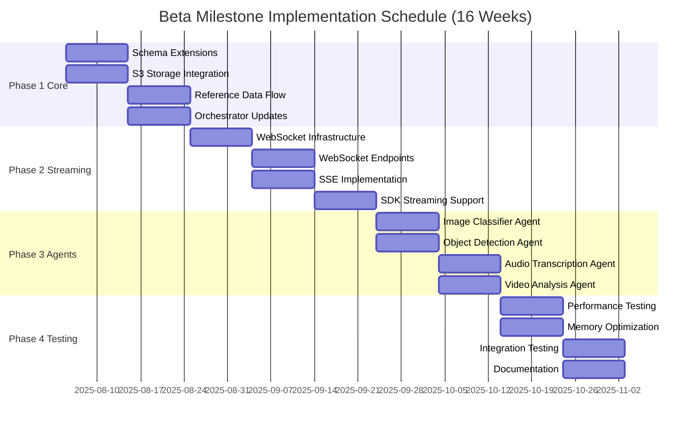
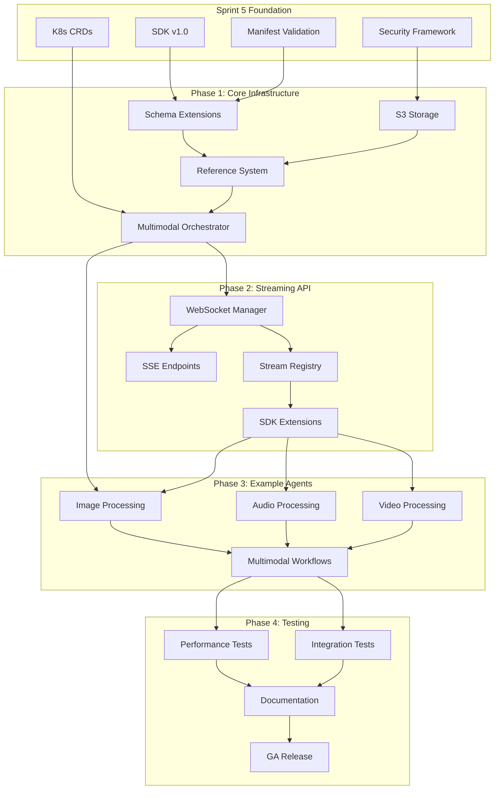
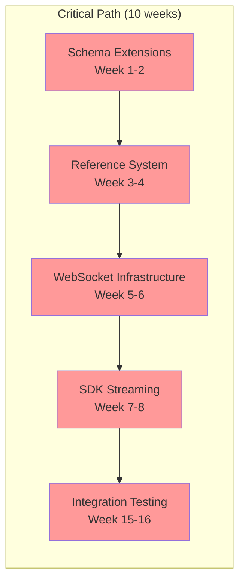
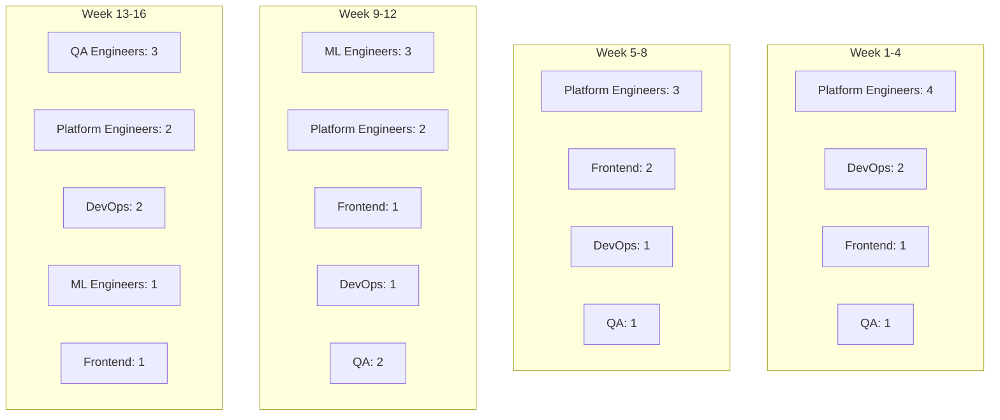
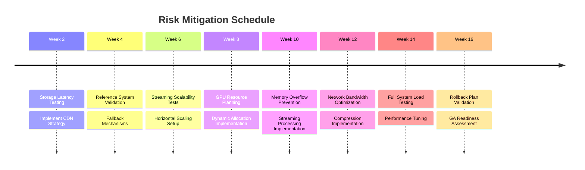

# Beta Milestone Implementation Timeline

## Visual Timeline

## Dependency Flow

## Critical Path

## Resource Allocation

## Risk Timeline

## Milestone Checkpoints

| Week | Checkpoint | Success Criteria | Go/No-Go Decision |
|------|------------|------------------|-------------------|
| 4 | Core Infrastructure Complete | Schema validated, Storage operational, Reference system working | Phase 2 proceed |
| 8 | Streaming API Complete | WebSocket < 100ms latency, SSE operational, SDK updated | Phase 3 proceed |
| 12 | Example Agents Complete | All agents functional, Performance within targets | Phase 4 proceed |
| 16 | GA Ready | All tests passing, Documentation complete, Rollback tested | Release decision |

---

**Document Version:** 1.0  
**Created:** August 2, 2025  
**Next Review:** End of Week 4 (Checkpoint 1)