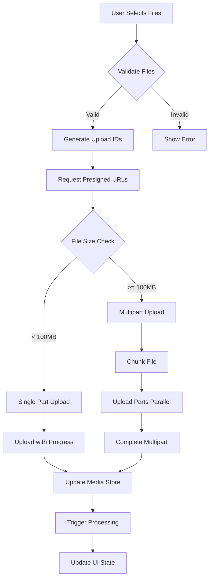

# Phase 2: Core Features Architecture Plan
## WebUI Multimodal Implementation (Weeks 4-8)

## Executive Summary

This document details the architectural implementation plan for Phase 2 of the WebUI rearchitecture, focusing on core multimodal features. Building upon the successfully completed Phase 1 foundation (service layer, type system, and state management), Phase 2 will deliver:

- **Comprehensive file upload system** with drag & drop, chunked uploads, and progress tracking
- **S3 storage integration** with secure presigned URLs and CDN distribution
- **Multimodal display components** for audio, image, and video with performance optimizations
- **Support for 1GB file uploads** with <100ms streaming latency maintained

**Timeline**: 5 weeks (Weeks 4-8)  
**Effort**: ~25 developer days  
**Dependencies**: Completed Phase 1 foundation

## 1. Component Architecture

### 1.1 Component Structure Overview

```
src/components/multimodal/
├── FileUploader/
│   ├── index.tsx                    # Main export
│   ├── FileUploader.tsx             # Core component
│   ├── FileUploader.types.ts        # TypeScript interfaces
│   ├── FileUploader.styles.ts       # Styled components/CSS modules
│   ├── components/
│   │   ├── DropZone.tsx            # Drag & drop area
│   │   ├── FileList.tsx            # Upload queue display
│   │   ├── UploadProgress.tsx      # Progress indicators
│   │   └── FilePreview.tsx         # Thumbnail previews
│   ├── hooks/
│   │   ├── useFileUpload.ts        # Upload logic hook
│   │   ├── useChunking.ts          # File chunking logic
│   │   └── useDragDrop.ts          # Drag & drop handlers
│   └── utils/
│       ├── validation.ts            # File validation
│       └── chunking.ts              # Chunking algorithms
│
├── AudioPlayer/
│   ├── index.tsx
│   ├── AudioPlayer.tsx
│   ├── AudioPlayer.types.ts
│   ├── components/
│   │   ├── WaveformVisualizer.tsx  # Web Audio API visualization
│   │   ├── PlaybackControls.tsx    # Play/pause/seek
│   │   ├── VolumeControl.tsx       # Volume slider
│   │   └── PlaybackSpeed.tsx       # Speed adjustment
│   ├── hooks/
│   │   ├── useAudioContext.ts      # Web Audio API wrapper
│   │   ├── useWaveform.ts          # Waveform generation
│   │   └── usePlayback.ts          # Playback state
│   └── utils/
│       ├── audioProcessor.ts       # Audio processing utilities
│       └── waveformGenerator.ts    # Waveform data generation
│
├── ImageViewer/
│   ├── index.tsx
│   ├── ImageViewer.tsx
│   ├── ImageViewer.types.ts
│   ├── components/
│   │   ├── ImageCanvas.tsx         # WebGL/Canvas rendering
│   │   ├── ZoomControls.tsx        # Zoom in/out/fit
│   │   ├── PanControls.tsx         # Pan navigation
│   │   └── AnnotationLayer.tsx     # Drawing annotations
│   ├── hooks/
│   │   ├── useImageLoader.ts       # Progressive loading
│   │   ├── useZoomPan.ts           # Zoom/pan state
│   │   └── useAnnotations.ts       # Annotation management
│   └── utils/
│       ├── imageOptimizer.ts       # Image optimization
│       └── webglRenderer.ts        # WebGL rendering logic
│
└── VideoPlayer/
    ├── index.tsx
    ├── VideoPlayer.tsx
    ├── VideoPlayer.types.ts
    ├── components/
    │   ├── VideoCanvas.tsx          # Video rendering surface
    │   ├── VideoControls.tsx        # Playback controls
    │   ├── QualitySelector.tsx     # Resolution selection
    │   └── StreamingIndicator.tsx  # Buffering/streaming status
    ├── hooks/
    │   ├── useVideoStream.ts        # HLS/DASH streaming
    │   ├── useAdaptiveBitrate.ts   # Quality adaptation
    │   └── useBufferManagement.ts  # Buffer optimization
    └── utils/
        ├── hlsManager.ts            # HLS.js integration
        └── dashManager.ts           # DASH.js integration
```

### 1.2 Component Interfaces

#### 1.2.1 FileUploader Component

```typescript
// FileUploader.types.ts
export interface FileUploaderProps {
  // Configuration
  accept?: Record<string, string[]>;  // MIME types and extensions
  maxSize?: number;                   // Max file size in bytes
  maxFiles?: number;                  // Max concurrent files
  multiple?: boolean;                 // Allow multiple file selection
  
  // Handlers
  onUpload?: (files: File[]) => void;
  onProgress?: (progress: UploadProgress) => void;
  onComplete?: (results: UploadResult[]) => void;
  onError?: (error: UploadError) => void;
  
  // Customization
  className?: string;
  disabled?: boolean;
  showPreview?: boolean;
  showProgress?: boolean;
  
  // S3 Configuration
  getPresignedUrl?: (file: File) => Promise<PresignedUrlResponse>;
  chunkSize?: number;  // Default: 5MB
}

export interface UploadProgress {
  fileId: string;
  fileName: string;
  loaded: number;
  total: number;
  percentage: number;
  speed: number;        // bytes/second
  timeRemaining: number; // seconds
  status: 'queued' | 'uploading' | 'processing' | 'completed' | 'error';
}

export interface UploadResult {
  fileId: string;
  reference: MediaReference;
  duration: number;     // Upload duration in ms
  averageSpeed: number; // bytes/second
}

export interface ChunkingStrategy {
  chunkSize: number;
  maxConcurrentChunks: number;
  retryAttempts: number;
  retryDelay: number;
}
```

#### 1.2.2 AudioPlayer Component

```typescript
// AudioPlayer.types.ts
export interface AudioPlayerProps {
  // Media source
  source: MediaReference | string;
  
  // Controls
  autoPlay?: boolean;
  loop?: boolean;
  muted?: boolean;
  volume?: number;         // 0-1
  playbackRate?: number;   // 0.25-4
  
  // Features
  showWaveform?: boolean;
  showSpectrogram?: boolean;
  enableKeyboardShortcuts?: boolean;
  
  // Visualization
  waveformColor?: string;
  waveformHeight?: number;
  waveformStyle?: 'bars' | 'wave' | 'mirror';
  
  // Callbacks
  onPlay?: () => void;
  onPause?: () => void;
  onEnded?: () => void;
  onTimeUpdate?: (currentTime: number, duration: number) => void;
  onError?: (error: Error) => void;
  onLoadedMetadata?: (metadata: AudioMetadata) => void;
}

export interface AudioVisualizationConfig {
  fftSize: number;         // 256-32768
  smoothingTimeConstant: number; // 0-1
  minDecibels: number;
  maxDecibels: number;
  colorGradient: string[];
}
```

#### 1.2.3 ImageViewer Component

```typescript
// ImageViewer.types.ts
export interface ImageViewerProps {
  // Image source
  source: MediaReference | string;
  
  // Display options
  initialZoom?: number | 'fit' | 'fill';
  minZoom?: number;      // Default: 0.1
  maxZoom?: number;      // Default: 10
  zoomStep?: number;     // Default: 0.1
  
  // Features
  enableZoom?: boolean;
  enablePan?: boolean;
  enableRotate?: boolean;
  enableAnnotations?: boolean;
  
  // Annotations
  annotations?: Annotation[];
  annotationTools?: AnnotationTool[];
  onAnnotationChange?: (annotations: Annotation[]) => void;
  
  // Performance
  useWebGL?: boolean;
  progressiveLoading?: boolean;
  tileSize?: number;     // For large images
  
  // Callbacks
  onLoad?: (imageData: ImageMetadata) => void;
  onZoomChange?: (zoom: number) => void;
  onError?: (error: Error) => void;
}

export interface Annotation {
  id: string;
  type: 'rectangle' | 'circle' | 'polygon' | 'line' | 'text';
  coordinates: number[];
  style: AnnotationStyle;
  metadata?: Record<string, any>;
}

export interface AnnotationStyle {
  strokeColor?: string;
  strokeWidth?: number;
  fillColor?: string;
  fontSize?: number;
  fontFamily?: string;
}
```

#### 1.2.4 VideoPlayer Component

```typescript
// VideoPlayer.types.ts
export interface VideoPlayerProps {
  // Video source
  source: MediaReference | string | StreamingSource;
  
  // Playback options
  autoPlay?: boolean;
  loop?: boolean;
  muted?: boolean;
  volume?: number;         // 0-1
  playbackRate?: number;   // 0.25-2
  startTime?: number;      // Start position in seconds
  
  // Streaming configuration
  streamingProtocol?: 'hls' | 'dash' | 'native';
  adaptiveBitrate?: boolean;
  initialQuality?: VideoQuality;
  bufferLength?: number;   // Seconds to buffer
  
  // UI options
  controls?: boolean | CustomControls;
  showQualitySelector?: boolean;
  showPlaybackSpeed?: boolean;
  showPictureInPicture?: boolean;
  
  // Performance
  preload?: 'none' | 'metadata' | 'auto';
  crossOrigin?: 'anonymous' | 'use-credentials';
  
  // Callbacks
  onPlay?: () => void;
  onPause?: () => void;
  onEnded?: () => void;
  onTimeUpdate?: (currentTime: number, duration: number) => void;
  onQualityChange?: (quality: VideoQuality) => void;
  onError?: (error: Error) => void;
  onBuffering?: (isBuffering: boolean) => void;
}

export interface StreamingSource {
  url: string;
  type: 'application/x-mpegURL' | 'application/dash+xml';
  drm?: DRMConfig;
}

export interface VideoQuality {
  height: number;
  width: number;
  bitrate: number;
  label: string;  // e.g., "1080p", "720p"
}
```

### 1.3 Component Implementation Patterns

#### 1.3.1 Lazy Loading Pattern

```typescript
// components/multimodal/index.ts
import { lazy, Suspense } from 'react';
import { MediaType } from '../../types/media';
import { MediaSkeleton } from '../shared/MediaSkeleton';

// Lazy load components based on media type
const componentMap = {
  [MediaType.AUDIO]: lazy(() => import('./AudioPlayer')),
  [MediaType.IMAGE]: lazy(() => import('./ImageViewer')),
  [MediaType.VIDEO]: lazy(() => import('./VideoPlayer')),
};

export const MediaRenderer: React.FC<{ reference: MediaReference }> = ({ reference }) => {
  const Component = componentMap[reference.type];
  
  if (!Component) {
    return <div>Unsupported media type: {reference.type}</div>;
  }
  
  return (
    <Suspense fallback={<MediaSkeleton type={reference.type} />}>
      <Component source={reference} />
    </Suspense>
  );
};
```

#### 1.3.2 Error Boundary Pattern

```typescript
// components/shared/MediaErrorBoundary.tsx
export class MediaErrorBoundary extends React.Component<
  { children: React.ReactNode; mediaType?: MediaType },
  { hasError: boolean; error?: Error }
> {
  static getDerivedStateFromError(error: Error) {
    return { hasError: true, error };
  }
  
  componentDidCatch(error: Error, errorInfo: React.ErrorInfo) {
    console.error('Media component error:', error, errorInfo);
    // Send to error tracking service
  }
  
  render() {
    if (this.state.hasError) {
      return (
        <MediaErrorFallback 
          error={this.state.error}
          mediaType={this.props.mediaType}
          onRetry={() => this.setState({ hasError: false })}
        />
      );
    }
    
    return this.props.children;
  }
}
```

## 2. S3 Integration Architecture

### 2.1 S3 Service Architecture

```typescript
// services/storage/S3Service.ts
import AWS from 'aws-sdk';
import { MediaReference } from '../../types/media';

export class S3Service {
  private s3: AWS.S3;
  private bucketName: string;
  private cdnBaseUrl?: string;
  
  constructor(config: S3Config) {
    this.s3 = new AWS.S3({
      accessKeyId: config.accessKeyId,
      secretAccessKey: config.secretAccessKey,
      region: config.region,
      endpoint: config.endpoint, // For MinIO/local development
      s3ForcePathStyle: config.forcePathStyle,
      signatureVersion: 'v4',
    });
    
    this.bucketName = config.bucketName;
    this.cdnBaseUrl = config.cdnBaseUrl;
  }
  
  /**
   * Generate a presigned URL for secure uploads
   */
  async getPresignedUploadUrl(params: {
    key: string;
    contentType: string;
    metadata?: Record<string, string>;
    expiresIn?: number; // seconds, default 3600
  }): Promise<PresignedUrlResponse> {
    const { key, contentType, metadata = {}, expiresIn = 3600 } = params;
    
    // Add security headers
    const securityHeaders = {
      'x-amz-server-side-encryption': 'AES256',
      'x-amz-acl': 'private',
      ...metadata,
    };
    
    const uploadUrl = await this.s3.getSignedUrlPromise('putObject', {
      Bucket: this.bucketName,
      Key: key,
      ContentType: contentType,
      Expires: expiresIn,
      Metadata: securityHeaders,
    });
    
    return {
      uploadUrl,
      key,
      expiresAt: new Date(Date.now() + expiresIn * 1000).toISOString(),
    };
  }
  
  /**
   * Generate a presigned URL for multipart upload
   */
  async initiateMultipartUpload(params: {
    key: string;
    contentType: string;
    metadata?: Record<string, string>;
  }): Promise<MultipartUploadSession> {
    const { key, contentType, metadata = {} } = params;
    
    const multipartParams = {
      Bucket: this.bucketName,
      Key: key,
      ContentType: contentType,
      Metadata: metadata,
      ServerSideEncryption: 'AES256',
    };
    
    const { UploadId } = await this.s3.createMultipartUpload(multipartParams).promise();
    
    return {
      uploadId: UploadId!,
      key,
      bucket: this.bucketName,
    };
  }
  
  /**
   * Get presigned URLs for upload parts
   */
  async getUploadPartUrls(params: {
    uploadId: string;
    key: string;
    parts: number;
  }): Promise<string[]> {
    const { uploadId, key, parts } = params;
    const urls: string[] = [];
    
    for (let i = 1; i <= parts; i++) {
      const url = await this.s3.getSignedUrlPromise('uploadPart', {
        Bucket: this.bucketName,
        Key: key,
        UploadId: uploadId,
        PartNumber: i,
        Expires: 3600,
      });
      urls.push(url);
    }
    
    return urls;
  }
  
  /**
   * Complete multipart upload
   */
  async completeMultipartUpload(params: {
    uploadId: string;
    key: string;
    parts: CompletedPart[];
  }): Promise<MediaReference> {
    const { uploadId, key, parts } = params;
    
    const result = await this.s3.completeMultipartUpload({
      Bucket: this.bucketName,
      Key: key,
      UploadId: uploadId,
      MultipartUpload: {
        Parts: parts.map(part => ({
          ETag: part.etag,
          PartNumber: part.partNumber,
        })),
      },
    }).promise();
    
    // Generate CDN URL if available
    const url = this.cdnBaseUrl 
      ? `${this.cdnBaseUrl}/${key}`
      : result.Location!;
    
    return this.createMediaReference(key, url);
  }
  
  /**
   * Generate a secure download URL
   */
  async getPresignedDownloadUrl(key: string, expiresIn = 3600): Promise<string> {
    // Check CDN first
    if (this.cdnBaseUrl) {
      return `${this.cdnBaseUrl}/${key}`;
    }
    
    return this.s3.getSignedUrlPromise('getObject', {
      Bucket: this.bucketName,
      Key: key,
      Expires: expiresIn,
    });
  }
}
```

### 2.2 Security Architecture

#### 2.2.1 Access Control Strategy

```typescript
// services/storage/SecurityService.ts
export class StorageSecurityService {
  /**
   * Generate secure storage key with namespacing
   */
  generateStorageKey(params: {
    userId: string;
    workspaceId: string;
    flowId: string;
    nodeId: string;
    pinName: string;
    filename: string;
  }): string {
    const { userId, workspaceId, flowId, nodeId, pinName, filename } = params;
    const timestamp = Date.now();
    const sanitizedFilename = this.sanitizeFilename(filename);
    
    // Hierarchical key structure for access control
    return `${userId}/${workspaceId}/${flowId}/${nodeId}/${pinName}_${timestamp}_${sanitizedFilename}`;
  }
  
  /**
   * Validate upload permissions
   */
  async validateUploadPermissions(params: {
    userId: string;
    workspaceId: string;
    fileSize: number;
    mimeType: string;
  }): Promise<ValidationResult> {
    // Check user quota
    const quota = await this.getUserQuota(params.userId);
    if (quota.used + params.fileSize > quota.limit) {
      return { valid: false, reason: 'Quota exceeded' };
    }
    
    // Validate MIME type
    if (!this.isAllowedMimeType(params.mimeType)) {
      return { valid: false, reason: 'Invalid file type' };
    }
    
    // Check workspace permissions
    const hasPermission = await this.checkWorkspacePermission(
      params.userId,
      params.workspaceId,
      'upload'
    );
    
    if (!hasPermission) {
      return { valid: false, reason: 'Insufficient permissions' };
    }
    
    return { valid: true };
  }
  
  /**
   * Content Security Policy headers
   */
  getSecurityHeaders(): Record<string, string> {
    return {
      'X-Content-Type-Options': 'nosniff',
      'X-Frame-Options': 'DENY',
      'X-XSS-Protection': '1; mode=block',
      'Content-Security-Policy': "default-src 'self'; img-src 'self' data: https:; media-src 'self' blob:",
      'Strict-Transport-Security': 'max-age=31536000; includeSubDomains',
    };
  }
  
  private sanitizeFilename(filename: string): string {
    // Remove special characters and spaces
    return filename
      .replace(/[^a-zA-Z0-9.-]/g, '_')
      .replace(/_{2,}/g, '_')
      .toLowerCase();
  }
  
  private isAllowedMimeType(mimeType: string): boolean {
    const allowedTypes = [
      'image/jpeg', 'image/png', 'image/webp', 'image/gif',
      'audio/wav', 'audio/mpeg', 'audio/ogg', 'audio/webm',
      'video/mp4', 'video/webm', 'video/ogg',
      'application/pdf',
    ];
    
    return allowedTypes.includes(mimeType);
  }
}
```

#### 2.2.2 Encryption Strategy

```typescript
// services/storage/EncryptionService.ts
export class EncryptionService {
  /**
   * Client-side encryption for sensitive files
   */
  async encryptFile(file: File, key: CryptoKey): Promise<EncryptedFile> {
    const arrayBuffer = await file.arrayBuffer();
    const iv = crypto.getRandomValues(new Uint8Array(12));
    
    const encryptedData = await crypto.subtle.encrypt(
      { name: 'AES-GCM', iv },
      key,
      arrayBuffer
    );
    
    return {
      data: encryptedData,
      iv: Array.from(iv),
      metadata: {
        originalName: file.name,
        originalSize: file.size,
        mimeType: file.type,
      },
    };
  }
  
  /**
   * Generate encryption key for file
   */
  async generateFileKey(): Promise<CryptoKey> {
    return crypto.subtle.generateKey(
      { name: 'AES-GCM', length: 256 },
      true,
      ['encrypt', 'decrypt']
    );
  }
}
```

### 2.3 CDN Strategy

#### 2.3.1 CDN Configuration

```typescript
// services/cdn/CDNService.ts
export class CDNService {
  private cdnBaseUrl: string;
  private cacheRules: Map<string, CacheRule>;
  
  constructor(config: CDNConfig) {
    this.cdnBaseUrl = config.baseUrl;
    this.cacheRules = new Map(config.cacheRules);
  }
  
  /**
   * Get optimized CDN URL with caching headers
   */
  getCDNUrl(key: string, options?: CDNOptions): string {
    const baseUrl = `${this.cdnBaseUrl}/${key}`;
    const params = new URLSearchParams();
    
    // Add image optimization parameters
    if (options?.resize) {
      params.append('w', options.resize.width.toString());
      params.append('h', options.resize.height.toString());
      params.append('fit', options.resize.fit || 'cover');
    }
    
    if (options?.quality) {
      params.append('q', options.quality.toString());
    }
    
    if (options?.format) {
      params.append('fm', options.format);
    }
    
    return params.toString() ? `${baseUrl}?${params}` : baseUrl;
  }
  
  /**
   * Get cache headers for media type
   */
  getCacheHeaders(mimeType: string): Record<string, string> {
    const rule = this.getCacheRule(mimeType);
    
    return {
      'Cache-Control': `public, max-age=${rule.maxAge}, s-maxage=${rule.sMaxAge}`,
      'Vary': 'Accept-Encoding, Accept',
      'X-Cache-Tag': rule.tag,
    };
  }
  
  private getCacheRule(mimeType: string): CacheRule {
    // Find matching rule or use default
    for (const [pattern, rule] of this.cacheRules) {
      if (new RegExp(pattern).test(mimeType)) {
        return rule;
      }
    }
    
    return {
      maxAge: 3600,      // 1 hour browser cache
      sMaxAge: 86400,    // 24 hours CDN cache
      tag: 'default',
    };
  }
}

interface CacheRule {
  maxAge: number;    // Browser cache duration
  sMaxAge: number;   // CDN cache duration
  tag: string;       // Cache invalidation tag
}

interface CDNOptions {
  resize?: {
    width: number;
    height: number;
    fit?: 'cover' | 'contain' | 'fill' | 'inside' | 'outside';
  };
  quality?: number;  // 1-100
  format?: 'webp' | 'jpeg' | 'png' | 'avif';
}
```

#### 2.3.2 Edge Processing

```typescript
// Edge worker for CDN (Cloudflare Workers example)
export default {
  async fetch(request: Request): Promise<Response> {
    const url = new URL(request.url);
    const cache = caches.default;
    
    // Check cache first
    let response = await cache.match(request);
    if (response) {
      return response;
    }
    
    // Process image transformations
    if (url.searchParams.has('w') || url.searchParams.has('h')) {
      response = await this.processImage(request);
    } else {
      // Fetch from origin
      response = await fetch(request);
    }
    
    // Add security headers
    const headers = new Headers(response.headers);
    headers.set('X-Content-Type-Options', 'nosniff');
    headers.set('X-Frame-Options', 'SAMEORIGIN');
    
    // Cache the response
    const cacheResponse = new Response(response.body, {
      status: response.status,
      statusText: response.statusText,
      headers,
    });
    
    await cache.put(request, cacheResponse.clone());
    return cacheResponse;
  },
  
  async processImage(request: Request): Promise<Response> {
    const url = new URL(request.url);
    const width = parseInt(url.searchParams.get('w') || '0');
    const height = parseInt(url.searchParams.get('h') || '0');
    const quality = parseInt(url.searchParams.get('q') || '85');
    
    // Use Cloudflare Image Resizing
    return fetch(request, {
      cf: {
        image: {
          width,
          height,
          quality,
          format: 'auto',
        },
      },
    });
  },
};
```

## 3. File Upload Workflow

### 3.1 Upload Flow Architecture



### 3.2 Upload Implementation

#### 3.2.1 Upload Manager

```typescript
// services/upload/UploadManager.ts
export class UploadManager {
  private uploadQueue: Map<string, UploadTask>;
  private activeUploads: Map<string, UploadController>;
  private maxConcurrentUploads = 3;
  private chunkSize = 5 * 1024 * 1024; // 5MB
  
  constructor(
    private s3Service: S3Service,
    private mediaService: MediaService,
    private store: MediaStore
  ) {
    this.uploadQueue = new Map();
    this.activeUploads = new Map();
  }
  
  /**
   * Queue files for upload
   */
  async queueUploads(files: File[]): Promise<string[]> {
    const uploadIds: string[] = [];
    
    for (const file of files) {
      const uploadId = uuidv4();
      const task: UploadTask = {
        id: uploadId,
        file,
        status: 'queued',
        progress: 0,
        startTime: Date.now(),
        metadata: await this.extractMetadata(file),
      };
      
      this.uploadQueue.set(uploadId, task);
      uploadIds.push(uploadId);
      
      // Update store
      this.store.queueUpload(file, task.metadata);
    }
    
    // Process queue
    this.processQueue();
    
    return uploadIds;
  }
  
  /**
   * Process upload queue
   */
  private async processQueue() {
    while (
      this.activeUploads.size < this.maxConcurrentUploads &&
      this.uploadQueue.size > 0
    ) {
      const [uploadId, task] = this.uploadQueue.entries().next().value;
      this.uploadQueue.delete(uploadId);
      
      const controller = new UploadController(
        task,
        this.s3Service,
        this.mediaService,
        {
          chunkSize: this.chunkSize,
          onProgress: (progress) => this.handleProgress(uploadId, progress),
          onComplete: (result) => this.handleComplete(uploadId, result),
          onError: (error) => this.handleError(uploadId, error),
        }
      );
      
      this.activeUploads.set(uploadId, controller);
      controller.start();
    }
  }
  
  /**
   * Handle upload progress
   */
  private handleProgress(uploadId: string, progress: UploadProgress) {
    this.store.setUploadProgress(uploadId, progress.percentage);
    
    // Emit progress event
    this.emit('progress', { uploadId, progress });
  }
  
  /**
   * Handle upload completion
   */
  private handleComplete(uploadId: string, result: UploadResult) {
    this.activeUploads.delete(uploadId);
    this.store.addMediaItem(result.reference);
    this.store.setProcessingState(uploadId, 'completed');
    
    // Process next in queue
    this.processQueue();
    
    // Emit complete event
    this.emit('complete', { uploadId, result });
  }
  
  /**
   * Cancel upload
   */
  cancelUpload(uploadId: string) {
    const controller = this.activeUploads.get(uploadId);
    if (controller) {
      controller.cancel();
      this.activeUploads.delete(uploadId);
    }
    
    // Remove from queue if present
    this.uploadQueue.delete(uploadId);
    
    // Update store
    this.store.removeMediaItem(uploadId);
  }
  
  /**
   * Extract metadata from file
   */
  private async extractMetadata(file: File): Promise<MediaMetadata> {
    const metadata: MediaMetadata = {
      id: uuidv4(),
      filename: file.name,
      size: file.size,
      mimeType: file.type,
      createdAt: new Date().toISOString(),
    };
    
    // Extract type-specific metadata
    if (file.type.startsWith('image/')) {
      const imageMetadata = await this.extractImageMetadata(file);
      Object.assign(metadata, imageMetadata);
    } else if (file.type.startsWith('audio/')) {
      const audioMetadata = await this.extractAudioMetadata(file);
      Object.assign(metadata, audioMetadata);
    } else if (file.type.startsWith('video/')) {
      const videoMetadata = await this.extractVideoMetadata(file);
      Object.assign(metadata, videoMetadata);
    }
    
    return metadata;
  }
}
```

#### 3.2.2 Upload Controller

```typescript
// services/upload/UploadController.ts
export class UploadController {
  private abortController: AbortController;
  private uploadedParts: CompletedPart[] = [];
  private uploadProgress: Map<number, number> = new Map();
  
  constructor(
    private task: UploadTask,
    private s3Service: S3Service,
    private mediaService: MediaService,
    private config: UploadConfig
  ) {
    this.abortController = new AbortController();
  }
  
  /**
   * Start upload process
   */
  async start() {
    try {
      const { file } = this.task;
      
      // Determine upload strategy
      if (file.size < 100 * 1024 * 1024) { // < 100MB
        await this.singlePartUpload();
      } else {
        await this.multipartUpload();
      }
    } catch (error) {
      if (error.name !== 'AbortError') {
        this.config.onError?.(error);
      }
    }
  }
  
  /**
   * Single part upload for smaller files
   */
  private async singlePartUpload() {
    const { file } = this.task;
    
    // Get presigned URL
    const storageKey = this.generateStorageKey();
    const { uploadUrl } = await this.s3Service.getPresignedUploadUrl({
      key: storageKey,
      contentType: file.type,
      metadata: {
        'x-amz-meta-filename': file.name,
        'x-amz-meta-filesize': file.size.toString(),
      },
    });
    
    // Upload with progress tracking
    await this.uploadWithProgress(file, uploadUrl, 0, file.size);
    
    // Create media reference
    const reference = await this.createMediaReference(storageKey);
    
    this.config.onComplete?.({
      fileId: this.task.id,
      reference,
      duration: Date.now() - this.task.startTime,
      averageSpeed: file.size / ((Date.now() - this.task.startTime) / 1000),
    });
  }
  
  /**
   * Multipart upload for large files
   */
  private async multipartUpload() {
    const { file } = this.task;
    const { chunkSize } = this.config;
    
    // Initiate multipart upload
    const storageKey = this.generateStorageKey();
    const session = await this.s3Service.initiateMultipartUpload({
      key: storageKey,
      contentType: file.type,
      metadata: {
        'x-amz-meta-filename': file.name,
        'x-amz-meta-filesize': file.size.toString(),
      },
    });
    
    // Calculate parts
    const numParts = Math.ceil(file.size / chunkSize);
    const partUrls = await this.s3Service.getUploadPartUrls({
      uploadId: session.uploadId,
      key: storageKey,
      parts: numParts,
    });
    
    // Upload parts in parallel (max 3 concurrent)
    const uploadPromises: Promise<void>[] = [];
    const semaphore = new Semaphore(3);
    
    for (let i = 0; i < numParts; i++) {
      const start = i * chunkSize;
      const end = Math.min(start + chunkSize, file.size);
      const blob = file.slice(start, end);
      
      const uploadPromise = semaphore.acquire().then(async (release) => {
        try {
          const etag = await this.uploadPart(
            blob,
            partUrls[i],
            i + 1,
            start,
            end
          );
          
          this.uploadedParts.push({
            partNumber: i + 1,
            etag,
          });
        } finally {
          release();
        }
      });
      
      uploadPromises.push(uploadPromise);
    }
    
    // Wait for all parts
    await Promise.all(uploadPromises);
    
    // Complete multipart upload
    const reference = await this.s3Service.completeMultipartUpload({
      uploadId: session.uploadId,
      key: storageKey,
      parts: this.uploadedParts.sort((a, b) => a.partNumber - b.partNumber),
    });
    
    this.config.onComplete?.({
      fileId: this.task.id,
      reference,
      duration: Date.now() - this.task.startTime,
      averageSpeed: file.size / ((Date.now() - this.task.startTime) / 1000),
    });
  }
  
  /**
   * Upload part with progress tracking
   */
  private async uploadPart(
    blob: Blob,
    url: string,
    partNumber: number,
    start: number,
    end: number
  ): Promise<string> {
    return new Promise((resolve, reject) => {
      const xhr = new XMLHttpRequest();
      
      xhr.upload.addEventListener('progress', (event) => {
        if (event.lengthComputable) {
          this.uploadProgress.set(partNumber, event.loaded);
          this.updateTotalProgress();
        }
      });
      
      xhr.addEventListener('load', () => {
        if (xhr.status >= 200 && xhr.status < 300) {
          const etag = xhr.getResponseHeader('ETag') || '';
          resolve(etag);
        } else {
          reject(new Error(`Upload failed: ${xhr.status}`));
        }
      });
      
      xhr.addEventListener('error', () => {
        reject(new Error('Upload failed'));
      });
      
      xhr.addEventListener('abort', () => {
        reject(new Error('Upload cancelled'));
      });
      
      // Setup request
      xhr.open('PUT', url);
      xhr.setRequestHeader('Content-Type', this.task.file.type);
      
      // Attach abort signal
      this.abortController.signal.addEventListener('abort', () => {
        xhr.abort();
      });
      
      // Send
      xhr.send(blob);
    });
  }
  
  /**
   * Update total progress
   */
  private updateTotalProgress() {
    const totalUploaded = Array.from(this.uploadProgress.values()).reduce(
      (sum, bytes) => sum + bytes,
      0
    );
    
    const progress: UploadProgress = {
      fileId: this.task.id,
      fileName: this.task.file.name,
      loaded: totalUploaded,
      total: this.task.file.size,
      percentage: Math.round((totalUploaded / this.task.file.size) * 100),
      speed: this.calculateSpeed(totalUploaded),
      timeRemaining: this.calculateTimeRemaining(totalUploaded),
      status: 'uploading',
    };
    
    this.config.onProgress?.(progress);
  }
  
  /**
   * Cancel upload
   */
  cancel() {
    this.abortController.abort();
  }
}
```

### 3.3 Drag & Drop Implementation

```typescript
// components/multimodal/FileUploader/hooks/useDragDrop.ts
export function useDragDrop(options: DragDropOptions) {
  const [isDragging, setIsDragging] = useState(false);
  const [dragError, setDragError] = useState<string | null>(null);
  const dragCounter = useRef(0);
  
  const handleDragEnter = useCallback((e: DragEvent) => {
    e.preventDefault();
    e.stopPropagation();
    
    dragCounter.current++;
    
    if (e.dataTransfer?.items) {
      const hasFiles = Array.from(e.dataTransfer.items).some(
        item => item.kind === 'file'
      );
      
      if (hasFiles) {
        setIsDragging(true);
        setDragError(null);
      } else {
        setDragError('Only files can be dropped here');
      }
    }
  }, []);
  
  const handleDragLeave = useCallback((e: DragEvent) => {
    e.preventDefault();
    e.stopPropagation();
    
    dragCounter.current--;
    
    if (dragCounter.current === 0) {
      setIsDragging(false);
      setDragError(null);
    }
  }, []);
  
  const handleDragOver = useCallback((e: DragEvent) => {
    e.preventDefault();
    e.stopPropagation();
    
    // Set drop effect
    if (e.dataTransfer) {
      e.dataTransfer.dropEffect = 'copy';
    }
  }, []);
  
  const handleDrop = useCallback((e: DragEvent) => {
    e.preventDefault();
    e.stopPropagation();
    
    dragCounter.current = 0;
    setIsDragging(false);
    setDragError(null);
    
    if (e.dataTransfer?.files) {
      const files = Array.from(e.dataTransfer.files);
      const validFiles = files.filter(file => validateFile(file, options));
      
      if (validFiles.length > 0) {
        options.onDrop?.(validFiles);
      } else {
        setDragError('No valid files found');
      }
    }
  }, [options]);
  
  return {
    isDragging,
    dragError,
    dragHandlers: {
      onDragEnter: handleDragEnter,
      onDragLeave: handleDragLeave,
      onDragOver: handleDragOver,
      onDrop: handleDrop,
    },
  };
}

function validateFile(file: File, options: DragDropOptions): boolean {
  // Check file size
  if (options.maxSize && file.size > options.maxSize) {
    console.warn(`File ${file.name} exceeds max size`);
    return false;
  }
  
  // Check file type
  if (options.accept) {
    const acceptedTypes = Object.entries(options.accept).flatMap(
      ([type, extensions]) => {
        if (type.includes('*')) {
          // Handle wildcards like 'image/*'
          return extensions;
        }
        return [type, ...extensions];
      }
    );
    
    const isAccepted = acceptedTypes.some(accepted => {
      if (accepted.startsWith('.')) {
        return file.name.endsWith(accepted);
      }
      return file.type === accepted || file.type.startsWith(accepted.replace('*', ''));
    });
    
    if (!isAccepted) {
      console.warn(`File ${file.name} type not accepted`);
      return false;
    }
  }
  
  return true;
}
```

## 4. Performance Optimization Strategies

### 4.1 Memory Management

#### 4.1.1 File Chunking Strategy

```typescript
// utils/performance/chunking.ts
export class ChunkingStrategy {
  private static readonly MIN_CHUNK_SIZE = 1 * 1024 * 1024;    // 1MB
  private static readonly MAX_CHUNK_SIZE = 10 * 1024 * 1024;   // 10MB
  private static readonly OPTIMAL_CHUNKS = 100;                 // Target number of chunks
  
  /**
   * Calculate optimal chunk size based on file size and network conditions
   */
  static calculateChunkSize(fileSize: number, networkSpeed?: number): number {
    // Base calculation on file size
    let chunkSize = Math.ceil(fileSize / this.OPTIMAL_CHUNKS);
    
    // Clamp to min/max
    chunkSize = Math.max(this.MIN_CHUNK_SIZE, chunkSize);
    chunkSize = Math.min(this.MAX_CHUNK_SIZE, chunkSize);
    
    // Adjust based on network speed if available
    if (networkSpeed) {
      // Aim for chunks that upload in ~5 seconds
      const targetChunkSize = networkSpeed * 5;
      chunkSize = Math.min(chunkSize, targetChunkSize);
    }
    
    // Round to nearest MB for efficiency
    return Math.ceil(chunkSize / (1024 * 1024)) * (1024 * 1024);
  }
  
  /**
   * Create file chunks with memory optimization
   */
  static async* createChunks(
    file: File,
    chunkSize: number
  ): AsyncGenerator<FileChunk> {
    let offset = 0;
    let chunkIndex = 0;
    
    while (offset < file.size) {
      const end = Math.min(offset + chunkSize, file.size);
      const blob = file.slice(offset, end);
      
      yield {
        index: chunkIndex,
        blob,
        start: offset,
        end,
        size: end - offset,
      };
      
      offset = end;
      chunkIndex++;
      
      // Allow garbage collection between chunks
      await new Promise(resolve => setTimeout(resolve, 0));
    }
  }
}
```

#### 4.1.2 Media Loading Optimization

```typescript
// utils/performance/mediaLoader.ts
export class MediaLoader {
  private cache: LRUCache<string, Blob>;
  private pendingLoads: Map<string, Promise<Blob>>;
  
  constructor(maxCacheSize: number = 100 * 1024 * 1024) { // 100MB default
    this.cache = new LRUCache({ maxSize: maxCacheSize });
    this.pendingLoads = new Map();
  }
  
  /**
   * Load media with caching and deduplication
   */
  async loadMedia(url: string, options?: LoadOptions): Promise<Blob> {
    // Check cache first
    const cached = this.cache.get(url);
    if (cached) {
      return cached;
    }
    
    // Check if already loading
    const pending = this.pendingLoads.get(url);
    if (pending) {
      return pending;
    }
    
    // Start new load
    const loadPromise = this.performLoad(url, options);
    this.pendingLoads.set(url, loadPromise);
    
    try {
      const blob = await loadPromise;
      this.cache.set(url, blob);
      return blob;
    } finally {
      this.pendingLoads.delete(url);
    }
  }
  
  /**
   * Progressive image loading
   */
  async loadImageProgressive(
    url: string,
    onProgress?: (stage: 'thumbnail' | 'preview' | 'full', data: string) => void
  ): Promise<void> {
    // Load thumbnail first (if available)
    const thumbnailUrl = url.replace(/\.(jpg|jpeg|png)$/i, '_thumb.$1');
    try {
      const thumbBlob = await this.loadMedia(thumbnailUrl, { priority: 'high' });
      const thumbDataUrl = await this.blobToDataUrl(thumbBlob);
      onProgress?.('thumbnail', thumbDataUrl);
    } catch (e) {
      // Thumbnail might not exist
    }
    
    // Load preview quality
    const previewUrl = url.replace(/\.(jpg|jpeg|png)$/i, '_preview.$1');
    try {
      const previewBlob = await this.loadMedia(previewUrl, { priority: 'high' });
      const previewDataUrl = await this.blobToDataUrl(previewBlob);
      onProgress?.('preview', previewDataUrl);
    } catch (e) {
      // Preview might not exist
    }
    
    // Load full quality
    const fullBlob = await this.loadMedia(url, { priority: 'low' });
    const fullDataUrl = await this.blobToDataUrl(fullBlob);
    onProgress?.('full', fullDataUrl);
  }
  
  private async performLoad(url: string, options?: LoadOptions): Promise<Blob> {
    const response = await fetch(url, {
      priority: options?.priority || 'auto',
      signal: options?.signal,
    });
    
    if (!response.ok) {
      throw new Error(`Failed to load: ${response.status}`);
    }
    
    return response.blob();
  }
}
```

### 4.2 Lazy Loading and Virtual Scrolling

#### 4.2.1 Virtual Media Grid

```typescript
// components/shared/VirtualMediaGrid.tsx
import { FixedSizeGrid as Grid } from 'react-window';
import AutoSizer from 'react-virtualized-auto-sizer';

interface VirtualMediaGridProps {
  items: MediaReference[];
  columnCount?: number;
  rowHeight?: number;
  gap?: number;
  onItemClick?: (item: MediaReference, index: number) => void;
}

export const VirtualMediaGrid: React.FC<VirtualMediaGridProps> = ({
  items,
  columnCount = 4,
  rowHeight = 200,
  gap = 16,
  onItemClick,
}) => {
  const rowCount = Math.ceil(items.length / columnCount);
  
  const Cell = ({ columnIndex, rowIndex, style }) => {
    const index = rowIndex * columnCount + columnIndex;
    if (index >= items.length) return null;
    
    const item = items[index];
    const adjustedStyle = {
      ...style,
      left: style.left + gap,
      top: style.top + gap,
      width: style.width - gap,
      height: style.height - gap,
    };
    
    return (
      <div style={adjustedStyle}>
        <MediaCard
          media={item}
          onClick={() => onItemClick?.(item, index)}
          lazy
        />
      </div>
    );
  };
  
  return (
    <AutoSizer>
      {({ height, width }) => (
        <Grid
          columnCount={columnCount}
          columnWidth={width / columnCount}
          height={height}
          rowCount={rowCount}
          rowHeight={rowHeight}
          width={width}
          itemData={items}
        >
          {Cell}
        </Grid>
      )}
    </AutoSizer>
  );
};
```

#### 4.2.2 Intersection Observer for Lazy Loading

```typescript
// hooks/useIntersectionObserver.ts
export function useIntersectionObserver<T extends HTMLElement>(
  options?: IntersectionObserverInit
): [RefObject<T>, boolean] {
  const ref = useRef<T>(null);
  const [isIntersecting, setIsIntersecting] = useState(false);
  
  useEffect(() => {
    const element = ref.current;
    if (!element) return;
    
    const observer = new IntersectionObserver(([entry]) => {
      setIsIntersecting(entry.isIntersecting);
    }, options);
    
    observer.observe(element);
    
    return () => {
      observer.unobserve(element);
      observer.disconnect();
    };
  }, [options]);
  
  return [ref, isIntersecting];
}

// Usage in MediaCard
export const MediaCard: React.FC<{ media: MediaReference; lazy?: boolean }> = ({
  media,
  lazy = false,
}) => {
  const [ref, isVisible] = useIntersectionObserver({
    threshold: 0.1,
    rootMargin: '100px',
  });
  
  const shouldLoad = !lazy || isVisible;
  
  return (
    <div ref={ref} className={styles.mediaCard}>
      {shouldLoad ? (
        <MediaRenderer reference={media} />
      ) : (
        <MediaSkeleton type={media.type} />
      )}
    </div>
  );
};
```

### 4.3 Web Workers for Heavy Processing

#### 4.3.1 File Processing Worker

```typescript
// workers/fileProcessor.worker.ts
interface ProcessingMessage {
  type: 'process' | 'cancel';
  data?: {
    file: File;
    operation: 'thumbnail' | 'checksum' | 'metadata';
    options?: any;
  };
}

self.addEventListener('message', async (event: MessageEvent<ProcessingMessage>) => {
  const { type, data } = event.data;
  
  switch (type) {
    case 'process':
      try {
        const result = await processFile(data!);
        self.postMessage({ type: 'success', result });
      } catch (error) {
        self.postMessage({ type: 'error', error: error.message });
      }
      break;
      
    case 'cancel':
      // Cancel ongoing operation
      break;
  }
});

async function processFile(data: ProcessingMessage['data']) {
  const { file, operation, options } = data!;
  
  switch (operation) {
    case 'thumbnail':
      return generateThumbnail(file, options);
      
    case 'checksum':
      return calculateChecksum(file);
      
    case 'metadata':
      return extractMetadata(file);
  }
}

async function generateThumbnail(file: File, options: ThumbnailOptions) {
  // Use OffscreenCanvas for image processing
  const bitmap = await createImageBitmap(file);
  const { width, height } = calculateThumbnailDimensions(
    bitmap.width,
    bitmap.height,
    options.maxWidth || 200,
    options.maxHeight || 200
  );
  
  const canvas = new OffscreenCanvas(width, height);
  const ctx = canvas.getContext('2d')!;
  
  ctx.drawImage(bitmap, 0, 0, width, height);
  
  const blob = await canvas.convertToBlob({
    type: 'image/jpeg',
    quality: options.quality || 0.8,
  });
  
  return {
    blob,
    width,
    height,
    dataUrl: await blobToDataUrl(blob),
  };
}

async function calculateChecksum(file: File): Promise<string> {
  const CHUNK_SIZE = 1024 * 1024; // 1MB chunks
  const chunks = Math.ceil(file.size / CHUNK_SIZE);
  const hasher = new SubtleCrypto();
  
  for (let i = 0; i < chunks; i++) {
    const start = i * CHUNK_SIZE;
    const end = Math.min(start + CHUNK_SIZE, file.size);
    const chunk = file.slice(start, end);
    const buffer = await chunk.arrayBuffer();
    
    // Update hash with chunk
    await hasher.update(buffer);
  }
  
  const hash = await hasher.digest();
  return bufferToHex(hash);
}
```

#### 4.3.2 Worker Pool Manager

```typescript
// services/workers/WorkerPool.ts
export class WorkerPool<TMessage, TResult> {
  private workers: Worker[] = [];
  private availableWorkers: Worker[] = [];
  private taskQueue: Array<{
    message: TMessage;
    resolve: (result: TResult) => void;
    reject: (error: Error) => void;
  }> = [];
  
  constructor(
    private workerScript: string,
    private poolSize: number = navigator.hardwareConcurrency || 4
  ) {
    this.initializeWorkers();
  }
  
  private initializeWorkers() {
    for (let i = 0; i < this.poolSize; i++) {
      const worker = new Worker(this.workerScript);
      
      worker.addEventListener('message', (event) => {
        this.handleWorkerMessage(worker, event);
      });
      
      worker.addEventListener('error', (error) => {
        this.handleWorkerError(worker, error);
      });
      
      this.workers.push(worker);
      this.availableWorkers.push(worker);
    }
  }
  
  async process(message: TMessage): Promise<TResult> {
    return new Promise((resolve, reject) => {
      const task = { message, resolve, reject };
      
      const worker = this.availableWorkers.pop();
      if (worker) {
        this.executeTask(worker, task);
      } else {
        this.taskQueue.push(task);
      }
    });
  }
  
  private executeTask(
    worker: Worker,
    task: typeof this.taskQueue[0]
  ) {
    // Store task reference on worker
    (worker as any).__currentTask = task;
    
    // Send message to worker
    worker.postMessage(task.message);
  }
  
  private handleWorkerMessage(worker: Worker, event: MessageEvent) {
    const task = (worker as any).__currentTask;
    if (!task) return;
    
    // Clear task reference
    delete (worker as any).__currentTask;
    
    // Resolve or reject based on message
    if (event.data.type === 'success') {
      task.resolve(event.data.result);
    } else {
      task.reject(new Error(event.data.error));
    }
    
    // Process next task or return worker to pool
    const nextTask = this.taskQueue.shift();
    if (nextTask) {
      this.executeTask(worker, nextTask);
    } else {
      this.availableWorkers.push(worker);
    }
  }
  
  terminate() {
    this.workers.forEach(worker => worker.terminate());
    this.workers = [];
    this.availableWorkers = [];
    this.taskQueue = [];
  }
}
```

## 5. Implementation Phases

### 5.1 Phase Breakdown

#### 5.1.1 Week 4-5: File Upload System (10 days)

**Day 1-2: Core Upload Infrastructure**
- [ ] Create UploadManager service class
- [ ] Implement upload queue management
- [ ] Set up upload state in Zustand store
- [ ] Create upload progress tracking system

**Day 3-4: Drag & Drop Implementation**
- [ ] Create DropZone component
- [ ] Implement drag & drop hooks
- [ ] Add file validation logic
- [ ] Create visual feedback states

**Day 5-6: Chunked Upload Logic**
- [ ] Implement file chunking algorithm
- [ ] Create parallel chunk upload system
- [ ] Add chunk retry mechanism
- [ ] Implement upload resumption

**Day 7-8: UI Components**
- [ ] Create FileUploader main component
- [ ] Build FileList component with queue display
- [ ] Implement UploadProgress indicators
- [ ] Add FilePreview component

**Day 9-10: Integration & Testing**
- [ ] Integrate with MediaService
- [ ] Connect to Zustand store
- [ ] Add error handling
- [ ] Write unit tests

**Deliverables:**
- Fully functional drag & drop file uploader
- Support for files up to 1GB
- Real-time progress tracking
- Upload queue management

#### 5.1.2 Week 6-7: Storage Integration (10 days)

**Day 1-2: S3 Service Setup**
- [ ] Create S3Service class
- [ ] Configure AWS SDK for browser
- [ ] Implement presigned URL generation
- [ ] Set up multipart upload methods

**Day 3-4: Security Implementation**
- [ ] Create StorageSecurityService
- [ ] Implement access control validation
- [ ] Add content security headers
- [ ] Set up encryption utilities

**Day 5-6: CDN Integration**
- [ ] Create CDNService class
- [ ] Implement cache strategies
- [ ] Add image optimization parameters
- [ ] Set up edge worker configuration

**Day 7-8: Backend Integration**
- [ ] Update MediaService for S3
- [ ] Implement storage key generation
- [ ] Add metadata storage
- [ ] Create cleanup utilities

**Day 9-10: Testing & Optimization**
- [ ] Test with MinIO locally
- [ ] Verify CDN integration
- [ ] Performance testing
- [ ] Security audit

**Deliverables:**
- Complete S3 integration
- Secure presigned URL handling
- CDN distribution setup
- Storage security layer

#### 5.1.3 Week 8: Media Display Components (5 days)

**Day 1: AudioPlayer Component**
- [ ] Create AudioPlayer structure
- [ ] Implement Web Audio API integration
- [ ] Add waveform visualization
- [ ] Build playback controls

**Day 2: ImageViewer Component**
- [ ] Create ImageViewer structure
- [ ] Implement zoom/pan functionality
- [ ] Add WebGL rendering option
- [ ] Build annotation system

**Day 3: VideoPlayer Component**
- [ ] Create VideoPlayer structure
- [ ] Integrate HLS.js/Dash.js
- [ ] Add adaptive bitrate support
- [ ] Build custom controls

**Day 4: Performance Optimization**
- [ ] Implement lazy loading
- [ ] Add virtual scrolling
- [ ] Set up Web Workers
- [ ] Optimize bundle sizes

**Day 5: Integration & Polish**
- [ ] Create MediaRenderer wrapper
- [ ] Add error boundaries
- [ ] Implement loading states
- [ ] Final testing

**Deliverables:**
- Three specialized media components
- Optimized performance
- Consistent user experience
- Full multimodal support

### 5.2 Risk Mitigation

| Risk | Mitigation Strategy | Contingency Plan |
|------|-------------------|------------------|
| S3 Integration Delays | Use MinIO for development | Local file storage fallback |
| Large File Memory Issues | Implement aggressive chunking | Reduce max file size temporarily |
| Browser Compatibility | Progressive enhancement | Polyfills and fallbacks |
| CDN Configuration | Test with multiple providers | Direct S3 serving |
| Performance Degradation | Continuous monitoring | Feature flags for rollback |

### 5.3 Success Criteria

**Technical Metrics:**
- ✅ Support for 1GB file uploads without crashes
- ✅ <100ms streaming latency maintained
- ✅ <200ms component load time
- ✅ >10MB/s upload speed on fast connections
- ✅ <500MB memory usage during uploads

**User Experience Metrics:**
- ✅ Smooth drag & drop experience
- ✅ Real-time progress feedback
- ✅ Intuitive media playback controls
- ✅ Responsive on all screen sizes
- ✅ Graceful error handling

**Code Quality Metrics:**
- ✅ >80% test coverage
- ✅ TypeScript strict mode compliance
- ✅ Accessibility standards met
- ✅ Performance budgets maintained
- ✅ Security best practices followed

## 6. Conclusion

This architectural plan provides a comprehensive roadmap for implementing Phase 2's core multimodal features. By leveraging the strong foundation from Phase 1 and following this structured approach, we can deliver a robust, performant, and user-friendly multimodal experience that meets all beta milestone requirements.

The modular component architecture, secure S3 integration, and performance-first design ensure that the system can scale to handle enterprise workloads while maintaining the <100ms latency target. The phased implementation approach minimizes risk and allows for continuous delivery of value throughout the 5-week development period.

### Next Steps

1. **Review and approve** this architectural plan with the team
2. **Set up development environment** with MinIO for S3 testing
3. **Create feature branches** for each sub-phase
4. **Begin Week 4 implementation** with file upload system
5. **Establish daily standups** for progress tracking

With this plan in place, the team is well-positioned to successfully deliver Phase 2 and continue the momentum toward the beta milestone.