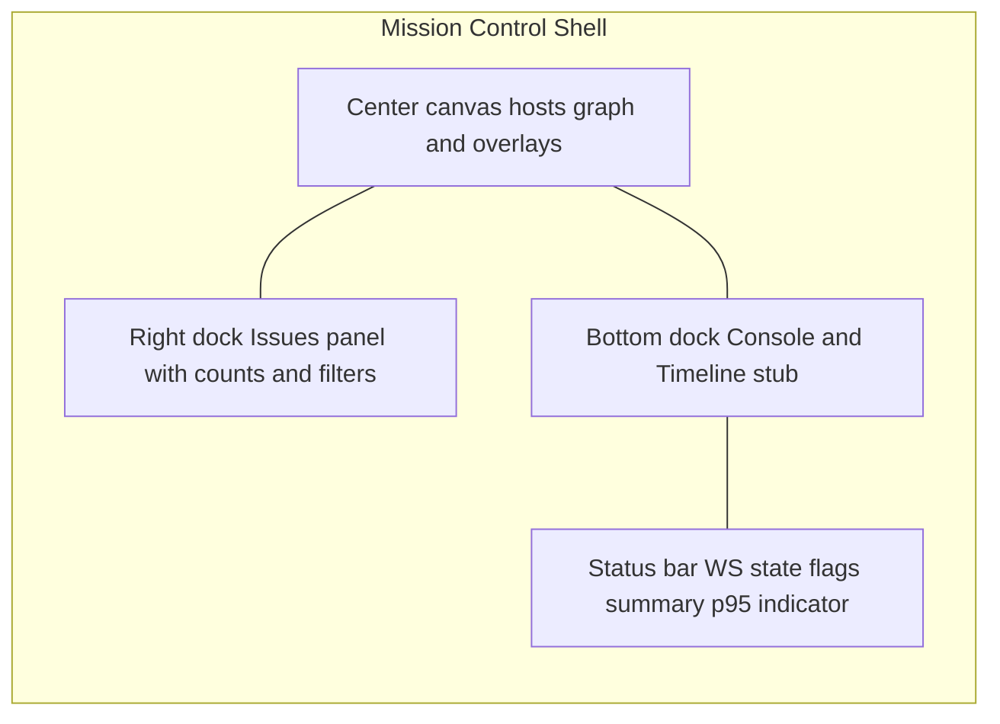
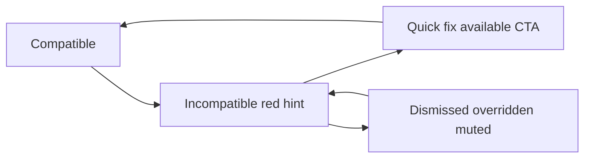
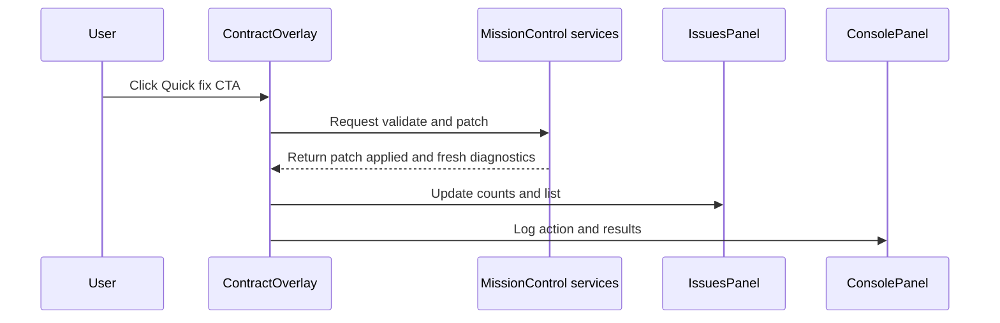
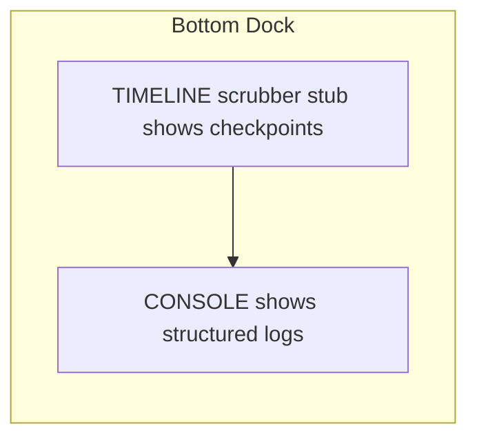
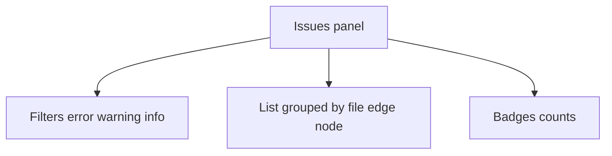
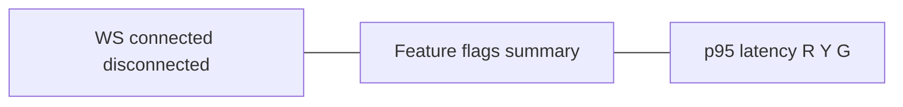
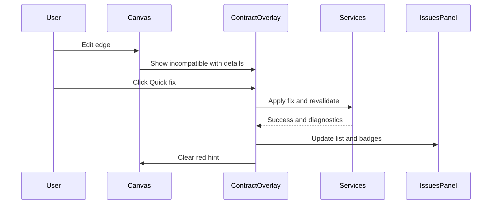
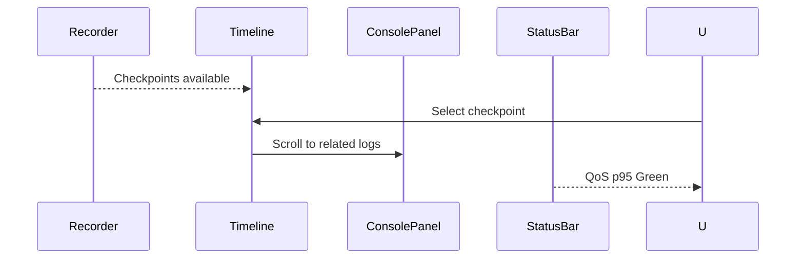

# Mission Control UI
Document path: [docs/ui-mission-control.md](docs/ui-mission-control.md:1)

1. Title and Purpose
This document defines the Mission Control shell, core panels, overlays, and feature flag surfaces required to satisfy Phase 1 acceptance criteria in [docs/mvp-roadmap.md](docs/mvp-roadmap.md:1), including PR-D2 requirement for annotated wireframes and file anchors. It establishes a shared contract between product, design, and engineering for [MissionControlLayout](services/frontend/src/components/mission-control/layout/MissionControlLayout.tsx:1), panels under [services/frontend/src/components/mission-control/panels/](services/frontend/src/components/mission-control/panels/:1), overlays under [services/frontend/src/components/mission-control/overlays/](services/frontend/src/components/mission-control/overlays/:1), and service hooks in [services.ts](services/frontend/src/services/mission-control/services.ts:1).

2. Mission Control Shell Overview
2.1 Wireframe

2.2 Responsibilities and Anchors
- Layout container: [MissionControlLayout](services/frontend/src/components/mission-control/layout/MissionControlLayout.tsx:1)
- Panels root: [services/frontend/src/components/mission-control/panels/](services/frontend/src/components/mission-control/panels/:1)
- Overlays root: [services/frontend/src/components/mission-control/overlays/](services/frontend/src/components/mission-control/overlays/:1)

3. Canvas and Contract Overlay
3.1 CONTRACT_OVERLAY States
- Compatible
- Incompatible
- Quick fix available
- Dismissed overridden

3.2 Overlay Wireframe and State Transitions

Anchors:
- Overlay view: [ContractOverlay](services/frontend/src/components/mission-control/overlays/ContractOverlay.tsx:1)
- Issues surfacing: [IssuesPanel](services/frontend/src/components/mission-control/panels/IssuesPanel.tsx:1)
- Services integration: [services.ts](services/frontend/src/services/mission-control/services.ts:1)

Named service hooks:
- [validateContract()](services/frontend/src/services/mission-control/services.ts:1)
- [applyQuickFix()](services/frontend/src/services/mission-control/services.ts:1)

3.3 Quick-fix CTA Flow and Linter Integration

Counts update location: [IssuesPanel](services/frontend/src/components/mission-control/panels/IssuesPanel.tsx:1)

4. Bottom Dock: Console and Timeline Stub
4.1 Layout Wireframe

Anchors:
- Console: [ConsolePanel](services/frontend/src/components/mission-control/panels/ConsolePanel.tsx:1)
- Services: [services.ts](services/frontend/src/services/mission-control/services.ts:1)

Recorder hooks:
- [listRuns()](services/frontend/src/services/mission-control/services.ts:1)
- [listCheckpoints()](services/frontend/src/services/mission-control/services.ts:1)

4.2 Behavior
- Timeline populates from [listRuns()](services/frontend/src/services/mission-control/services.ts:1) and [listCheckpoints()](services/frontend/src/services/mission-control/services.ts:1)
- Selecting a checkpoint scrolls Console to related logs

5. Right Dock: Issues Panel
5.1 Wireframe and Responsibilities

Anchor:
- [IssuesPanel](services/frontend/src/components/mission-control/panels/IssuesPanel.tsx:1)

5.2 Data Sources and Tie-ins
- Contract validation output from [validateContract()](services/frontend/src/services/mission-control/services.ts:1)
- Quick-fix results from [applyQuickFix()](services/frontend/src/services/mission-control/services.ts:1)

6. Status Bar: Connectivity and QoS
6.1 Placement Wireframe

Anchors:
- Host layout: [MissionControlLayout](services/frontend/src/components/mission-control/layout/MissionControlLayout.tsx:1)
- Status bar component placeholder: add under [MissionControlLayout](services/frontend/src/components/mission-control/layout/MissionControlLayout.tsx:1)

6.2 Indicators
- WS Connected: connected disconnected with reconnection spinner
- Flags summary: compact pill with active flags
- p95 latency thresholds:
  - Green ≤ 250 ms
  - Yellow ≤ 500 ms
  - Red > 500 ms

Note: This is forward-looking to PR-MC3 and included here for placement.

7. Feature Flags Surfaces
7.1 Flags Matrix
| Flag | Default | Affects | Surfaces Toggled |
| --- | --- | --- | --- |
| CONTRACT_OVERLAY | On | Contract validation and quick fixes | [ContractOverlay](services/frontend/src/components/mission-control/overlays/ContractOverlay.tsx:1), [IssuesPanel](services/frontend/src/components/mission-control/panels/IssuesPanel.tsx:1) |
| CONNECT_WS | On | Live connectivity and streaming | Status bar WS, streaming to [ConsolePanel](services/frontend/src/components/mission-control/panels/ConsolePanel.tsx:1) |
| EXPERIMENTS | Off | Experimental UI toggles | Gates new panels or controls in [MissionControlLayout](services/frontend/src/components/mission-control/layout/MissionControlLayout.tsx:1) |
| LINEAGE | Off | Data lineage views | Future overlay in [services/frontend/src/components/mission-control/overlays/](services/frontend/src/components/mission-control/overlays/:1) |
| POLICY_GUARDRAILS | Off | Policy warnings blocks | Warnings in [IssuesPanel](services/frontend/src/components/mission-control/panels/IssuesPanel.tsx:1) and canvas callouts |

7.2 Behavior Notes
- Flags determine visibility and interactivity, not just style.
- Flags are summarized in status bar and should be queryable from [services.ts](services/frontend/src/services/mission-control/services.ts:1).

8. User Flows Mapped to Acceptance Criteria
8.1 Flow A: Fix incompatible edge
Steps:
- Edge edited leads to overlay state Incompatible with red hint on canvas via [ContractOverlay](services/frontend/src/components/mission-control/overlays/ContractOverlay.tsx:1)
- Hover reveals mismatch details and suggested fix
- Quick-fix CTA invokes [applyQuickFix()](services/frontend/src/services/mission-control/services.ts:1)
- Revalidate via [validateContract()](services/frontend/src/services/mission-control/services.ts:1)
- [IssuesPanel](services/frontend/src/components/mission-control/panels/IssuesPanel.tsx:1) updates counts and clears resolved item

8.2 Flow B: Runs and QoS
Steps:
- New run emits checkpoints to timeline via [listRuns()](services/frontend/src/services/mission-control/services.ts:1) and [listCheckpoints()](services/frontend/src/services/mission-control/services.ts:1)
- Selecting a checkpoint scrolls [ConsolePanel](services/frontend/src/components/mission-control/panels/ConsolePanel.tsx:1)
- Status bar QoS shows Green when p95 under threshold

9. Anchor Map
| UI Section | Source |
| --- | --- |
| Shell layout | [MissionControlLayout](services/frontend/src/components/mission-control/layout/MissionControlLayout.tsx:1) |
| Contract overlay | [ContractOverlay](services/frontend/src/components/mission-control/overlays/ContractOverlay.tsx:1) |
| Console panel | [ConsolePanel](services/frontend/src/components/mission-control/panels/ConsolePanel.tsx:1) |
| Issues panel | [IssuesPanel](services/frontend/src/components/mission-control/panels/IssuesPanel.tsx:1) |
| Mission control services | [services.ts](services/frontend/src/services/mission-control/services.ts:1) |

10. Assets and Conventions
10.1 Mermaid Notes
- Prefer flowchart and sequenceDiagram for layout and flows.
- Avoid double quotes and parentheses inside square brackets in node labels.
- Preview options: GitHub native Mermaid preview or VS Code Mermaid extensions.

10.2 Images Directory and Naming
- Optional images under [docs/assets/ui/](docs/assets/ui/:1)
- Naming: ui-mc-shell-v1.png, ui-mc-overlay-states-v1.png, ui-mc-bottom-dock-v1.png

10.3 Badge and Iconography Legend
- Error badge Red
- Warning badge Yellow
- Info badge Gray
- Quick-fix CTA Blue
- WS indicator Green Yellow Red
- Icons: circle filled for status dot, triangle for warning, square for info

11. Roadmap Tie-ins and Handoffs
- PR-MC1: Establish shell scaffolding and panel placeholders in [MissionControlLayout](services/frontend/src/components/mission-control/layout/MissionControlLayout.tsx:1) with bottom and right dock stubs
- PR-MC2: Implement CONTRACT_OVERLAY states and quick-fix CTA wired to [services.ts](services/frontend/src/services/mission-control/services.ts:1)
- PR-MC3: Add status bar WS and QoS p95 with thresholds and flags summary
- Traceability: see acceptance criteria in [docs/mvp-roadmap.md](docs/mvp-roadmap.md:1)
- Flags covered: CONTRACT_OVERLAY, CONNECT_WS, EXPERIMENTS, LINEAGE, POLICY_GUARDRAILS

Optional supporting asset:
- Create [docs/assets/ui/.gitkeep](docs/assets/ui/.gitkeep:1) as a placeholder (empty file) to allow adding images later.

Tooling guidance:
- Use write_to_file (or equivalent file creation tool) to create the above files with the exact content.
- Do not alter any other files.

Completion:
- When finished, use the attempt_completion tool summarizing the files created/updated and confirming the content was written verbatim and links follow the [name](relative/path:line) format.