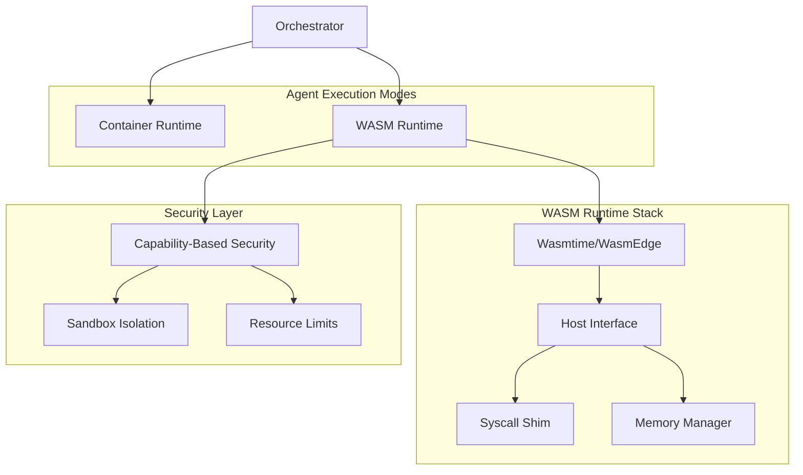
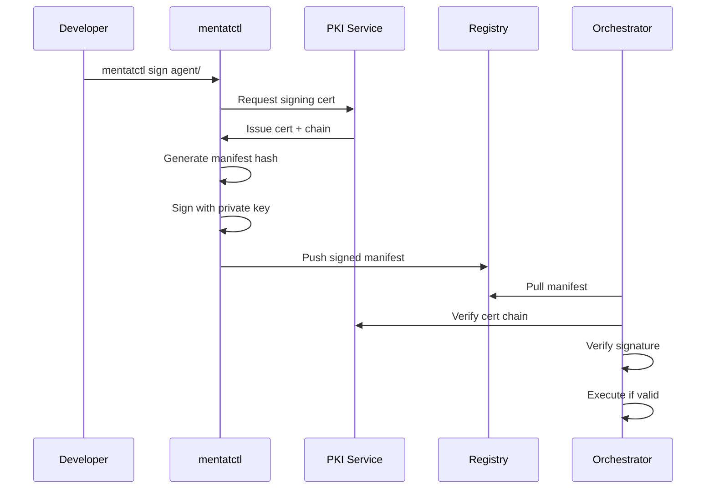
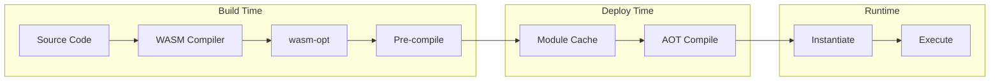

# MentatLab v1.0 Milestone Technical Specification
## WebAssembly Runtime Support & Signed Attestations

*Version: 1.0*  
*Date: August 1, 2025*  
*Timeline: Q1 2026*

---

## Executive Summary

This specification outlines the technical implementation for MentatLab's v1.0 milestone, introducing two transformative features:
1. **WebAssembly Runtime Support**: Sandboxed execution environment for agents using WASM modules
2. **Signed Attestations**: Cryptographic signing and verification of agent manifests

Building upon the Beta milestone's multimodal capabilities and streaming APIs, v1.0 establishes MentatLab as a secure, polyglot platform for AI agent orchestration with zero-trust execution and verifiable agent provenance.

---

## 1. WebAssembly Runtime Architecture

### 1.1 Core Runtime Components



### 1.2 WASM Module Structure

```wat
;; Example WASM agent module structure
(module
  ;; Import host functions
  (import "mentat" "read_input" (func $read_input (result i32)))
  (import "mentat" "write_output" (func $write_output (param i32 i32)))
  (import "mentat" "log" (func $log (param i32 i32)))
  
  ;; Memory for data exchange
  (memory (export "memory") 1 100) ;; 1-100 pages
  
  ;; Main entry point
  (func (export "process") (result i32)
    ;; Agent processing logic
    (call $read_input)
    ;; Process data...
    (call $write_output (i32.const 0) (i32.const 100))
    (i32.const 0) ;; Success
  )
  
  ;; Metadata exports
  (export "agent_version" (global $version))
  (global $version i32 (i32.const 1))
)
```

### 1.3 Host API Specification

```rust
// Host API exposed to WASM modules
pub trait MentatHostAPI {
    // Input/Output operations
    fn read_input(&mut self) -> Result<Vec<u8>, HostError>;
    fn write_output(&mut self, data: &[u8]) -> Result<(), HostError>;
    
    // Streaming operations
    fn start_stream(&mut self, stream_id: &str) -> Result<(), HostError>;
    fn write_stream(&mut self, stream_id: &str, chunk: &[u8]) -> Result<(), HostError>;
    fn end_stream(&mut self, stream_id: &str) -> Result<(), HostError>;
    
    // Multimodal operations
    fn download_media(&mut self, reference: &str) -> Result<Vec<u8>, HostError>;
    fn upload_media(&mut self, data: &[u8], media_type: &str) -> Result<String, HostError>;
    
    // Logging and metrics
    fn log(&mut self, level: LogLevel, message: &str) -> Result<(), HostError>;
    fn record_metric(&mut self, name: &str, value: f64) -> Result<(), HostError>;
    
    // Resource access (capability-based)
    fn request_capability(&mut self, cap: &str) -> Result<CapabilityHandle, HostError>;
    fn invoke_capability(&mut self, handle: CapabilityHandle, args: &[u8]) -> Result<Vec<u8>, HostError>;
}
```

### 1.4 Manifest Extensions for WASM

```yaml
# manifest.yaml with WASM support
id: mentatlab.wasm-example
version: 1.0.0
runtime: wasm  # NEW: indicates WASM runtime
module: agent.wasm  # NEW: WASM module file
image: harbor.lan/agents/wasm-example:1.0.0  # Fallback container image

# WASM-specific configuration
wasm:
  engine: wasmtime  # or wasmedge
  memory:
    initial: 10  # MB
    maximum: 100  # MB
  capabilities:  # Required capabilities
    - filesystem:read:/tmp
    - network:http:*.openai.com
    - env:OPENAI_API_KEY
  
  # Optional WASI configuration
  wasi:
    version: preview2
    preopens:
      /data: read-write
    env:
      - RUST_LOG=info
```

---

## 2. Cryptographic Signing and Attestation

### 2.1 Signing Architecture



### 2.2 Attestation Format

```yaml
# manifest.yaml with attestation
id: mentatlab.trusted-agent
version: 1.0.0
image: harbor.lan/agents/trusted:1.0.0

# Attestation block (NEW)
attestation:
  version: 1.0
  timestamp: "2026-01-15T10:30:00Z"
  signer:
    subject: "CN=john.doe@mentatlab.com,O=MentatLab,C=US"
    issuer: "CN=MentatLab Agent CA,O=MentatLab,C=US"
  algorithm: "SHA256withRSA"
  signature: |
    MEUCIQDxxx...base64...xxxIgYyy
  certificate_chain:
    - |
      -----BEGIN CERTIFICATE-----
      MIIDxxx...developer cert...xxx
      -----END CERTIFICATE-----
    - |
      -----BEGIN CERTIFICATE-----
      MIIExxx...intermediate CA...xxx
      -----END CERTIFICATE-----
```

### 2.3 Verification Process

```python
class ManifestVerifier:
    """Verify signed agent manifests"""
    
    def __init__(self, trust_store: TrustStore):
        self.trust_store = trust_store
        self.revocation_checker = RevocationChecker()
    
    async def verify_manifest(self, manifest: dict) -> VerificationResult:
        """Complete verification pipeline"""
        
        # 1. Extract attestation
        attestation = manifest.get("attestation")
        if not attestation:
            return VerificationResult(valid=False, reason="No attestation found")
        
        # 2. Verify certificate chain
        cert_chain = self._parse_cert_chain(attestation["certificate_chain"])
        chain_result = await self._verify_cert_chain(cert_chain)
        if not chain_result.valid:
            return chain_result
        
        # 3. Check revocation status
        for cert in cert_chain:
            if await self.revocation_checker.is_revoked(cert):
                return VerificationResult(valid=False, reason="Certificate revoked")
        
        # 4. Verify signature
        canonical_manifest = self._canonicalize_manifest(manifest)
        signature = base64.b64decode(attestation["signature"])
        
        if not self._verify_signature(canonical_manifest, signature, cert_chain[0]):
            return VerificationResult(valid=False, reason="Invalid signature")
        
        # 5. Check policy constraints
        policy_result = await self._check_policies(cert_chain[0], manifest)
        if not policy_result.valid:
            return policy_result
        
        return VerificationResult(
            valid=True,
            signer=self._extract_signer_info(cert_chain[0]),
            timestamp=attestation["timestamp"]
        )
```

### 2.4 PKI Infrastructure

```yaml
# PKI hierarchy for agent signing
root_ca:
  subject: "CN=MentatLab Root CA,O=MentatLab,C=US"
  validity: 10 years
  key_size: 4096
  
intermediate_ca:
  subject: "CN=MentatLab Agent CA,O=MentatLab,C=US"
  validity: 5 years
  key_size: 3072
  constraints:
    - pathLenConstraint: 0
    - keyUsage: keyCertSign, cRLSign
    
developer_cert:
  subject_template: "CN={email},O=MentatLab,C=US"
  validity: 1 year
  key_size: 2048
  extensions:
    - keyUsage: digitalSignature
    - extendedKeyUsage: codeSigning
    - subjectAltName: email:{email}
```

---

## 3. Multi-Language SDK Support

### 3.1 Language Support Matrix

| Language | Compilation Target | SDK Features | Status |
|----------|-------------------|--------------|---------| 
| Rust | Native WASM | Full API, zero-cost abstractions | Primary |
| AssemblyScript | WASM | TypeScript-like, full API | Primary |
| Go | TinyGo | Subset API, garbage collected | Primary |
| C/C++ | Emscripten | Full API, manual memory | Secondary |
| Python | Pyodide | Interpreted, limited performance | Experimental |
| JavaScript | QuickJS | Interpreted, sandboxed | Experimental |

### 3.2 Rust SDK Example

```rust
use mentat_sdk::prelude::*;

#[mentat_agent]
struct ImageClassifier {
    model: Option<Model>,
}

#[mentat_agent::main]
impl Agent for ImageClassifier {
    fn init(&mut self, context: &AgentContext) -> Result<()> {
        // Load model from cache or download
        self.model = Some(Model::load("resnet50.onnx")?);
        Ok(())
    }
    
    async fn process(&self, input: Input) -> Result<Output> {
        // Read image input
        let image_ref = input.get::<ImageReference>("image")?;
        let image_data = self.download_media(&image_ref).await?;
        
        // Process with model
        let tensor = preprocess_image(image_data)?;
        let predictions = self.model.as_ref().unwrap().predict(tensor)?;
        
        // Return classification
        Ok(Output::new()
            .add("classification", predictions.top_class())
            .add("confidence", predictions.top_confidence()))
    }
}

// Memory-efficient preprocessing
fn preprocess_image(data: Vec<u8>) -> Result<Tensor> {
    // WASM-optimized image processing
    let img = image::load_from_memory(&data)?;
    let resized = img.resize_exact(224, 224, FilterType::Lanczos3);
    Ok(Tensor::from_image(resized))
}
```

### 3.3 AssemblyScript SDK Example

```typescript
import { Agent, Input, Output, log } from "@mentat/sdk";

@agent
export class TextProcessor extends Agent {
  process(input: Input): Output {
    const text = input.getString("text");
    log.info(`Processing text of length: ${text.length}`);
    
    // Simple transformation
    const processed = text
      .split(" ")
      .map(word => word.charAt(0).toUpperCase() + word.slice(1))
      .join(" ");
    
    return Output.create()
      .setString("result", processed)
      .setNumber("word_count", text.split(" ").length);
  }
}
```

### 3.4 Go (TinyGo) SDK Example

```go
package main

import (
    "github.com/mentatlab/sdk-go/agent"
    "strings"
)

type WordCounter struct{}

func (w *WordCounter) Process(input agent.Input) (agent.Output, error) {
    text, err := input.GetString("text")
    if err != nil {
        return nil, err
    }
    
    words := strings.Fields(text)
    
    return agent.NewOutput().
        SetNumber("count", float64(len(words))).
        SetJSON("frequencies", countFrequencies(words)), nil
}

func main() {
    agent.Register(&WordCounter{})
    agent.Run()
}
```

---

## 4. Security Model

### 4.1 Capability-Based Security

```rust
// Capability system implementation
pub enum Capability {
    FileSystem { path: PathBuf, mode: AccessMode },
    Network { pattern: String, protocols: Vec<Protocol> },
    Environment { var: String },
    Compute { max_memory: usize, max_cpu_ms: u64 },
    Extension { name: String, config: Value },
}

impl CapabilitySystem {
    pub fn request(&mut self, cap: Capability) -> Result<Handle, SecurityError> {
        // Check if capability is allowed in manifest
        if !self.manifest_allows(&cap) {
            return Err(SecurityError::Unauthorized);
        }
        
        // Runtime policy check
        if !self.policy_engine.evaluate(&cap, &self.context) {
            return Err(SecurityError::PolicyDenied);
        }
        
        // Grant capability with handle
        let handle = Handle::new();
        self.granted.insert(handle, cap);
        Ok(handle)
    }
}
```

### 4.2 Sandbox Isolation

```yaml
# Sandbox configuration
sandbox:
  # Process isolation
  process:
    namespace: true
    seccomp: strict
    no_new_privs: true
    
  # Filesystem isolation
  filesystem:
    readonly_root: true
    temp_dirs:
      - /tmp: 100MB
    preopens:
      - /data: read-only
      
  # Network isolation
  network:
    mode: restricted  # none, restricted, full
    allowed_hosts:
      - "*.openai.com"
      - "api.anthropic.com"
    blocked_ports: [22, 25, 3389]
    
  # Resource limits
  resources:
    memory_limit: 512MB
    cpu_quota: 1000ms/s
    file_descriptors: 100
    process_count: 1
```

### 4.3 Security Policy Engine

```python
class SecurityPolicyEngine:
    """Evaluate security policies for WASM agents"""
    
    def __init__(self):
        self.policies = self._load_policies()
        self.audit_logger = AuditLogger()
    
    def evaluate(self, agent: Agent, capability: Capability) -> PolicyResult:
        """Evaluate if agent can use capability"""
        
        # Check agent trust level
        trust_level = self._get_trust_level(agent)
        
        # Apply policies
        for policy in self.policies:
            if policy.matches(agent, capability):
                result = policy.evaluate(trust_level, capability)
                
                # Audit log
                self.audit_logger.log({
                    "agent_id": agent.id,
                    "capability": capability.to_dict(),
                    "policy": policy.name,
                    "result": result.allowed,
                    "reason": result.reason
                })
                
                if not result.allowed:
                    return result
        
        return PolicyResult(allowed=True)
    
    def _get_trust_level(self, agent: Agent) -> TrustLevel:
        """Determine agent trust level based on attestation"""
        
        if not agent.attestation:
            return TrustLevel.UNTRUSTED
        
        if agent.attestation.signer in self.trusted_signers:
            return TrustLevel.VERIFIED
        
        if self._is_community_verified(agent.attestation):
            return TrustLevel.COMMUNITY
        
        return TrustLevel.SIGNED
```

---

## 5. Performance Optimization

### 5.1 WASM Compilation Pipeline



### 5.2 Memory Management

```rust
// Efficient memory allocation for WASM
pub struct WasmMemoryPool {
    pools: HashMap<usize, Vec<Memory>>,
    max_memory: usize,
}

impl WasmMemoryPool {
    pub fn allocate(&mut self, size: usize) -> Result<Memory, MemoryError> {
        // Round up to nearest page size
        let pages = (size + WASM_PAGE_SIZE - 1) / WASM_PAGE_SIZE;
        let actual_size = pages * WASM_PAGE_SIZE;
        
        // Check pool for reusable memory
        if let Some(pool) = self.pools.get_mut(&actual_size) {
            if let Some(memory) = pool.pop() {
                memory.zero(); // Clear for security
                return Ok(memory);
            }
        }
        
        // Allocate new memory
        if self.total_allocated() + actual_size > self.max_memory {
            return Err(MemoryError::OutOfMemory);
        }
        
        Memory::new(pages)
    }
    
    pub fn release(&mut self, memory: Memory) {
        let size = memory.size() * WASM_PAGE_SIZE;
        self.pools.entry(size)
            .or_insert_with(Vec::new)
            .push(memory);
    }
}
```

### 5.3 Performance Benchmarks

```yaml
# Target performance metrics
benchmarks:
  wasm_vs_container:
    cold_start:
      wasm: < 50ms
      container: < 500ms
    
    warm_start:
      wasm: < 5ms
      container: < 100ms
    
    memory_overhead:
      wasm: < 10MB
      container: < 100MB
    
    execution_overhead:
      simple_task: < 1.5x
      compute_intensive: < 2x
      io_bound: < 1.2x
  
  module_sizes:
    rust_hello_world: < 100KB
    assemblyscript_basic: < 50KB
    tinygo_simple: < 500KB
    
  concurrent_agents:
    wasm_instances: > 1000/node
    container_pods: > 100/node
```

---

## 6. Backward Compatibility

### 6.1 Dual Runtime Support

```python
class AgentRuntimeSelector:
    """Select appropriate runtime based on manifest"""
    
    def select_runtime(self, manifest: dict) -> Runtime:
        runtime_type = manifest.get("runtime", "python3.12")
        
        if runtime_type == "wasm":
            return WasmRuntime(
                engine=manifest.get("wasm", {}).get("engine", "wasmtime"),
                config=manifest.get("wasm", {})
            )
        
        # Legacy container runtime
        if runtime_type.startswith(("python", "node", "java")):
            return ContainerRuntime(
                image=manifest["image"],
                runtime=runtime_type
            )
        
        raise ValueError(f"Unknown runtime: {runtime_type}")
```

### 6.2 Migration Strategy

```yaml
# Migration path for existing agents
migration:
  phase1_analysis:
    - Scan existing agents for WASM compatibility
    - Identify required capabilities
    - Estimate performance impact
    
  phase2_preparation:
    - Add WASM SDK dependencies
    - Implement capability requests
    - Add attestation signing
    
  phase3_dual_mode:
    - Maintain both container and WASM versions
    - A/B test performance
    - Gradual rollout with feature flags
    
  phase4_transition:
    - Default to WASM for compatible agents
    - Keep container fallback
    - Update documentation

# Feature flags for gradual rollout
feature_flags:
  wasm_runtime:
    enabled: true
    rollout_percentage: 10
    whitelist_agents:
      - "mentatlab.example-*"
    blacklist_agents:
      - "legacy.*"
      
  attestation_required:
    enabled: false  # Start optional
    enforcement_date: "2026-04-01"
    grace_period_days: 90
```

---

## 7. CI/CD Pipeline Integration

### 7.1 WASM Build Pipeline

```yaml
# .github/workflows/wasm-agents.yml
name: Build WASM Agents

on:
  push:
    paths:
      - 'agents/**/*.rs'
      - 'agents/**/*.ts'
      - 'agents/**/*.go'

jobs:
  build-rust-wasm:
    runs-on: ubuntu-latest
    steps:
      - uses: actions/checkout@v3
      
      - name: Install Rust WASM target
        run: |
          rustup target add wasm32-wasi
          cargo install wasm-opt
      
      - name: Build WASM modules
        run: |
          for agent in agents/*/Cargo.toml; do
            dir=$(dirname $agent)
            cargo build --manifest-path $agent --target wasm32-wasi --release
            wasm-opt -O3 -o $dir/agent.wasm target/wasm32-wasi/release/*.wasm
          done
      
      - name: Sign modules
        env:
          SIGNING_KEY: ${{ secrets.AGENT_SIGNING_KEY }}
        run: |
          mentatctl sign --key-env SIGNING_KEY agents/*/manifest.yaml
      
      - name: Validate attestations
        run: |
          mentatctl verify agents/*/manifest.yaml

  security-scan:
    runs-on: ubuntu-latest
    steps:
      - name: WASM security analysis
        run: |
          # Check for dangerous imports
          wasm-tools validate --features all agents/**/*.wasm
          
          # Static analysis
          cargo audit --file agents/*/Cargo.lock
          
          # Capability usage audit
          mentatctl audit-capabilities agents/*/manifest.yaml
```

### 7.2 Attestation Signing Flow

```bash
#!/bin/bash
# sign-and-publish.sh

# Request signing certificate if not cached
if [ ! -f ~/.mentat/signing.crt ]; then
  mentatctl pki request-cert \
    --email developer@mentatlab.com \
    --output ~/.mentat/signing.crt \
    --key ~/.mentat/signing.key
fi

# Sign manifest
mentatctl sign \
  --cert ~/.mentat/signing.crt \
  --key ~/.mentat/signing.key \
  --manifest agents/my-agent/manifest.yaml

# Build and push
docker build -t harbor.lan/agents/my-agent:1.0.0 agents/my-agent/
docker push harbor.lan/agents/my-agent:1.0.0

# Publish signed manifest
mentatctl publish agents/my-agent/manifest.yaml
```

---

## 8. Example WASM Agents

### 8.1 Text Sentiment Analyzer (Rust)

```rust
// agents/sentiment-analyzer/src/lib.rs
use mentat_sdk::prelude::*;
use sentiment::analyze;

#[mentat_agent]
pub struct SentimentAnalyzer;

#[mentat_agent::main]
impl Agent for SentimentAnalyzer {
    async fn process(&self, input: Input) -> Result<Output> {
        let text = input.get_string("text")?;
        
        let result = analyze(&text);
        
        Ok(Output::new()
            .add("sentiment", result.label)
            .add("positive", result.positive_score)
            .add("negative", result.negative_score)
            .add("neutral", result.neutral_score))
    }
}
```

### 8.2 JSON Transformer (AssemblyScript)

```typescript
// agents/json-transformer/assembly/index.ts
import { Agent, Input, Output, JSON } from "@mentat/sdk";

@agent
export class JsonTransformer extends Agent {
  process(input: Input): Output {
    const data = input.getJSON("data");
    const template = input.getJSON("template");
    
    const transformed = this.applyTemplate(data, template);
    
    return Output.create()
      .setJSON("result", transformed);
  }
  
  private applyTemplate(data: JSON.Value, template: JSON.Value): JSON.Value {
    // Template-based transformation logic
    // ...
  }
}
```

### 8.3 Metric Calculator (TinyGo)

```go
// agents/metric-calculator/main.go
package main

import (
    "github.com/mentatlab/sdk-go/agent"
    "math"
)

type MetricCalculator struct{}

func (m *MetricCalculator) Process(input agent.Input) (agent.Output, error) {
    values, err := input.GetNumberArray("values")
    if err != nil {
        return nil, err
    }
    
    return agent.NewOutput().
        SetNumber("mean", mean(values)).
        SetNumber("median", median(values)).
        SetNumber("stddev", stddev(values)).
        SetNumber("min", min(values)).
        SetNumber("max", max(values)), nil
}

func main() {
    agent.Register(&MetricCalculator{})
    agent.Run()
}
```

---

## 9. Monitoring and Observability

### 9.1 WASM-Specific Metrics

```python
# Prometheus metrics for WASM runtime
wasm_module_instantiation_duration = Histogram(
    'mentatlab_wasm_instantiation_seconds',
    'Time to instantiate WASM module',
    ['agent_id', 'engine', 'module_size_bucket']
)

wasm_memory_usage_bytes = Gauge(
    'mentatlab_wasm_memory_bytes',
    'Current WASM memory usage',
    ['agent_id', 'instance_id']
)

wasm_execution_duration = Histogram(
    'mentatlab_wasm_execution_seconds',
    'WASM agent execution time',
    ['agent_id', 'operation']
)

attestation_verification_duration = Histogram(
    'mentatlab_attestation_verify_seconds',
    'Time to verify agent attestation',
    ['result', 'signer_org']
)

capability_requests_total = Counter(
    'mentatlab_capability_requests_total',
    'Total capability requests',
    ['agent_id', 'capability_type', 'result']
)
```

### 9.2 Audit Logging

```json
{
  "timestamp": "2026-01-15T10:30:45Z",
  "event_type": "agent_execution",
  "agent": {
    "id": "mentatlab.secure-processor",
    "version": "1.0.0",
    "runtime": "wasm",
    "attestation": {
      "verified": true,
      "signer": "jane.doe@mentatlab.com",
      "trust_level": "verified"
    }
  },
  "execution": {
    "instance_id": "wasm-abc123",
    "capabilities_requested": [
      "network:https:api.openai.com",
      "env:OPENAI_API_KEY"
    ],
    "memory_used_mb": 45,
    "execution_time_ms": 230,
    "result": "success"
  },
  "security": {
    "sandbox_violations": 0,
    "policy_checks": 3,
    "capability_grants": 2,
    "capability_denials": 0
  }
}
```

---

## 10. Testing Strategy

### 10.1 WASM Runtime Tests

```rust
#[cfg(test)]
mod tests {
    use super::*;
    use mentat_test::*;
    
    #[test]
    fn test_wasm_sandbox_isolation() {
        let runtime = WasmRuntime::new();
        let agent = runtime.load_module("test-agent.wasm").unwrap();
        
        // Attempt forbidden operations
        let result = agent.try_access_filesystem("/etc/passwd");
        assert!(matches!(result, Err(SecurityError::Forbidden)));
        
        let result = agent.try_network_access("evil.com");
        assert!(matches!(result, Err(SecurityError::Unauthorized)));
    }
    
    #[test]
    fn test_memory_limits() {
        let runtime = WasmRuntime::new();
        let agent = runtime.load_module("memory-hog.wasm").unwrap();
        
        // Set 50MB limit
        agent.set_memory_limit(50 * 1024 * 1024);
        
        // Should fail when exceeding limit
        let result = agent.execute(Input::new());
        assert!(matches!(result, Err(RuntimeError::OutOfMemory)));
    }
}
```

### 10.2 Attestation Tests

```python
def test_attestation_verification():
    """Test complete attestation flow"""
    
    # Create test manifest
    manifest = {
        "id": "test.agent",
        "version": "1.0.0",
        "runtime": "wasm"
    }
    
    # Sign manifest
    signer = ManifestSigner(test_private_key)
    signed_manifest = signer.sign(manifest)
    
    # Verify
    verifier = ManifestVerifier(test_trust_store)
    result = verifier.verify_manifest(signed_manifest)
    
    assert result.valid
    assert result.signer == "test@mentatlab.com"

def test_revoked_certificate():
    """Test handling of revoked certificates"""
    
    # Use revoked cert
    signed_manifest = create_signed_manifest(revoked_cert)
    
    verifier = ManifestVerifier(test_trust_store)
    result = verifier.verify_manifest(signed_manifest)
    
    assert not result.valid
    assert "revoked" in result.reason.lower()
```

---

## 11. Documentation Updates

### 11.1 Developer Guide Structure

```markdown
# MentatLab WASM Agent Development Guide

## Getting Started
- Setting up WASM development environment
- Choosing the right language
- Hello World WASM agent

## SDK Guides
- Rust SDK complete reference
- AssemblyScript for TypeScript developers  
- TinyGo limitations and workarounds

## Security Model
- Understanding capabilities
- Requesting permissions
- Security best practices

## Attestation
- Setting up signing certificates
- CI/CD integration
- Troubleshooting verification

## Performance
- Optimization techniques
- Memory management
- Benchmarking agents

## Migration
- Converting container agents to WASM
- Dual-mode deployment
- Rollback strategies
```

---

## 12. Rollout Plan

### Phase 1: Foundation (Weeks 1-4)
- [ ] WASM runtime integration with Wasmtime
- [ ] Basic host API implementation
- [ ] Simple test agents in Rust

### Phase 2: Security (Weeks 5-8)
- [ ] PKI infrastructure setup
- [ ] Attestation signing/verification
- [ ] Capability-based security system

### Phase 3: SDK Development (Weeks 9-10)
- [ ] Rust SDK finalization
- [ ] AssemblyScript SDK
- [ ] TinyGo SDK

### Phase 4: Integration (Weeks 11-12)
- [ ] Orchestrator dual-runtime support
- [ ] CI/CD pipeline updates
- [ ] Performance optimization

### Phase 5: Production (Weeks 13-14)
- [ ] Security audits
- [ ] Load testing
- [ ] Documentation completion
- [ ] GA release

---

## 13. Success Metrics

### Technical Metrics
- **Cold Start**: < 50ms for WASM vs < 500ms container
- **Memory Usage**: < 10MB base overhead per WASM instance
- **Concurrent Agents**: > 1000 WASM instances per node
- **Attestation Verification**: < 10ms per manifest

### Security Metrics
- **Sandbox Escapes**: 0 in penetration testing
- **Capability Violations**: < 0.01% in production
- **Certificate Adoption**: > 80% agents signed within 90 days

### Business Metrics
- **WASM Adoption**: > 50% new agents use WASM
- **Performance Improvement**: 5x density increase
- **Security Incidents**: 50% reduction vs containers

---

## Appendix A: Complete WASM Agent Example

```rust
// Full example: AI-powered code reviewer
use mentat_sdk::prelude::*;
use tree_sitter::{Parser, Language};

#[mentat_agent]
pub struct CodeReviewer {
    parser: Parser,
    ai_client: Option<AIClient>,
}

#[mentat_agent::main]
impl Agent for CodeReviewer {
    fn init(&mut self, ctx: &AgentContext) -> Result<()> {
        // Initialize parser
        self.parser = Parser::new();
        self.parser.set_language(tree_sitter_rust::language())?;
        
        // Request AI capability
        let ai_cap = ctx.request_capability(
            Capability::Network {
                pattern: "https://api.openai.com/*".to_string(),
                protocols: vec![Protocol::Https],
            }
        )?;
        
        self.ai_client = Some(AIClient::new(ai_cap));
        Ok(())
    }
    
    async fn process(&self, input: Input) -> Result<Output> {
        let code = input.get_string("code")?;
        let language = input.get_string("language")?;
        
        // Parse code structure
        let tree = self.parser.parse(&code, None)
            .ok_or("Failed to parse code")?;
        
        // Extract interesting patterns
        let patterns = self.extract_patterns(&tree);
        
        // Get AI review if available
        let ai_review = if let Some(client) = &self.ai_client {
            client.review_code(&code, &patterns).await?
        } else {
            "AI review not available".to_string()
        };
        
        Ok(Output::new()
            .add("syntax_valid", tree.root_node().has_error() == false)
            .add("patterns", patterns)
            .add("ai_review", ai_review)
            .add("metrics", self.calculate_metrics(&tree)))
    }
}
```

---

This comprehensive specification establishes MentatLab v1.0 as a secure, high-performance platform for AI agent orchestration, combining the power of WebAssembly's polyglot support with the trust guarantees of cryptographic attestations.