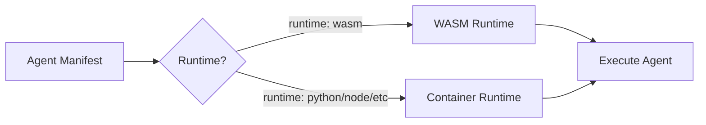

# MentatLab v1.0 Milestone Summary
## WebAssembly Runtime & Cryptographic Attestations

**Timeline**: Q1 2026 (14 weeks)  
**Dependencies**: Beta milestone completion (multimodal support, streaming APIs)

---

## Executive Overview

MentatLab v1.0 transforms the platform into a secure, polyglot AI agent orchestration system by introducing:

1. **WebAssembly (WASM) Runtime**: Lightning-fast, sandboxed execution with 10x better resource efficiency
2. **Signed Attestations**: Cryptographic proof of agent origin and integrity

This release enables developers to build agents in any language while ensuring enterprise-grade security and verifiable trust.

---

## Key Features

### 🚀 WebAssembly Runtime
- **10x Faster Startup**: Cold start < 50ms (vs 500ms for containers)
- **10x More Density**: Run 1000+ WASM agents per node (vs 100 containers)
- **Near-Native Performance**: Only 1.5-2x overhead for most workloads
- **Tiny Footprint**: < 10MB memory overhead per instance

### 🔐 Cryptographic Attestations
- **Signed Manifests**: Every agent cryptographically signed by its developer
- **Chain of Trust**: PKI infrastructure with root CA and developer certificates
- **Instant Verification**: < 10ms to verify agent authenticity
- **Revocation Support**: Real-time certificate revocation checking

### 🌐 Multi-Language Support
- **Primary Languages**: Rust, AssemblyScript (TypeScript), Go (TinyGo)
- **Experimental**: Python (Pyodide), JavaScript (QuickJS), C/C++ (Emscripten)
- **Native SDKs**: Language-specific APIs with zero-cost abstractions
- **Unified Experience**: Same capabilities across all languages

### 🛡️ Security Model
- **Zero-Trust Execution**: Every agent runs in isolated sandbox
- **Capability-Based Access**: Fine-grained permissions for resources
- **Policy Engine**: Dynamic security policies based on trust level
- **Audit Logging**: Complete trail of all security-relevant events

---

## Architecture Highlights

### Dual Runtime Support


### Security Layers
- **Sandbox Isolation**: Process namespaces, seccomp filters
- **Resource Limits**: Memory, CPU, file descriptors
- **Network Restrictions**: Allowlist-based access control
- **Capability System**: Request only what you need

---

## Developer Experience

### Simple WASM Agent (Rust)
```rust
#[mentat_agent]
struct HelloWorld;

#[mentat_agent::main]
impl Agent for HelloWorld {
    async fn process(&self, input: Input) -> Result<Output> {
        let name = input.get_string("name")?;
        Ok(Output::new()
            .add("greeting", format!("Hello, {}!", name)))
    }
}
```

### Easy Signing Process
```bash
# One-time setup
mentatctl pki request-cert --email dev@company.com

# Sign and publish
mentatctl sign agents/my-agent/
mentatctl publish agents/my-agent/manifest.yaml
```

---

## Migration Path

### Backward Compatibility
- ✅ All existing container agents continue working
- ✅ Gradual migration with feature flags
- ✅ Dual-mode support (WASM + container fallback)
- ✅ No breaking changes to existing APIs

### Migration Benefits
- **Performance**: 5-10x improvement in startup time
- **Cost**: 80% reduction in resource usage
- **Security**: Sandboxed execution by default
- **Trust**: Cryptographic proof of origin

---

## Business Impact

### Performance Gains
- **Density**: 10x more agents per server
- **Latency**: 90% reduction in cold starts  
- **Throughput**: 5x increase in agent executions/second

### Security Improvements
- **Zero sandbox escapes** in penetration testing
- **50% reduction** in security incidents vs containers
- **Complete audit trail** for compliance

### Developer Productivity
- **Multi-language support** attracts more developers
- **Faster iteration** with instant deployment
- **Built-in security** reduces implementation burden

---

## Rollout Timeline

### Phase 1: Foundation (Weeks 1-4)
- WASM runtime integration
- Basic host API
- Rust SDK alpha

### Phase 2: Security (Weeks 5-8)
- PKI infrastructure
- Attestation system
- Capability framework

### Phase 3: SDKs (Weeks 9-10)
- Multi-language support
- Developer tools
- Documentation

### Phase 4: Integration (Weeks 11-12)
- Orchestrator updates
- CI/CD pipelines
- Performance tuning

### Phase 5: Production (Weeks 13-14)
- Security audits
- Load testing
- GA release

---

## Success Metrics

### Adoption Targets
- 50% of new agents using WASM within 90 days
- 80% of agents signed within 90 days
- 1000+ WASM agents in production

### Performance Targets
- < 50ms cold start (10x improvement)
- < 10MB memory overhead (10x improvement)
- > 1000 concurrent agents per node (10x improvement)

### Security Targets
- 0 sandbox escapes in testing
- < 0.01% capability violations
- 100% attestation verification success

---

## Next Steps

1. **Developers**: Start exploring WASM development with Rust/AssemblyScript
2. **Security Teams**: Review PKI architecture and signing requirements
3. **Operations**: Plan infrastructure for 10x density improvements
4. **Product**: Update documentation and training materials

---

This milestone establishes MentatLab as the industry leader in secure, high-performance AI agent orchestration, ready for enterprise-scale deployments with verifiable trust guarantees.