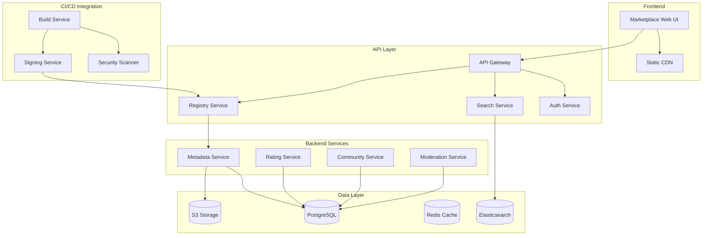

# MentatLab v1.1 Milestone Technical Specification
## Agent Marketplace & Enhanced Developer Experience

*Version: 1.0*  
*Date: August 1, 2025*  
*Timeline: Q2 2026*

---

## Executive Summary

This specification outlines the technical implementation for MentatLab's v1.1 milestone, introducing two transformative features:
1. **Agent Marketplace**: A web-based discovery platform with search, ratings, and community features
2. **Enhanced mentatctl CLI**: Improved local development workflow with testing, debugging, and profiling tools

Building upon v1.0's WASM runtime and cryptographic attestations, v1.1 establishes MentatLab as a thriving ecosystem for agent development, sharing, and collaboration.

---

## 1. Agent Marketplace Architecture

### 1.1 High-Level Architecture



### 1.2 Database Schema

```sql
-- Core agent registry
CREATE TABLE agents (
    id UUID PRIMARY KEY DEFAULT gen_random_uuid(),
    agent_id VARCHAR(255) UNIQUE NOT NULL, -- e.g., "mentatlab.image-classifier"
    publisher_id UUID REFERENCES users(id),
    created_at TIMESTAMPTZ DEFAULT NOW(),
    updated_at TIMESTAMPTZ DEFAULT NOW(),
    
    -- Metadata
    display_name VARCHAR(255) NOT NULL,
    summary TEXT NOT NULL,
    description TEXT,
    keywords TEXT[],
    categories TEXT[],
    
    -- Stats
    download_count INTEGER DEFAULT 0,
    star_count INTEGER DEFAULT 0,
    fork_count INTEGER DEFAULT 0,
    
    -- Flags
    is_verified BOOLEAN DEFAULT FALSE,
    is_featured BOOLEAN DEFAULT FALSE,
    is_deprecated BOOLEAN DEFAULT FALSE,
    visibility VARCHAR(20) DEFAULT 'public' -- public, unlisted, private
);

-- Agent versions
CREATE TABLE agent_versions (
    id UUID PRIMARY KEY DEFAULT gen_random_uuid(),
    agent_id UUID REFERENCES agents(id) ON DELETE CASCADE,
    version VARCHAR(50) NOT NULL, -- SemVer
    manifest JSONB NOT NULL,
    
    -- Attestation data
    signature TEXT,
    signer_cert TEXT,
    signed_at TIMESTAMPTZ,
    trust_level VARCHAR(20), -- untrusted, signed, verified, certified
    
    -- Package data
    wasm_url TEXT,
    container_url TEXT,
    source_url TEXT,
    size_bytes BIGINT,
    
    -- Dependencies
    dependencies JSONB DEFAULT '[]'::JSONB,
    peer_dependencies JSONB DEFAULT '[]'::JSONB,
    
    -- Metadata
    changelog TEXT,
    license VARCHAR(50),
    min_mentat_version VARCHAR(20),
    
    created_at TIMESTAMPTZ DEFAULT NOW(),
    published_at TIMESTAMPTZ,
    yanked BOOLEAN DEFAULT FALSE,
    yank_reason TEXT,
    
    UNIQUE(agent_id, version)
);

-- User profiles for publishers
CREATE TABLE users (
    id UUID PRIMARY KEY DEFAULT gen_random_uuid(),
    username VARCHAR(50) UNIQUE NOT NULL,
    email VARCHAR(255) UNIQUE NOT NULL,
    display_name VARCHAR(255),
    bio TEXT,
    avatar_url TEXT,
    website_url TEXT,
    github_username VARCHAR(50),
    
    -- Verification
    is_verified BOOLEAN DEFAULT FALSE,
    verification_type VARCHAR(20), -- email, github, enterprise
    
    -- Stats
    agent_count INTEGER DEFAULT 0,
    total_downloads INTEGER DEFAULT 0,
    reputation_score INTEGER DEFAULT 0,
    
    created_at TIMESTAMPTZ DEFAULT NOW(),
    updated_at TIMESTAMPTZ DEFAULT NOW()
);

-- Ratings and reviews
CREATE TABLE reviews (
    id UUID PRIMARY KEY DEFAULT gen_random_uuid(),
    agent_id UUID REFERENCES agents(id) ON DELETE CASCADE,
    user_id UUID REFERENCES users(id),
    version VARCHAR(50),
    
    rating INTEGER CHECK (rating >= 1 AND rating <= 5),
    title VARCHAR(255),
    content TEXT,
    
    -- Helpful votes
    helpful_count INTEGER DEFAULT 0,
    not_helpful_count INTEGER DEFAULT 0,
    
    -- Moderation
    is_flagged BOOLEAN DEFAULT FALSE,
    moderation_status VARCHAR(20) DEFAULT 'pending',
    
    created_at TIMESTAMPTZ DEFAULT NOW(),
    updated_at TIMESTAMPTZ DEFAULT NOW()
);

-- Download tracking
CREATE TABLE downloads (
    id BIGSERIAL PRIMARY KEY,
    agent_id UUID REFERENCES agents(id),
    version VARCHAR(50),
    user_id UUID REFERENCES users(id),
    ip_hash VARCHAR(64),
    user_agent TEXT,
    
    -- Context
    source VARCHAR(50), -- cli, web, api, flow
    mentat_version VARCHAR(20),
    
    downloaded_at TIMESTAMPTZ DEFAULT NOW()
);

-- Collections (curated lists)
CREATE TABLE collections (
    id UUID PRIMARY KEY DEFAULT gen_random_uuid(),
    owner_id UUID REFERENCES users(id),
    name VARCHAR(255) NOT NULL,
    description TEXT,
    is_public BOOLEAN DEFAULT TRUE,
    
    -- Stats
    subscriber_count INTEGER DEFAULT 0,
    
    created_at TIMESTAMPTZ DEFAULT NOW(),
    updated_at TIMESTAMPTZ DEFAULT NOW()
);

CREATE TABLE collection_items (
    collection_id UUID REFERENCES collections(id) ON DELETE CASCADE,
    agent_id UUID REFERENCES agents(id) ON DELETE CASCADE,
    added_at TIMESTAMPTZ DEFAULT NOW(),
    notes TEXT,
    
    PRIMARY KEY (collection_id, agent_id)
);
```

### 1.3 API Endpoints

```yaml
openapi: 3.0.3
info:
  title: MentatLab Marketplace API
  version: 1.1.0

paths:
  /api/v1/marketplace/agents:
    get:
      summary: Search and list agents
      parameters:
        - name: q
          in: query
          schema:
            type: string
          description: Search query
        - name: category
          in: query
          schema:
            type: string
        - name: sort
          in: query
          schema:
            type: string
            enum: [relevance, downloads, stars, recent, trending]
        - name: filter
          in: query
          schema:
            type: object
            properties:
              verified: boolean
              has_wasm: boolean
              min_rating: number
      responses:
        200:
          content:
            application/json:
              schema:
                type: object
                properties:
                  agents:
                    type: array
                    items:
                      $ref: '#/components/schemas/AgentSummary'
                  pagination:
                    $ref: '#/components/schemas/Pagination'

  /api/v1/marketplace/agents/{agent_id}:
    get:
      summary: Get agent details
      parameters:
        - name: agent_id
          in: path
          required: true
          schema:
            type: string
      responses:
        200:
          content:
            application/json:
              schema:
                $ref: '#/components/schemas/AgentDetail'

  /api/v1/marketplace/agents/{agent_id}/versions:
    get:
      summary: List agent versions
      responses:
        200:
          content:
            application/json:
              schema:
                type: array
                items:
                  $ref: '#/components/schemas/AgentVersion'

  /api/v1/marketplace/agents/{agent_id}/reviews:
    get:
      summary: Get agent reviews
    post:
      summary: Submit a review
      security:
        - bearerAuth: []

  /api/v1/marketplace/publish:
    post:
      summary: Publish a new agent or version
      security:
        - bearerAuth: []
      requestBody:
        content:
          multipart/form-data:
            schema:
              type: object
              properties:
                manifest:
                  type: string
                  format: binary
                wasm_module:
                  type: string
                  format: binary
                attestation:
                  type: object

components:
  schemas:
    AgentSummary:
      type: object
      properties:
        id: string
        agent_id: string
        display_name: string
        summary: string
        publisher:
          type: object
          properties:
            username: string
            is_verified: boolean
        latest_version: string
        download_count: integer
        star_count: integer
        rating_avg: number
        categories: array
        is_verified: boolean
        has_wasm: boolean
```

### 1.4 Search Infrastructure

```python
# Elasticsearch mapping for agent search
agent_search_mapping = {
    "mappings": {
        "properties": {
            "agent_id": {"type": "keyword"},
            "display_name": {
                "type": "text",
                "analyzer": "standard",
                "fields": {
                    "keyword": {"type": "keyword"},
                    "suggest": {"type": "completion"}
                }
            },
            "summary": {"type": "text"},
            "description": {"type": "text"},
            "keywords": {"type": "keyword"},
            "categories": {"type": "keyword"},
            
            # Publisher info
            "publisher": {
                "properties": {
                    "username": {"type": "keyword"},
                    "display_name": {"type": "text"},
                    "is_verified": {"type": "boolean"}
                }
            },
            
            # Metrics for ranking
            "download_count": {"type": "long"},
            "star_count": {"type": "long"},
            "rating_avg": {"type": "float"},
            "rating_count": {"type": "long"},
            
            # Boost factors
            "is_verified": {"type": "boolean"},
            "is_featured": {"type": "boolean"},
            "has_wasm": {"type": "boolean"},
            "last_updated": {"type": "date"},
            
            # Version info
            "versions": {
                "type": "nested",
                "properties": {
                    "version": {"type": "keyword"},
                    "published_at": {"type": "date"},
                    "trust_level": {"type": "keyword"}
                }
            }
        }
    }
}

# Search relevance algorithm
class AgentSearchService:
    def search(self, query: str, filters: dict) -> SearchResults:
        """Advanced search with ML-powered relevance"""
        
        # Build Elasticsearch query
        es_query = {
            "query": {
                "function_score": {
                    "query": {
                        "multi_match": {
                            "query": query,
                            "fields": [
                                "display_name^3",
                                "summary^2",
                                "description",
                                "keywords^2",
                                "publisher.display_name"
                            ]
                        }
                    },
                    "functions": [
                        # Boost verified agents
                        {
                            "filter": {"term": {"is_verified": True}},
                            "weight": 1.5
                        },
                        # Boost by popularity
                        {
                            "field_value_factor": {
                                "field": "download_count",
                                "factor": 1.2,
                                "modifier": "log1p"
                            }
                        },
                        # Boost by rating
                        {
                            "field_value_factor": {
                                "field": "rating_avg",
                                "factor": 1.5,
                                "missing": 3.0
                            }
                        },
                        # Recency boost
                        {
                            "decay": {
                                "last_updated": {
                                    "scale": "30d",
                                    "decay": 0.5
                                }
                            }
                        }
                    ],
                    "score_mode": "multiply"
                }
            },
            "post_filter": self._build_filters(filters),
            "aggs": {
                "categories": {"terms": {"field": "categories"}},
                "trust_levels": {"terms": {"field": "versions.trust_level"}}
            }
        }
        
        return self.es_client.search(index="agents", body=es_query)
```

### 1.5 Web UI Components

```typescript
// Frontend architecture using React + TypeScript

// Main marketplace page
export const MarketplacePage: React.FC = () => {
  const [searchQuery, setSearchQuery] = useState("");
  const [filters, setFilters] = useState<FilterState>({});
  const [sortBy, setSortBy] = useState<SortOption>("relevance");
  
  const { data: agents, loading } = useAgentSearch({
    query: searchQuery,
    filters,
    sort: sortBy
  });
  
  return (
    <div className="marketplace-container">
      <MarketplaceHeader />
      
      <div className="search-section">
        <SearchBar 
          value={searchQuery}
          onChange={setSearchQuery}
          placeholder="Search agents..."
        />
        <FilterPanel 
          filters={filters}
          onChange={setFilters}
        />
      </div>
      
      <div className="results-section">
        <SortDropdown value={sortBy} onChange={setSortBy} />
        <AgentGrid agents={agents} loading={loading} />
      </div>
    </div>
  );
};

// Agent detail page
export const AgentDetailPage: React.FC<{agentId: string}> = ({agentId}) => {
  const { data: agent } = useAgent(agentId);
  const [selectedVersion, setSelectedVersion] = useState<string>();
  
  return (
    <div className="agent-detail">
      <AgentHeader agent={agent} />
      
      <div className="content-grid">
        <div className="main-content">
          <TabPanel>
            <Tab label="Overview">
              <AgentOverview agent={agent} />
            </Tab>
            <Tab label="Documentation">
              <AgentDocs agent={agent} version={selectedVersion} />
            </Tab>
            <Tab label="Versions">
              <VersionHistory 
                agent={agent}
                onVersionSelect={setSelectedVersion}
              />
            </Tab>
            <Tab label="Reviews">
              <ReviewSection agentId={agentId} />
            </Tab>
          </TabPanel>
        </div>
        
        <div className="sidebar">
          <InstallInstructions 
            agent={agent} 
            version={selectedVersion}
          />
          <AgentStats agent={agent} />
          <PublisherCard publisher={agent.publisher} />
          <DependencyTree agent={agent} version={selectedVersion} />
        </div>
      </div>
    </div>
  );
};

// Component library
interface AgentCardProps {
  agent: AgentSummary;
  onClick?: () => void;
}

export const AgentCard: React.FC<AgentCardProps> = ({agent, onClick}) => (
  <div className="agent-card" onClick={onClick}>
    <div className="card-header">
      <h3>{agent.display_name}</h3>
      {agent.is_verified && <VerifiedBadge />}
    </div>
    
    <p className="summary">{agent.summary}</p>
    
    <div className="metadata">
      <div className="categories">
        {agent.categories.map(cat => (
          <CategoryChip key={cat} category={cat} />
        ))}
      </div>
      
      <div className="stats">
        <StarRating value={agent.rating_avg} count={agent.rating_count} />
        <DownloadCount count={agent.download_count} />
      </div>
    </div>
    
    <div className="publisher">
      <PublisherAvatar publisher={agent.publisher} />
      <span className="version">v{agent.latest_version}</span>
    </div>
  </div>
);
```

---

## 2. Enhanced mentatctl CLI

### 2.1 Command Structure

```bash
# New command hierarchy
mentatctl
├── agent           # Agent management
│   ├── new         # Scaffold new agent
│   ├── test        # Run agent tests
│   ├── build       # Build agent (container/WASM)
│   ├── publish     # Publish to marketplace
│   ├── search      # Search marketplace
│   ├── install     # Install from marketplace
│   └── info        # Show agent details
├── dev             # Development tools
│   ├── run         # Run agent locally
│   ├── debug       # Debug with breakpoints
│   ├── profile     # Performance profiling
│   ├── watch       # Hot reload mode
│   └── shell       # Interactive agent shell
├── flow            # Flow management (existing)
│   ├── run
│   ├── plan
│   └── convert
├── registry        # Local registry
│   ├── add         # Add agent to local registry
│   ├── remove      # Remove from local registry
│   ├── list        # List local agents
│   └── sync        # Sync with marketplace
└── config          # Configuration
    ├── set         # Set config values
    ├── get         # Get config values
    └── auth        # Authenticate with marketplace
```

### 2.2 Agent Development Commands

```python
# cli/mentatctl/commands/agent.py
import typer
from pathlib import Path
from typing import Optional
import yaml
import docker
import subprocess

app = typer.Typer()

@app.command()
def new(
    name: str = typer.Argument(..., help="Agent name (e.g., 'image-classifier')"),
    template: str = typer.Option("python", help="Template to use"),
    author: str = typer.Option(None, help="Author name"),
    org: str = typer.Option("mentatlab", help="Organization prefix")
):
    """Create a new agent from template"""
    
    agent_id = f"{org}.{name}"
    agent_dir = Path(f"agents/{name}")
    
    if agent_dir.exists():
        typer.echo(f"Error: Directory {agent_dir} already exists")
        raise typer.Exit(1)
    
    # Create directory structure
    agent_dir.mkdir(parents=True)
    (agent_dir / "src").mkdir()
    (agent_dir / "tests").mkdir()
    (agent_dir / "docs").mkdir()
    
    # Generate manifest
    manifest = {
        "id": agent_id,
        "version": "0.1.0",
        "image": f"harbor.lan/agents/{name}:0.1.0",
        "runtime": TEMPLATE_RUNTIMES[template],
        "description": f"TODO: Add description for {name}",
        "author": author or "Unknown",
        "license": "MIT",
        "inputs": [
            {"name": "input", "type": "string", "description": "TODO"}
        ],
        "outputs": [
            {"name": "output", "type": "string", "description": "TODO"}
        ],
        "resources": {
            "cpu": "1",
            "memory": "1Gi"
        }
    }
    
    with open(agent_dir / "manifest.yaml", "w") as f:
        yaml.dump(manifest, f, default_flow_style=False)
    
    # Copy template files
    copy_template(template, agent_dir)
    
    # Initialize git repo
    subprocess.run(["git", "init"], cwd=agent_dir)
    
    typer.echo(f"✅ Created new agent: {agent_id}")
    typer.echo(f"📁 Location: {agent_dir}")
    typer.echo("\nNext steps:")
    typer.echo("  1. cd " + str(agent_dir))
    typer.echo("  2. Edit manifest.yaml")
    typer.echo("  3. Implement your agent logic in src/")
    typer.echo("  4. mentatctl agent test")
    typer.echo("  5. mentatctl agent publish")

@app.command()
def test(
    path: Path = typer.Argument(".", help="Agent directory"),
    verbose: bool = typer.Option(False, "-v", "--verbose"),
    coverage: bool = typer.Option(False, "--coverage"),
    integration: bool = typer.Option(False, "--integration")
):
    """Run agent tests"""
    
    manifest_path = path / "manifest.yaml"
    if not manifest_path.exists():
        typer.echo("Error: No manifest.yaml found")
        raise typer.Exit(1)
    
    with open(manifest_path) as f:
        manifest = yaml.safe_load(f)
    
    runtime = manifest.get("runtime", "python3.12")
    
    # Run unit tests
    typer.echo("🧪 Running unit tests...")
    if runtime.startswith("python"):
        cmd = ["pytest", "tests/"]
        if verbose:
            cmd.append("-v")
        if coverage:
            cmd.extend(["--cov=src", "--cov-report=term-missing"])
        
        result = subprocess.run(cmd, cwd=path)
        if result.returncode != 0:
            raise typer.Exit(1)
    
    # Run integration tests
    if integration:
        typer.echo("\n🔗 Running integration tests...")
        run_integration_tests(path, manifest)
    
    typer.echo("\n✅ All tests passed!")

@app.command()
def build(
    path: Path = typer.Argument(".", help="Agent directory"),
    push: bool = typer.Option(False, "--push"),
    platform: str = typer.Option("linux/amd64", "--platform"),
    wasm: bool = typer.Option(False, "--wasm", help="Build WASM module")
):
    """Build agent container or WASM module"""
    
    manifest_path = path / "manifest.yaml"
    with open(manifest_path) as f:
        manifest = yaml.safe_load(f)
    
    if wasm and manifest.get("runtime") == "wasm":
        build_wasm_module(path, manifest)
    else:
        build_container(path, manifest, platform, push)

@app.command()
def publish(
    path: Path = typer.Argument(".", help="Agent directory"),
    registry: str = typer.Option(None, "--registry"),
    dry_run: bool = typer.Option(False, "--dry-run")
):
    """Publish agent to marketplace"""
    
    # Load and validate manifest
    manifest_path = path / "manifest.yaml"
    with open(manifest_path) as f:
        manifest = yaml.safe_load(f)
    
    # Check authentication
    auth_token = get_auth_token()
    if not auth_token:
        typer.echo("Error: Not authenticated. Run 'mentatctl config auth'")
        raise typer.Exit(1)
    
    # Run pre-publish checks
    typer.echo("🔍 Running pre-publish checks...")
    checks = run_prepublish_checks(path, manifest)
    if not checks.passed:
        typer.echo("❌ Pre-publish checks failed:")
        for error in checks.errors:
            typer.echo(f"  - {error}")
        raise typer.Exit(1)
    
    # Build and sign
    typer.echo("🔨 Building agent...")
    build_result = build_for_publish(path, manifest)
    
    typer.echo("🔏 Signing manifest...")
    signed_manifest = sign_manifest(manifest, path)
    
    if dry_run:
        typer.echo("\n📋 Dry run - would publish:")
        typer.echo(f"  Agent: {manifest['id']}")
        typer.echo(f"  Version: {manifest['version']}")
        typer.echo(f"  Size: {build_result.size_bytes} bytes")
        return
    
    # Upload to marketplace
    typer.echo("📤 Publishing to marketplace...")
    result = marketplace_client.publish(
        manifest=signed_manifest,
        artifacts=build_result.artifacts,
        auth_token=auth_token
    )
    
    typer.echo(f"\n✅ Published {manifest['id']}@{manifest['version']}")
    typer.echo(f"🔗 View at: {result.marketplace_url}")
```

### 2.3 Local Development Tools

```python
# cli/mentatctl/commands/dev.py

@app.command()
def run(
    agent_path: Path = typer.Argument(...),
    input_file: Optional[Path] = typer.Option(None, "--input"),
    params: Optional[str] = typer.Option(None, "--params"),
    follow: bool = typer.Option(False, "--follow", "-f"),
    debug: bool = typer.Option(False, "--debug"),
    profile: bool = typer.Option(False, "--profile")
):
    """Run agent locally with hot reload"""
    
    manifest = load_manifest(agent_path)
    
    # Set up local environment
    env_manager = LocalEnvironmentManager()
    env = env_manager.create_environment(manifest)
    
    # Configure debugging
    if debug:
        env.enable_debugging(port=5678)
        typer.echo("🐛 Debug server listening on port 5678")
    
    # Configure profiling
    if profile:
        env.enable_profiling()
        typer.echo("📊 Profiling enabled")
    
    # Prepare input
    if input_file:
        with open(input_file) as f:
            input_data = json.load(f)
    elif params:
        input_data = json.loads(params)
    else:
        input_data = {}
    
    # Run with file watching
    if follow:
        watcher = FileWatcher(agent_path)
        watcher.on_change(lambda: restart_agent(env, manifest, input_data))
        watcher.start()
    
    # Execute agent
    typer.echo(f"🚀 Running {manifest['id']}...")
    result = env.run_agent(manifest, input_data)
    
    # Display results
    display_agent_output(result)
    
    if profile:
        display_profiling_results(env.get_profile_data())

@app.command()
def debug(
    agent_path: Path = typer.Argument(...),
    breakpoint: Optional[str] = typer.Option(None, "--break", "-b"),
    port: int = typer.Option(5678, "--port")
):
    """Interactive debugging session"""
    
    manifest = load_manifest(agent_path)
    
    # Start debug adapter
    debug_adapter = DebugAdapter(port=port)
    debug_adapter.start()
    
    # Set breakpoints
    if breakpoint:
        for bp in breakpoint.split(","):
            debug_adapter.set_breakpoint(bp)
    
    # Launch agent in debug mode
    typer.echo(f"🐛 Starting debug session on port {port}")
    typer.echo("📎 Attach your debugger or use the built-in commands:")
    typer.echo("  - continue (c)")
    typer.echo("  - step (s)")
    typer.echo("  - next (n)")
    typer.echo("  - print <var> (p)")
    typer.echo("  - breakpoint <location> (b)")
    
    debug_shell = InteractiveDebugShell(debug_adapter)
    debug_shell.run()

@app.command()
def profile(
    agent_path: Path = typer.Argument(...),
    input_file: Path = typer.Option(..., "--input"),
    output: Path = typer.Option("profile.html", "--output"),
    metrics: List[str] = typer.Option(["cpu", "memory", "io"])
):
    """Profile agent performance"""
    
    manifest = load_manifest(agent_path)
    
    # Set up profiling environment
    profiler = AgentProfiler(metrics=metrics)
    
    with open(input_file) as f:
        input_data = json.load(f)
    
    typer.echo("📊 Profiling agent execution...")
    
    # Run with profiling
    with profiler.profile():
        env = LocalEnvironmentManager().create_environment(manifest)
        result = env.run_agent(manifest, input_data)
    
    # Generate report
    report = profiler.generate_report()
    
    # Display summary
    typer.echo("\n📈 Performance Summary:")
    typer.echo(f"  Total Time: {report.total_time:.2f}s")
    typer.echo(f"  CPU Usage: {report.cpu_percent:.1f}%")
    typer.echo(f"  Memory Peak: {report.memory_peak_mb:.1f}MB")
    typer.echo(f"  I/O Operations: {report.io_operations}")
    
    # Hot spots
    typer.echo("\n🔥 Hot Spots:")
    for hotspot in report.hotspots[:5]:
        typer.echo(f"  {hotspot.function}: {hotspot.time:.2f}s ({hotspot.percent:.1f}%)")
    
    # Save detailed report
    with open(output, "w") as f:
        f.write(report.to_html())
    
    typer.echo(f"\n📄 Detailed report saved to: {output}")

@app.command()
def shell(
    agent_path: Path = typer.Argument(...),
    context: Optional[Path] = typer.Option(None, "--context")
):
    """Interactive agent shell"""
    
    manifest = load_manifest(agent_path)
    
    # Create interactive environment
    shell_env = InteractiveAgentShell(manifest, agent_path)
    
    # Load context if provided
    if context:
        shell_env.load_context(context)
    
    typer.echo(f"🐚 MentatLab Agent Shell - {manifest['id']}")
    typer.echo("Type 'help' for available commands")
    typer.echo("Type 'exit' to quit\n")
    
    # REPL loop
    while True:
        try:
            command = typer.prompt("mentat> ")
            
            if command == "exit":
                break
            elif command == "help":
                shell_env.show_help()
            elif command.startswith("run "):
                input_str = command[4:]
                result = shell_env.run_with_input(input_str)
                display_agent_output(result)
            elif command.startswith("set "):
                shell_env.set_parameter(command[4:])
            elif command == "reset":
                shell_env.reset()
            else:
                typer.echo(f"Unknown command: {command}")
        
        except KeyboardInterrupt:
            typer.echo("\nUse 'exit' to quit")
        except Exception as e:
            typer.echo(f"Error: {e}")
```

### 2.4 Local Registry System

```python
# cli/mentatctl/registry.py

class LocalAgentRegistry:
    """Manages local agent installations and cache"""
    
    def __init__(self, registry_dir: Path = None):
        self.registry_dir = registry_dir or Path.home() / ".mentatlab" / "registry"
        self.registry_dir.mkdir(parents=True, exist_ok=True)
        self.db_path = self.registry_dir / "registry.db"
        self._init_db()
    
    def _init_db(self):
        """Initialize SQLite database for registry"""
        self.conn = sqlite3.connect(self.db_path)
        self.conn.execute("""
            CREATE TABLE IF NOT EXISTS agents (
                agent_id TEXT PRIMARY KEY,
                version TEXT NOT NULL,
                path TEXT NOT NULL,
                manifest TEXT NOT NULL,
                installed_at TIMESTAMP DEFAULT CURRENT_TIMESTAMP,
                source TEXT,
                size_bytes INTEGER,
                signature TEXT,
                UNIQUE(agent_id, version)
            )
        """)
        
        self.conn.execute("""
            CREATE TABLE IF NOT EXISTS dependencies (
                agent_id TEXT,
                version TEXT,
                dependency_id TEXT,
                dependency_version TEXT,
                FOREIGN KEY(agent_id, version) 
                    REFERENCES agents(agent_id, version)
            )
        """)
    
    def install_agent(
        self, 
        agent_id: str, 
        version: Optional[str] = None,
        source: str = "marketplace"
    ) -> InstallResult:
        """Install agent from marketplace or local path"""
        
        typer.echo(f"📦 Installing {agent_id}...")
        
        # Resolve version
        if not version:
            version = self._resolve_latest_version(agent_id)
        
        # Check if already installed
        if self.is_installed(agent_id, version):
            typer.echo(f"✅ {agent_id}@{version} already installed")
            return InstallResult(agent_id, version, cached=True)
        
        # Download from marketplace
        if source == "marketplace":
            artifacts = self._download_from_marketplace(agent_id, version)
        else:
            artifacts = self._load_local_artifacts(source)
        
        # Verify signature
        if not self._verify_signature(artifacts):
            raise SecurityError("Invalid agent signature")
        
        # Install to registry
        install_path = self.registry_dir / agent_id / version
        install_path.mkdir(parents=True, exist_ok=True)
        
        # Extract artifacts
        self._extract_artifacts(artifacts, install_path)
        
        # Install dependencies
        manifest = artifacts.manifest
        for dep in manifest.get("dependencies", []):
            self.install_agent(dep["id"], dep["version"])
        
        # Register in database
        self._register_agent(agent_id, version, install_path, manifest)
        
        typer.echo(f"✅ Installed {agent_id}@{version}")
        return InstallResult(agent_id, version, path=install_path)
    
    def resolve_dependencies(
        self, 
        agent_id: str, 
        version: str
    ) -> DependencyTree:
        """Resolve full dependency tree"""
        
        tree = DependencyTree(agent_id, version)
        visited = set()
        
        def _resolve(aid: str, ver: str, parent: DependencyNode):
            key = f"{aid}@{ver}"
            if key in visited:
                return
            visited.add(key)
            
            manifest = self.get_manifest(aid, ver)
            node = DependencyNode(aid, ver, manifest)
            parent.add_child(node)
            
            for dep in manifest.get("dependencies", []):
                _resolve(dep["id"], dep["version"], node)
        
        _resolve(agent_id, version, tree.root)
        return tree
    
    def check_conflicts(self, tree: DependencyTree) -> List[Conflict]:
        """Check for dependency conflicts"""
        
        version_map = defaultdict(set)
        
        def _collect(node: DependencyNode):
            version_map[node.agent_id].add(node.version)
            for child in node.children:
                _collect(child)
        
        _collect(tree.root)
        
        conflicts = []
        for agent_id, versions in version_map.items():
            if len(versions) > 1:
                conflicts.append(Conflict(
                    agent_id=agent_id,
                    versions=list(versions),
                    severity="error" if not self._versions_compatible(versions) else "warning"
                ))
        
        return conflicts

# Registry commands
@registry_app.command()
def add(
    path: Path = typer.Argument(..., help="Path to agent directory"),
    link: bool = typer.Option(False, "--link", help="Create symlink instead of copying")
):
    """Add local agent to registry"""
    
    registry = LocalAgentRegistry()
    manifest = load_manifest(path)
    
    if link:
        registry.link_local_agent(path, manifest)
    else:
        registry.install_local_agent(path, manifest)
    
    typer.echo(f"✅ Added {manifest['id']}@{manifest['version']} to local registry")

@registry_app.command()
def sync(
    upgrade: bool = typer.Option(False, "--upgrade"),
    prune: bool = typer.Option(False, "--prune")
):
    """Sync local registry with marketplace"""
    
    registry = LocalAgentRegistry()
    marketplace = MarketplaceClient()
    
    typer.echo("🔄 Syncing with marketplace...")
    
    # Check for updates
    local_agents = registry.list_installed()
    updates_available = []
    
    for agent in local_agents:
        latest = marketplace.get_latest_version(agent.agent_id)
        if latest and latest > agent.version:
            updates_available.append((agent, latest))
    
    if updates_available:
        typer.echo(f"\n📦 {len(updates_available)} updates available:")
        for agent, latest in updates_available:
            typer.echo(f"  {agent.agent_id}: {agent.version} → {latest}")
        
        if upgrade:
            for agent, latest in updates_available:
                registry.install_agent(agent.agent_id, latest)
    
    # Prune old versions
    if prune:
        pruned = registry.prune_old_versions()
        if pruned:
            typer.echo(f"\n🧹 Removed {len(pruned)} old versions")
```

---

## 3. Community Features

### 3.1 Review and Rating System

```python
class ReviewService:
    """Handles agent reviews and ratings"""
    
    async def submit_review(
        self,
        agent_id: str,
        user_id: str,
        rating: int,
        title: str,
        content: str,
        version: Optional[str] = None
    ) -> Review:
        """Submit a new review"""
        
        # Validate rating
        if not 1 <= rating <= 5:
            raise ValueError("Rating must be between 1 and 5")
        
        # Check for existing review
        existing = await self.get_user_review(agent_id, user_id)
        if existing:
            raise ConflictError("User has already reviewed this agent")
        
        # Content moderation
        moderation_result = await self.moderate_content(title, content)
        if moderation_result.is_spam:
            raise ValidationError("Review appears to be spam")
        
        # Create review
        review = await self.db.reviews.create(
            agent_id=agent_id,
            user_id=user_id,
            version=version,
            rating=rating,
            title=title,
            content=content,
            moderation_status=moderation_result.status
        )
        
        # Update agent stats
        await self._update_agent_ratings(agent_id)
        
        # Notify publisher
        await self.notify_publisher(review)
        
        return review
    
    async def moderate_content(
        self, 
        title: str, 
        content: str
    ) -> ModerationResult:
        """AI-powered content moderation"""
        
        # Check for spam patterns
        spam_score = await self.spam_detector.score(f"{title} {content}")
        if spam_score > 0.8:
            return ModerationResult(is_spam=True, status="rejected")
        
        # Check for inappropriate content
        toxicity = await self.toxicity_detector.analyze(content)
        if toxicity.score > 0.7:
            return ModerationResult(
                is_spam=False, 
                status="flagged",
                reason="Potentially inappropriate content"
            )
        
        # Check for promotional content
        if self._contains_promotional_content(content):
            return ModerationResult(
                is_spam=False,
                status="flagged", 
                reason="Promotional content"
            )
        
        return ModerationResult(is_spam=False, status="approved")
```

### 3.2 Collections and Curation

```typescript
// Collection management
export class CollectionService {
  async createCollection(
    name: string,
    description: string,
    isPublic: boolean = true
  ): Promise<Collection> {
    const collection = await this.api.post('/collections', {
      name,
      description,
      is_public: isPublic
    });
    
    return collection;
  }
  
  async addToCollection(
    collectionId: string,
    agentId: string,
    notes?: string
  ): Promise<void> {
    await this.api.post(`/collections/${collectionId}/items`, {
      agent_id: agentId,
      notes
    });
    
    // Update collection stats
    await this.updateCollectionStats(collectionId);
  }
  
  async getFeaturedCollections(): Promise<Collection[]> {
    // Curated collections by the MentatLab team
    const featured = await this.api.get('/collections/featured');
    
    // Popular community collections
    const popular = await this.api.get('/collections/popular', {
      params: {
        min_subscribers: 100,
        sort: 'subscribers'
      }
    });
    
    return [...featured, ...popular];
  }
}

// Collection UI component
export const CollectionView: React.FC<{collectionId: string}> = ({collectionId}) => {
  const {data: collection} = useCollection(collectionId);
  const {user} = useAuth();
  const isOwner = user?.id === collection?.owner_id;
  
  return (
    <div className="collection-view">
      <CollectionHeader 
        collection={collection}
        isOwner={isOwner}
        onSubscribe={() => subscribeToCollection(collectionId)}
      />
      
      <div className="collection-items">
        {collection.items.map(item => (
          <CollectionItem
            key={item.agent_id}
            item={item}
            editable={isOwner}
            onRemove={() => removeFromCollection(collectionId, item.agent_id)}
          />
        ))}
      </div>
      
      {isOwner && (
        <AddToCollectionButton
          collectionId={collectionId}
          onAdd={(agentId) => addToCollection(collectionId, agentId)}
        />
      )}
    </div>
  );
};
```

### 3.3 Publisher Profiles

```python
class PublisherProfile:
    """Publisher profile and reputation system"""
    
    async def calculate_reputation(self, user_id: str) -> int:
        """Calculate publisher reputation score"""
        
        user = await self.db.users.get(user_id)
        agents = await self.db.agents.filter(publisher_id=user_id)
        
        score = 0
        
        # Base score from verified status
        if user.is_verified:
            score += 100
        
        # Score from agent quality
        for agent in agents:
            # Downloads indicate usage
            score += min(agent.download_count // 100, 50)
            
            # Ratings indicate quality
            if agent.rating_avg >= 4.0:
                score += 20
            elif agent.rating_avg >= 3.0:
                score += 10
            
            # Verified agents
            if agent.is_verified:
                score += 30
            
            # WASM support
            if agent.has_wasm:
                score += 10
        
        # Community engagement
        reviews = await self.db.reviews.filter(user_id=user_id)
        helpful_reviews = sum(1 for r in reviews if r.helpful_count > 5)
        score += helpful_reviews * 5
        
        # Penalties
        violations = await self.get_violations(user_id)
        score -= violations * 50
        
        return max(0, score)
    
    async def get_publisher_stats(self, user_id: str) -> PublisherStats:
        """Get comprehensive publisher statistics"""
        
        agents = await self.db.agents.filter(publisher_id=user_id)
        
        return PublisherStats(
            total_agents=len(agents),
            total_downloads=sum(a.download_count for a in agents),
            average_rating=statistics.mean(
                a.rating_avg for a in agents if a.rating_avg
            ),
            verified_agents=sum(1 for a in agents if a.is_verified),
            wasm_agents=sum(1 for a in agents if a.has_wasm),
            top_agents=sorted(
                agents, 
                key=lambda a: a.download_count, 
                reverse=True
            )[:5]
        )
```

---

## 4. Security and Moderation

### 4.1 Automated Security Scanning

```python
class SecurityScanner:
    """Automated security scanning for published agents"""
    
    def __init__(self):
        self.vulnerability_db = VulnerabilityDatabase()
        self.static_analyzer = StaticCodeAnalyzer()
        self.runtime_scanner = RuntimeSecurityScanner()
    
    async def scan_agent(
        self, 
        agent_path: Path,
        manifest: dict
    ) -> SecurityReport:
        """Comprehensive security scan"""
        
        report = SecurityReport(agent_id=manifest["id"])
        
        # 1. Dependency vulnerability scan
        deps = manifest.get("dependencies", [])
        for dep in deps:
            vulns = await self.vulnerability_db.check(
                dep["id"], 
                dep["version"]
            )
            if vulns:
                report.add_vulnerabilities(vulns)
        
        # 2. Static code analysis
        if manifest.get("runtime") != "wasm":
            static_issues = await self.static_analyzer.analyze(agent_path)
            report.add_static_issues(static_issues)
        
        # 3. Container/WASM security scan
        if manifest.get("image"):
            container_issues = await self.scan_container(manifest["image"])
            report.add_container_issues(container_issues)
        
        # 4. Capability analysis
        capabilities = manifest.get("wasm", {}).get("capabilities", [])
        cap_risks = self.analyze_capabilities(capabilities)
        report.add_capability_risks(cap_risks)
        
        # 5. License compatibility
        license_issues = await self.check_license_compatibility(manifest)
        report.add_license_issues(license_issues)
        
        # Calculate risk score
        report.risk_score = self.calculate_risk_score(report)
        
        return report
    
    def analyze_capabilities(self, capabilities: List[str]) -> List[Risk]:
        """Analyze requested capabilities for security risks"""
        
        risks = []
        
        HIGH_RISK_PATTERNS = {
            r"filesystem:write:/": "Full filesystem write access",
            r"network:\*": "Unrestricted network access",
            r"env:\*": "Access to all environment variables",
            r"process:spawn": "Can spawn new processes"
        }
        
        for cap in capabilities:
            for pattern, description in HIGH_RISK_PATTERNS.items():
                if re.match(pattern, cap):
                    risks.append(Risk(
                        level="high",
                        category="capability",
                        description=description,
                        capability=cap
                    ))
        
        return risks
```

### 4.2 Community Moderation

```python
class CommunityModerationService:
    """Community-driven moderation system"""
    
    async def flag_content(
        self,
        content_type: str,  # "agent", "review", "comment"
        content_id: str,
        reason: str,
        reporter_id: str,
        details: Optional[str] = None
    ) -> Flag:
        """Flag content for moderation"""
        
        # Check for duplicate flags
        existing = await self.db.flags.find_one({
            "content_type": content_type,
            "content_id": content_id,
            "reporter_id": reporter_id
        })
        
        if existing:
            raise ConflictError("You have already flagged this content")
        
        # Create flag
        flag = await self.db.flags.create(
            content_type=content_type,
            content_id=content_id,
            reason=reason,
            reporter_id=reporter_id,
            details=details
        )
        
        # Auto-action thresholds
        flag_count = await self.db.flags.count({
            "content_type": content_type,
            "content_id": content_id
        })
        
        if flag_count >= 5:
            await self.auto_moderate(content_type, content_id)
        
        # Notify moderators
        if flag_count >= 3:
            await self.notify_moderators(flag)
        
        return flag
    
    async def review_flag(
        self,
        flag_id: str,
        moderator_id: str,
        action: str,  # "dismiss", "warn", "hide", "remove", "ban"
        reason: str
    ) -> ModerationAction:
        """Moderator reviews flagged content"""
        
        flag = await self.db.flags.get(flag_id)
        
        # Create moderation action
        action_record = await self.db.moderation_actions.create(
            flag_id=flag_id,
            moderator_id=moderator_id,
            action=action,
            reason=reason
        )
        
        # Execute action
        if action == "hide":
            await self.hide_content(flag.content_type, flag.content_id)
        elif action == "remove":
            await self.remove_content(flag.content_type, flag.content_id)
        elif action == "ban":
            await self.ban_user(flag.content_id)
        
        # Update flag status
        await self.db.flags.update(flag_id, {"status": "resolved"})
        
        return action_record
```

---

## 5. Integration with Existing Infrastructure

### 5.1 CI/CD Pipeline Integration

```yaml
# .github/workflows/marketplace-publish.yml
name: Publish to Marketplace

on:
  push:
    tags:
      - 'agents/*/v*'

jobs:
  publish:
    runs-on: ubuntu-latest
    steps:
      - uses: actions/checkout@v3
      
      - name: Extract agent info
        id: info
        run: |
          TAG=${GITHUB_REF#refs/tags/}
          AGENT=$(echo $TAG | cut -d'/' -f2)
          VERSION=$(echo $TAG | cut -d'/' -f3)
          echo "agent=$AGENT" >> $GITHUB_OUTPUT
          echo "version=$VERSION" >> $GITHUB_OUTPUT
      
      - name: Setup MentatLab CLI
        run: |
          curl -L https://github.com/mentatlab/cli/releases/latest/download/mentatctl-linux-amd64 -o mentatctl
          chmod +x mentatctl
          sudo mv mentatctl /usr/local/bin/
      
      - name: Authenticate
        env:
          MARKETPLACE_TOKEN: ${{ secrets.MARKETPLACE_TOKEN }}
        run: |
          mentatctl config auth --token "$MARKETPLACE_TOKEN"
      
      - name: Build and test
        run: |
          cd agents/${{ steps.info.outputs.agent }}
          mentatctl agent test --integration
          mentatctl agent build --push
      
      - name: Security scan
        run: |
          mentatctl agent scan agents/${{ steps.info.outputs.agent }}
      
      - name: Publish
        run: |
          cd agents/${{ steps.info.outputs.agent }}
          mentatctl agent publish
```

### 5.2 Kubernetes Integration

```yaml
# Marketplace agent installer CRD
apiVersion: apiextensions.k8s.io/v1
kind: CustomResourceDefinition
metadata:
  name: marketplaceagents.mentatlab.io
spec:
  group: mentatlab.io
  versions:
  - name: v1
    served: true
    storage: true
    schema:
      openAPIV3Schema:
        type: object
        properties:
          spec:
            type: object
            properties:
              agentId:
                type: string
              version:
                type: string
              source:
                type: string
                enum: ["marketplace", "git", "local"]
              autoUpdate:
                type: boolean
              verification:
                type: string
                enum: ["none", "signed", "verified"]
          status:
            type: object
            properties:
              installed:
                type: boolean
              version:
                type: string
              lastUpdated:
                type: string
              signature:
                type: object

---
# Example usage
apiVersion: mentatlab.io/v1
kind: MarketplaceAgent
metadata:
  name: image-classifier
spec:
  agentId: mentatlab.image-classifier
  version: "~1.2.0"  # Semver range
  source: marketplace
  autoUpdate: true
  verification: verified
```

### 5.3 WASM Runtime Integration

```rust
// Extension to WASM runtime for marketplace agents
pub struct MarketplaceAgentLoader {
    registry_client: RegistryClient,
    cache_dir: PathBuf,
    verification_enabled: bool,
}

impl MarketplaceAgentLoader {
    pub async fn load_agent(
        &self,
        agent_id: &str,
        version: Option<&str>
    ) -> Result<WasmModule, LoadError> {
        // Resolve version
        let resolved_version = match version {
            Some(v) => v.to_string(),
            None => self.registry_client.get_latest_version(agent_id).await?
        };
        
        // Check cache
        let cache_key = format!("{}-{}", agent_id, resolved_version);
        if let Some(cached) = self.check_cache(&cache_key).await? {
            return Ok(cached);
        }
        
        // Download from marketplace
        let artifact = self.registry_client
            .download_wasm(agent_id, &resolved_version)
            .await?;
        
        // Verify signature
        if self.verification_enabled {
            self.verify_artifact(&artifact).await?;
        }
        
        // Load WASM module
        let module = WasmModule::from_bytes(&artifact.wasm_bytes)?;
        
        // Cache for future use
        self.cache_module(&cache_key, &module).await?;
        
        Ok(module)
    }
    
    async fn verify_artifact(&self, artifact: &AgentArtifact) -> Result<(), VerificationError> {
        // Verify attestation signature
        let verifier = ManifestVerifier::new();
        let result = verifier.verify_manifest(&artifact.manifest).await?;
        
        if !result.valid {
            return Err(VerificationError::InvalidSignature(result.reason));
        }
        
        // Verify WASM module hash
        let computed_hash = sha256::digest(&artifact.wasm_bytes);
        let expected_hash = artifact.manifest
            .get("wasm")
            .and_then(|w| w.get("sha256"))
            .and_then(|h| h.as_str())
            .ok_or(VerificationError::MissingHash)?;
        
        if computed_hash != expected_hash {
            return Err(VerificationError::HashMismatch);
        }
        
        Ok(())
    }
}
```

---

## 6. Performance and Scalability

### 6.1 CDN Distribution

```yaml
# CDN configuration for marketplace assets
cdn:
  providers:
    - name: cloudflare
      zones:
        - marketplace.mentatlab.com
        - cdn.mentatlab.com
      
  caching:
    # Static UI assets
    - pattern: "*.{js,css,woff2}"
      ttl: 31536000  # 1 year
      headers:
        Cache-Control: "public, immutable"
    
    # Agent artifacts
    - pattern: "/artifacts/*.wasm"
      ttl: 31536000
      headers:
        Cache-Control: "public, immutable"
        X-Content-Type-Options: "nosniff"
    
    # API responses
    - pattern: "/api/v1/marketplace/agents/*"
      ttl: 300  # 5 minutes
      vary: ["Accept", "Authorization"]
    
    # Search results
    - pattern: "/api/v1/marketplace/search"
      ttl: 60
      vary: ["Accept", "X-User-Context"]

  optimization:
    - brotli_compression: true
    - http2_push: true
    - early_hints: true
```

### 6.2 Database Optimization

```sql
-- Optimized indexes for marketplace queries
CREATE INDEX idx_agents_search ON agents 
  USING gin(to_tsvector('english', display_name || ' ' || summary || ' ' || description));

CREATE INDEX idx_agents_categories ON agents USING gin(categories);
CREATE INDEX idx_agents_publisher ON agents(publisher_id);
CREATE INDEX idx_agents_downloads ON agents(download_count DESC);
CREATE INDEX idx_agents_rating ON agents(star_count DESC, rating_avg DESC);

CREATE INDEX idx_versions_agent ON agent_versions(agent_id);
CREATE INDEX idx_versions_published ON agent_versions(published_at DESC);
CREATE INDEX idx_versions_semver ON agent_versions(
  split_part(version, '.', 1)::int,
  split_part(version, '.', 2)::int,
  split_part(version, '.', 3)::int
);

-- Materialized view for popular agents
CREATE MATERIALIZED VIEW popular_agents AS
SELECT 
  a.*,
  COUNT(DISTINCT d.user_id) as unique_users,
  COUNT(d.id) FILTER (WHERE d.downloaded_at > NOW() - INTERVAL '7 days') as weekly_downloads
FROM agents a
LEFT JOIN downloads d ON a.id = d.agent_id
GROUP BY a.id
ORDER BY weekly_downloads DESC;

CREATE INDEX idx_popular_agents ON popular_agents(weekly_downloads DESC);

-- Refresh periodically
CREATE OR REPLACE FUNCTION refresh_popular_agents()
RETURNS void AS $$
BEGIN
  REFRESH MATERIALIZED VIEW CONCURRENTLY popular_agents;
END;
$$ LANGUAGE plpgsql;

-- Schedule refresh every hour
SELECT cron.schedule('refresh-popular-agents', '0 * * * *', 'SELECT refresh_popular_agents()');
```

---

## 7. Monitoring and Analytics

### 7.1 Marketplace Metrics

```python
# Prometheus metrics for marketplace
marketplace_api_requests = Counter(
    'mentatlab_marketplace_api_requests_total',
    'Total marketplace API requests',
    ['endpoint', 'method', 'status']
)

marketplace_search_latency = Histogram(
    'mentatlab_marketplace_search_latency_seconds',
    'Search query latency',
    ['index', 'result_count_bucket']
)

marketplace_downloads = Counter(
    'mentatlab_marketplace_downloads_total',
    'Total agent downloads',
    ['agent_id', 'version', 'source']
)

marketplace_publish_duration = Histogram(
    'mentatlab_marketplace_publish_duration_seconds',
    'Time to publish agent',
    ['result']
)

cli_command_usage = Counter(
    'mentatlab_cli_command_usage_total',
    'CLI command usage',
    ['command', 'subcommand', 'version']
)
```

### 7.2 Analytics Dashboard

```typescript
// Analytics dashboard components
export const MarketplaceAnalytics: React.FC = () => {
  const timeRange = useTimeRange();
  
  return (
    <DashboardLayout>
      <MetricGrid>
        <MetricCard
          title="Total Agents"
          query="count(agents)"
          icon={<PackageIcon />}
        />
        <MetricCard
          title="Active Publishers"
          query="count(distinct publisher_id from agents where updated_at > now() - interval '30 days')"
          icon={<UsersIcon />}
        />
        <MetricCard
          title="Weekly Downloads"
          query="sum(downloads where downloaded_at > now() - interval '7 days')"
          icon={<DownloadIcon />}
        />
        <MetricCard
          title="Average Rating"
          query="avg(rating_avg from agents where rating_count > 0)"
          icon={<StarIcon />}
        />
      </MetricGrid>
      
      <ChartGrid>
        <TimeSeriesChart
          title="Downloads Over Time"
          query="downloads_by_day"
          timeRange={timeRange}
        />
        <PieChart
          title="Agents by Category"
          query="agent_count_by_category"
        />
        <BarChart
          title="Top Downloaded Agents"
          query="top_agents_by_downloads"
          limit={10}
        />
        <HeatMap
          title="Download Activity Heatmap"
          query="downloads_by_hour_and_day"
        />
      </ChartGrid>
      
      <TrendingSection>
        <TrendingAgents timeWindow="week" />
        <NewAgents limit={5} />
        <RecentlyUpdated limit={5} />
      </TrendingSection>
    </DashboardLayout>
  );
};
```

---

## 8. Migration Strategy

### 8.1 Existing Agent Migration

```python
# Migration script for existing agents
class AgentMigrationService:
    """Migrate existing agents to marketplace"""
    
    async def migrate_all_agents(self):
        """Migrate all agents from the monorepo"""
        
        agent_dirs = Path("agents").glob("*/")
        
        for agent_dir in agent_dirs:
            if (agent_dir / "manifest.yaml").exists():
                await self.migrate_agent(agent_dir)
    
    async def migrate_agent(self, agent_dir: Path):
        """Migrate single agent to marketplace"""
        
        manifest_path = agent_dir / "manifest.yaml"
        with open(manifest_path) as f:
            manifest = yaml.safe_load(f)
        
        agent_id = manifest["id"]
        version = manifest["version"]
        
        logger.info(f"Migrating {agent_id}@{version}")
        
        # 1. Create publisher account (if needed)
        publisher = await self.get_or_create_publisher(manifest)
        
        # 2. Register agent
        agent = await self.registry.create_agent(
            agent_id=agent_id,
            publisher_id=publisher.id,
            display_name=self.generate_display_name(agent_id),
            summary=manifest.get("description", ""),
            categories=self.infer_categories(manifest)
        )
        
        # 3. Build artifacts
        artifacts = await self.build_agent_artifacts(agent_dir, manifest)
        
        # 4. Sign manifest (if PKI is available)
        if self.pki_enabled:
            signed_manifest = await self.sign_manifest(manifest)
        else:
            signed_manifest = manifest
        
        # 5. Publish version
        await self.registry.publish_version(
            agent_id=agent.id,
            version=version,
            manifest=signed_manifest,
            artifacts=artifacts
        )
        
        logger.info(f"✅ Migrated {agent_id}@{version}")
```

### 8.2 Backward Compatibility

```python
# Maintain compatibility with existing workflows
class BackwardCompatibilityLayer:
    """Ensures existing mentatctl commands continue to work"""
    
    def __init__(self):
        self.legacy_commands = {
            "run": self.legacy_run,
            "dev run": self.legacy_dev_run,
            "sign": self.legacy_sign,
            "verify": self.legacy_verify
        }
    
    def handle_legacy_command(self, command: str, args: List[str]):
        """Route legacy commands to new implementation"""
        
        if command in self.legacy_commands:
            logger.warning(
                f"Legacy command '{command}' is deprecated. "
                f"Use 'mentatctl {self.get_new_command(command)}' instead."
            )
            return self.legacy_commands[command](args)
        
        raise UnknownCommandError(f"Unknown command: {command}")
    
    def legacy_dev_run(self, args: List[str]):
        """Map old 'dev run' to new 'dev run'"""
        # Parse legacy arguments
        manifest_path = args[0] if args else "manifest.yaml"
        
        # Convert to new command
        new_args = ["dev", "run", manifest_path]
        
        # Handle --input flag
        if "--input" in args:
            idx = args.index("--input")
            key_value = args[idx + 1]
            key, value = key_value.split("=", 1)
            new_args.extend(["--params", json.dumps({key: value})])
        
        # Handle --follow flag
        if "--follow" in args:
            new_args.append("--follow")
        
        return run_new_command(new_args)
```

---

## 9. Documentation Updates

### 9.1 Developer Guide Structure

```markdown
# MentatLab v1.1 Developer Guide

## Getting Started with the Marketplace
- Creating your publisher account
- Understanding agent versioning
- Publishing your first agent

## Enhanced CLI Workflow
- New mentatctl commands
- Local development tools
- Testing and debugging
- Performance profiling

## Marketplace Best Practices
- Writing effective descriptions
- Choosing categories and tags
- Versioning strategies
- Building community trust

## Advanced Topics
- Dependency management
- Creating agent collections
- Monetization options (future)
- Analytics and insights

## Migration Guide
- Updating from v1.0
- Legacy command mapping
- New manifest fields
```

### 9.2 API Documentation

```yaml
# OpenAPI specification updates
paths:
  /api/v1/marketplace:
    x-documentation:
      description: |
        The Marketplace API enables discovery, installation, and management
        of MentatLab agents. All endpoints support standard pagination,
        filtering, and sorting parameters.
        
        ## Authentication
        Most read operations are public. Write operations require
        authentication via Bearer token obtained from `mentatctl config auth`.
        
        ## Rate Limiting
        - Anonymous: 60 requests/hour
        - Authenticated: 600 requests/hour
        - Publishers: 6000 requests/hour
        
        ## Versioning
        The API uses semantic versioning. Breaking changes will increment
        the major version (e.g., v2).
```

---

## 10. Security Considerations

### 10.1 Supply Chain Security

```python
class SupplyChainSecurity:
    """Implement supply chain security measures"""
    
    async def verify_agent_provenance(
        self,
        agent_id: str,
        version: str
    ) -> ProvenanceReport:
        """Verify complete agent provenance"""
        
        agent = await self.registry.get_agent_version(agent_id, version)
        
        report = ProvenanceReport(agent_id, version)
        
        # 1. Verify publisher identity
        publisher = await self.verify_publisher(agent.publisher_id)
        report.publisher_verification = publisher.verification_status
        
        # 2. Check build attestations
        if agent.build_attestation:
            build_verification = await self.verify_build_attestation(
                agent.build_attestation
            )
            report.build_verified = build_verification.valid
        
        # 3. Scan dependencies
        for dep in agent.dependencies:
            dep_report = await self.verify_agent_provenance(
                dep.id, 
                dep.version
            )
            report.dependency_reports.append(dep_report)
        
        # 4. Check for known vulnerabilities
        vulnerabilities = await self.vuln_db.check_agent(agent_id, version)
        report.vulnerabilities = vulnerabilities
        
        # 5. Verify reproducible build
        if agent.source_url:
            reproducible = await self.verify_reproducible_build(
                agent.source_url,
                agent.build_instructions,
                agent.artifact_hash
            )
            report.reproducible_build = reproducible
        
        return report
```

### 10.2 Sandboxed Execution

```rust
// Enhanced sandbox for marketplace agents
pub struct MarketplaceAgentSandbox {
    base_sandbox: WasmSandbox,
    reputation_checker: ReputationChecker,
    capability_limiter: CapabilityLimiter,
}

impl MarketplaceAgentSandbox {
    pub async fn execute_agent(
        &self,
        agent_id: &str,
        version: &str,
        input: Input
    ) -> Result<Output, SandboxError> {
        // Check agent reputation
        let reputation = self.reputation_checker
            .get_reputation(agent_id)
            .await?;
        
        if reputation.score < self.min_reputation_score {
            return Err(SandboxError::LowReputation(reputation.score));
        }
        
        // Apply capability limits based on trust level
        let capabilities = self.capability_limiter
            .limit_by_trust_level(
                agent.requested_capabilities,
                reputation.trust_level
            );
        
        // Execute in sandbox with limited capabilities
        self.base_sandbox
            .with_capabilities(capabilities)
            .execute(agent, input)
            .await
    }
}
```

---

## 11. Future Considerations

### 11.1 Monetization Framework (Future)

```python
# Placeholder for future monetization features
class MonetizationFramework:
    """Framework for paid agents (future feature)"""
    
    # Potential features:
    # - Paid agents with licensing
    # - Revenue sharing with publishers
    # - Subscription models
    # - Usage-based pricing
    # - Enterprise licensing
    
    pass  # To be implemented in v2.0
```

### 11.2 Federation Support (Future)

```yaml
# Placeholder for federated marketplaces
federation:
  # Enable organizations to run private marketplaces
  # that can federate with the public marketplace
  
  features:
    - Private marketplace instances
    - Cross-marketplace search
    - Selective agent sharing
    - Trust propagation
    - Decentralized identity
```

---

## 12. Success Metrics

### Technical Metrics
- **Search Latency**: < 100ms for 95th percentile
- **API Response Time**: < 200ms for agent details
- **CLI Performance**: < 2s for local agent runs
- **Download Speed**: > 10MB/s from CDN
- **Availability**: 99.9% uptime for marketplace

### Business Metrics
- **Published Agents**: > 500 agents in first quarter
- **Active Publishers**: > 100 verified publishers
- **Weekly Downloads**: > 10,000 downloads/week
- **User Engagement**: > 50% of users rate/review
- **CLI Adoption**: > 80% using new commands

### Community Metrics
- **Review Quality**: < 5% flagged as spam
- **Publisher Satisfaction**: > 4.5/5 average rating
- **Time to First Publish**: < 30 minutes
- **Documentation Coverage**: 100% of new features
- **Support Response Time**: < 24 hours

---

This comprehensive specification establishes MentatLab v1.1 as a thriving ecosystem for AI agent development and sharing, building upon the secure foundation of v1.0 to create a vibrant marketplace and enhanced developer experience.