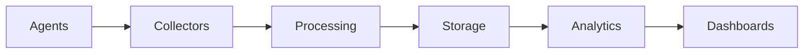

# MentatLab v2.0 Milestone Summary
## Advanced Observability & Cost Metering Platform

**Timeline**: Q3 2026 (16 weeks)  
**Dependencies**: v1.1 completion (Agent marketplace, enhanced developer tools)

---

## Executive Overview

MentatLab v2.0 transforms the platform into an enterprise-ready AI infrastructure by introducing comprehensive observability and cost transparency:

1. **Distributed Tracing**: See every step of agent execution across your entire system
2. **Cost Metering**: Know exactly what every agent execution costs, down to the penny
3. **Real-time Monitoring**: Custom dashboards with instant alerts and anomaly detection
4. **Performance Profiling**: Identify bottlenecks and get AI-powered optimization recommendations
5. **Enterprise Analytics**: Executive dashboards, predictive analytics, and detailed reporting

This release enables enterprises to run AI agents at scale with complete visibility, control, and cost optimization.

---

## 🔍 Distributed Tracing System

### OpenTelemetry-Powered Visibility
- **End-to-end tracing** across all agents and services
- **Cross-runtime correlation** between WASM and container agents
- **Automatic context propagation** through entire execution flows
- **Visual trace timeline** showing critical paths and dependencies

### Key Features
```yaml
Trace Capabilities:
  - Trace ID correlation across 10,000+ concurrent agents
  - Sub-millisecond span recording
  - Adaptive sampling (1-100% based on errors)
  - 30-day trace retention with cold storage

Critical Path Analysis:
  - Automatic bottleneck identification
  - Dependency visualization
  - Performance regression detection
  - Resource usage attribution
```

### Developer Experience
```python
# Zero-config tracing in agent SDK
@traced
async def process(self, input):
    # Automatic span creation and propagation
    result = await self.model.predict(input)
    return result
```

---

## 💰 Cost Metering Dashboard

### Accurate Resource Attribution
- **Per-execution cost tracking** with detailed breakdowns
- **Multi-dimensional aggregation** by user, project, agent, or resource
- **Real-time cost alerts** when spending exceeds thresholds
- **Volume discount automation** based on usage patterns

### Cost Components Tracked
- CPU core-seconds (± 0.1% accuracy)
- Memory GB-seconds
- GPU compute time
- Network ingress/egress
- Storage operations
- Model token usage

### Billing Integration
```yaml
Supported Providers:
  - Stripe (automatic usage reporting)
  - AWS Marketplace (native integration)
  - Custom ERP systems (REST API)
  
Features:
  - Automated invoice generation
  - Usage-based billing
  - Prepaid credit management
  - Multi-currency support
```

---

## 📊 Real-time Monitoring

### Customizable Dashboards
- **Drag-and-drop widget builder**
- **50+ pre-built visualizations**
- **Real-time WebSocket updates**
- **Mobile-responsive design**

### Monitoring Components
```typescript
Available Widgets:
  - Agent Health Heatmap
  - Cost Trend Analysis
  - Latency Distribution
  - Resource Usage Gauges
  - Flow Execution Timeline
  - Error Rate Tracking
  - Token Usage Burndown
```

### Intelligent Alerting
- **ML-powered anomaly detection**
- **Custom alert rules with complex conditions**
- **Multi-channel notifications** (Email, Slack, PagerDuty, Webhook)
- **Alert correlation and deduplication**

---

## 🚀 Performance Profiling

### Comprehensive Profiling
- **CPU profiling** with flame graphs
- **Memory analysis** with heap snapshots
- **I/O bottleneck detection**
- **Network latency tracking**
- **GPU utilization monitoring**
- **Model inference profiling**

### AI-Powered Recommendations
```yaml
Optimization Suggestions:
  - "Use INT8 quantization to reduce model size by 75%"
  - "Increase batch size to 32 for 2.5x throughput"
  - "Enable GPU memory pooling to reduce allocation overhead"
  - "Cache embeddings to save 40% on token costs"
```

### Before/After Comparison
- **Baseline performance capture**
- **A/B testing framework**
- **Regression detection**
- **ROI calculation for optimizations**

---

## 📈 Enterprise Analytics

### Executive Dashboard
- **Real-time KPI tracking**
- **Cost trend analysis**
- **Capacity forecasting**
- **SLA compliance monitoring**

### Advanced Analytics
```sql
Available Reports:
  - Agent Performance Rankings
  - Cost per Business Transaction
  - User Activity Heatmaps
  - Resource Utilization Trends
  - Model Efficiency Scores
  - Error Pattern Analysis
```

### Predictive Capabilities
- **30-day cost forecasting** with confidence intervals
- **Capacity planning** recommendations
- **Anomaly prediction** before they impact users
- **Churn risk scoring** for usage patterns

---

## 🏗️ Architecture Highlights

### Scalability
- Handle **10,000+ concurrent agents**
- Process **1M+ traces per minute**
- Ingest **10M+ metrics per minute**
- Sub-2% overhead on agent execution

### Data Pipeline


### Security & Compliance
- **End-to-end encryption** for all telemetry data
- **Multi-tenant isolation** with separate encryption keys
- **GDPR-compliant** data retention and deletion
- **SOC2 audit trail** for all access

---

## 💡 Use Cases

### For Developers
- Debug complex agent interactions with distributed tracing
- Optimize agent performance with profiling tools
- Monitor costs during development to avoid surprises

### For Operations
- Set up alerts for performance degradation
- Track SLA compliance in real-time
- Capacity planning with predictive analytics

### For Executives
- Track AI infrastructure costs by department
- Monitor ROI of AI initiatives
- Forecast future spending and capacity needs

---

## 📅 Rollout Plan

### Early Access (Week 12)
- Beta access for select enterprise customers
- Core tracing and monitoring features
- Basic cost tracking

### General Availability (Week 16)
- Full feature set
- Production-ready performance
- Enterprise support SLAs

---

## 🎯 Success Metrics

### Performance
- < 2% CPU overhead
- < 5% memory overhead
- < 10ms trace ingestion latency
- 99.9% dashboard availability

### Business Impact
- 80% improvement in cost visibility
- 30% average performance improvement from optimizations
- 50% reduction in time to identify issues
- 90% user satisfaction rating

---

## 🚀 Getting Started

### For New Users
```bash
# Enable observability in your agent
mentatctl agent enable-tracing my-agent

# View real-time costs
mentatctl cost watch --follow

# Access the dashboard
open https://dashboard.mentatlab.com
```

### For Existing Users
```bash
# Upgrade to v2.0
mentatctl upgrade --version 2.0

# Migrate existing agents
mentatctl migrate agents --enable-observability

# Configure cost alerts
mentatctl alerts create --type cost --threshold 100
```

---

## Next Steps

1. **Schedule a demo** with our enterprise team
2. **Review the technical specification** for implementation details
3. **Plan your rollout** with our migration guide
4. **Join the beta program** for early access

---

**Questions?** Contact the platform team or see [full specification](./v2.0_milestone_spec.md)

MentatLab v2.0 establishes the platform as the industry standard for enterprise AI infrastructure, providing unparalleled visibility, control, and optimization capabilities for organizations running AI at scale.