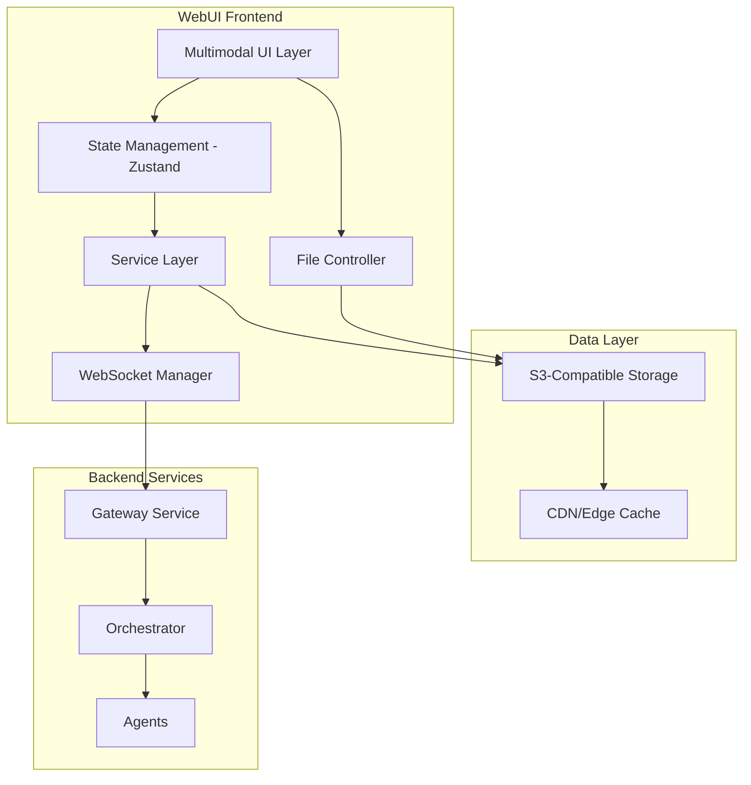
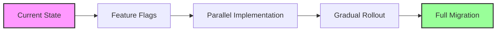

# WebUI Rearchitecture Plan for Beta Milestone

## Executive Summary

This plan outlines a comprehensive rearchitecture of the MentatLab WebUI to support the beta milestone's multimodal and streaming requirements. The transformation will evolve the current single-modal, batch-processing frontend into a sophisticated multimodal-first platform capable of handling audio (WAV), image (JPEG/PNG), and video streams up to 1GB with <100ms streaming latency.

**Total Effort**: 61-86 developer days across 4 phases over 16 weeks  
**Key Deliverables**: Multimodal UI, S3 integration, WebSocket streaming, enhanced state management  
**Success Metrics**: <100ms latency, 1GB file support, real-time progress tracking

## 1. New Architecture Overview

### 1.1 Core Design Principles

The new architecture embraces a **multimodal-first** approach with the following principles:

1. **Reference-Based Data Flow**: All large data (>1MB) flows through S3-compatible storage via references
2. **Streaming-Native**: Built-in support for WebSocket/SSE with automatic fallback
3. **Progressive Enhancement**: Graceful degradation for lower-capability clients
4. **Modular Service Architecture**: Centralized API services with clear separation of concerns
5. **Performance-Optimized**: Virtual scrolling, lazy loading, and chunk-based processing

### 1.2 High-Level Architecture



### 1.3 Key Architectural Changes

| Component | Current State | Target State |
|-----------|--------------|--------------|
| Data Flow | Direct upload/download | Reference-based with S3 |
| Streaming | Basic WebSocket | Enhanced WebSocket/SSE with <100ms latency |
| File Handling | In-memory | Chunked with progress tracking |
| State Management | Basic Zustand | Enhanced with middleware and plugins |
| UI Components | Text-focused | Multimodal with specialized viewers |
| API Layer | Direct fetch calls | Centralized service layer |

### 1.4 Mission Control UI Paradigm

This UI is “mission control for composable AI,” not a consumer media app. The primary experience is a canvas-first, operations-oriented workspace where agents, chat panels, and runtime tasks are composed, launched, and observed in real time. This section ties the UI choices to the README’s intent of a composable-frontend contract stored in Git and orchestrated by backend services.

Mission-control principles
- Canvas-first composition: Node-and-edges graph is the home view. Flows are the primary artifact linked to Git history.
- Dockable panes: Chat console, run queue, logs/metrics, inspector, and file pins are side panels that can be shown/hidden per workspace layout.
- Operations over artifacts: Controls to start/stop/pause, view timelines, watch metrics, and drill into agent internals are first-class.
- Live observability: Status bar surfaces health (gateway/orchestrator), active streams, and feature-flag state.
- Progressive disclosure: Heavy media players exist but are secondary to debugging/observability tasks.

Core UI primitives (aligned to the composable contract)
- Canvas Workspace (Flows): The graph editor where agents (nodes) connect via typed pins. Stores canonical flow specs in Git.
- Inspector Panel: Selected node’s configuration, including typed pins (data, media, credentials) and runtime overrides.
- Console & Runs: Task queue view with per-run logs, metrics, artifacts, and failure drills.
- Event Timeline: Ordered stream of significant events (start/stop, edge messages, errors, checkpoints).
- Media Preview: Lightweight in-panel previews for images/audio/video to validate pins and outputs; full viewers exist for deeper inspection.
- Global Status Bar: Environment, feature flags, connection health (WS/SSE), and recent alerts.

Layout skeleton (React)
```tsx
// ui/layout/MissionControlLayout.tsx
import { StatusBar } from './StatusBar';
import { Canvas } from '../canvas/Canvas';
import { RightDock } from './RightDock';
import { BottomDock } from './BottomDock';

export function MissionControlLayout() {
  return (
    <div className="mission-control">
      <header className="mc-topbar">MentatLab</header>
      <aside className="mc-leftnav">{/* Workspaces / Flows / Search */}</aside>
      <main className="mc-canvas"><Canvas /></main>
      <RightDock>
        {/* Inspector (pins, config), Media Preview, Properties */}
      </RightDock>
      <BottomDock>
        {/* Console, Runs, Metrics, Timeline */}
      </BottomDock>
      <StatusBar />
    </div>
  );
}
```

File handling in a mission-control UI
- FileUploader is a pin-level affordance, not a full-screen app surface. Users attach/upload artifacts in the Inspector for a selected node (e.g., “Input Audio” pin), or via a small “Add Artifact” control in the bottom dock.
- Previews are inline and fast (thumbnails/waveform snippets) to validate data flow; full viewers are available as a drill-down, not as a primary workspace view.
- Upload progress is routed to the run/task context (Run Queue and Console) with per-file and per-run aggregation, so operations remain anchored in execution, not storage browsing.

Why this choice
- Keeps the user anchored on building/debugging flows, consistent with “mission control.”
- Minimizes modal churn and “media app” feel while still providing high-fidelity inspection tools.
- Aligns with Git-backed flows: the UI emphasizes flow diffs, node config, and run results over ad hoc file management.

Feature-flag mapping to surfaces
- MULTIMODAL_UPLOAD: Enables pin-level FileUploader controls in the Inspector and bottom-dock quick action. Hides full-page uploader routes.
- NEW_STREAMING: Enables real-time timeline overlays and stream metrics in BottomDock; falls back to batch polling if disabled.
- S3_STORAGE: Enables reference-based artifacts on pins and presigned-upload paths; falls back to local/dev storage adapters when disabled.

Non-goals
- No full-screen media library as the primary navigation.
- No wizard-first authoring; canvas remains the center of gravity, with helpers optional.

Testing checklist (UI intent)
- Canvas is the default route; dock/panels remember layout across sessions.
- Uploads can be initiated from a node’s pin in the Inspector; progress is visible in Run Queue and Status Bar.
- Media previews render inline and do not steal primary focus from the canvas.
- Feature flags correctly hide/show pin-level media affordances and timeline overlays.
## 2. Component Architecture

### 2.1 Component Hierarchy

```
src/
├── components/
│   ├── multimodal/
│   │   ├── AudioPlayer/
│   │   │   ├── AudioPlayer.tsx
│   │   │   ├── WaveformVisualizer.tsx
│   │   │   └── AudioControls.tsx
│   │   ├── ImageViewer/
│   │   │   ├── ImageViewer.tsx
│   │   │   ├── ImageAnnotator.tsx
│   │   │   └── ImageGallery.tsx
│   │   ├── VideoPlayer/
│   │   │   ├── VideoPlayer.tsx
│   │   │   ├── VideoControls.tsx
│   │   │   └── StreamingVideo.tsx
│   │   └── FileUploader/
│   │       ├── FileUploader.tsx
│   │       ├── DropZone.tsx
│   │       ├── UploadProgress.tsx
│   │       └── FilePreview.tsx
│   ├── streaming/
│   │   ├── StreamingDisplay/
│   │   ├── ProgressIndicator/
│   │   └── RealtimeChart/
│   ├── flow/
│   │   ├── FlowCanvas/
│   │   ├── NodeEditor/
│   │   └── ConnectionManager/
│   └── shared/
│       ├── ErrorBoundary/
│       ├── LoadingStates/
│       └── VirtualList/
```

### 2.2 Component Design Patterns

#### 2.2.1 Multimodal Component Interface

```typescript
interface MultimodalComponent<T extends MediaType> {
  data: MediaReference<T>;
  onLoad?: (metadata: MediaMetadata<T>) => void;
  onError?: (error: Error) => void;
  onProgress?: (progress: ProgressEvent) => void;
  controls?: ControlOptions<T>;
  streaming?: StreamingOptions;
}
```

#### 2.2.2 Lazy Loading Strategy

```typescript
const AudioPlayer = lazy(() => import('./multimodal/AudioPlayer'));
const ImageViewer = lazy(() => import('./multimodal/ImageViewer'));
const VideoPlayer = lazy(() => import('./multimodal/VideoPlayer'));

const MediaRenderer: React.FC<{ media: MediaReference }> = ({ media }) => {
  const Component = getComponentForMediaType(media.type);
  return (
    <Suspense fallback={<MediaSkeleton type={media.type} />}>
      <Component data={media} />
    </Suspense>
  );
};
```

### 2.3 Component Features

| Component | Key Features | Performance Optimizations |
|-----------|-------------|-------------------------|
| AudioPlayer | Waveform visualization, seek, playback speed | Chunked loading, Web Audio API |
| ImageViewer | Zoom, pan, annotations, filters | Progressive loading, WebGL rendering |
| VideoPlayer | Streaming playback, quality selection | HLS/DASH support, adaptive bitrate |
| FileUploader | Drag & drop, progress, preview | Chunked upload, parallel streams |

## 3. State Management Strategy

### 3.1 Enhanced Zustand Architecture

```typescript
// stores/index.ts
import { create } from 'zustand';
import { devtools, persist, subscribeWithSelector } from 'zustand/middleware';
import { immer } from 'zustand/middleware/immer';

// Core stores
export const useFlowStore = create<FlowState>()(
  devtools(
    persist(
      subscribeWithSelector(
        immer((set, get) => ({
          // Flow state
          flows: new Map(),
          activeFlowId: null,
          
          // Actions
          updateFlow: (flowId, updates) =>
            set((state) => {
              state.flows.get(flowId).merge(updates);
            }),
        }))
      ),
      { name: 'flow-store' }
    )
  )
);

export const useMediaStore = create<MediaState>()(
  devtools(
    immer((set) => ({
      // Media references
      mediaItems: new Map(),
      uploadQueue: [],
      activeUploads: new Map(),
      
      // Actions
      queueUpload: (file, metadata) =>
        set((state) => {
          state.uploadQueue.push({ file, metadata, id: uuid() });
        }),
    }))
  )
);

export const useStreamingStore = create<StreamingState>()(
  devtools((set) => ({
    // Streaming state
    activeStreams: new Map(),
    connectionStatus: 'disconnected',
    
    // Actions
    registerStream: (streamId, config) => set((state) => ({
      activeStreams: new Map(state.activeStreams).set(streamId, {
        ...config,
        status: 'connecting',
        buffer: [],
      }),
    })),
  }))
);
```

### 3.2 State Architecture Patterns

#### 3.2.1 Normalized State Structure

```typescript
interface AppState {
  entities: {
    flows: Record<string, Flow>;
    nodes: Record<string, Node>;
    media: Record<string, MediaReference>;
    streams: Record<string, StreamState>;
  };
  ui: {
    selectedFlowId: string | null;
    activeModal: ModalType | null;
    viewSettings: ViewSettings;
  };
  session: {
    user: User | null;
    permissions: Permission[];
  };
}
```

#### 3.2.2 Middleware Stack

1. **Immer**: Immutable updates with mutable syntax
2. **Persist**: Local storage persistence with encryption
3. **Devtools**: Redux DevTools integration
4. **Subscribe**: Selective subscriptions for performance
5. **Custom Middleware**: Logging, analytics, error tracking

### 3.3 State Management Patterns

| Pattern | Use Case | Implementation |
|---------|----------|----------------|
| Normalized Entities | Relational data | Entity adapters with normalizr |
| Optimistic Updates | UI responsiveness | Temporary state with rollback |
| Derived State | Computed values | Selectors with memoization |
| Async Actions | API calls | Thunks with loading states |

## 4. API Service Layer

### 4.1 Service Architecture

```typescript
// services/api/index.ts
export class ApiService {
  private http: HttpClient;
  private ws: WebSocketClient;
  private storage: StorageClient;
  
  constructor(config: ApiConfig) {
    this.http = new HttpClient(config.baseUrl);
    this.ws = new WebSocketClient(config.wsUrl);
    this.storage = new StorageClient(config.s3Config);
  }
  
  // Modular service endpoints
  flows = new FlowService(this.http);
  agents = new AgentService(this.http);
  media = new MediaService(this.storage);
  streaming = new StreamingService(this.ws);
}
```

### 4.2 Service Modules

#### 4.2.1 Media Service

```typescript
export class MediaService {
  async uploadFile(file: File, options: UploadOptions): Promise<MediaReference> {
    // 1. Request presigned URL
    const { uploadUrl, reference } = await this.getPresignedUrl(file);
    
    // 2. Chunk file if needed
    const chunks = file.size > CHUNK_SIZE ? await this.chunkFile(file) : [file];
    
    // 3. Upload with progress
    await this.uploadChunks(chunks, uploadUrl, options.onProgress);
    
    // 4. Return reference
    return reference;
  }
  
  async getMedia(reference: MediaReference): Promise<MediaData> {
    // Implement caching, CDN fallback, etc.
  }
}
```

#### 4.2.2 Streaming Service

```typescript
export class StreamingService {
  private connections: Map<string, StreamConnection>;
  
  async createStream(config: StreamConfig): Promise<Stream> {
    const connection = await this.establishConnection(config);
    
    return {
      id: connection.id,
      send: (data) => connection.send(data),
      subscribe: (handler) => connection.on('message', handler),
      close: () => this.closeStream(connection.id),
    };
  }
  
  private async establishConnection(config: StreamConfig) {
    // WebSocket with SSE fallback
    try {
      return await this.createWebSocketConnection(config);
    } catch (error) {
      return await this.createSSEConnection(config);
    }
  }
}
```

### 4.3 API Integration Patterns

| Pattern | Purpose | Example |
|---------|---------|---------|
| Request Interceptors | Auth, logging | Add bearer token to headers |
| Response Transformers | Data normalization | Convert snake_case to camelCase |
| Retry Logic | Resilience | Exponential backoff for failures |
| Request Cancellation | Performance | AbortController for abandoned requests |

## 5. UI/UX Framework

### 5.1 Design System Components

```typescript
// design-system/multimodal/index.ts
export const MultimodalComponents = {
  // Media Display
  MediaCard: ({ media, size, actions }) => {...},
  MediaGallery: ({ items, layout, onSelect }) => {...},
  MediaPreview: ({ reference, controls }) => {...},
  
  // File Handling
  DropZone: ({ accept, maxSize, onDrop }) => {...},
  UploadQueue: ({ items, onCancel, onRetry }) => {...},
  FileTypeIcon: ({ mimeType, size }) => {...},
  
  // Progress & Feedback
  ProgressRing: ({ value, size, color }) => {...},
  StreamingIndicator: ({ status, latency }) => {...},
  ProcessingOverlay: ({ stage, progress }) => {...},
};
```

### 5.2 Multimodal Interaction Patterns

#### 5.2.1 Drag & Drop System

```typescript
const MultimodalDropZone: React.FC = () => {
  const { getRootProps, getInputProps, isDragActive } = useDropzone({
    accept: {
      'audio/*': ['.wav', '.mp3'],
      'image/*': ['.png', '.jpg', '.jpeg'],
      'video/*': ['.mp4', '.webm'],
    },
    maxSize: 1024 * 1024 * 1024, // 1GB
    onDrop: handleFileUpload,
  });
  
  return (
    <div {...getRootProps()} className={styles.dropzone}>
      <input {...getInputProps()} />
      {isDragActive ? (
        <DropActiveState />
      ) : (
        <DropIdleState />
      )}
    </div>
  );
};
```

#### 5.2.2 Media Preview System

```typescript
const MediaPreview: React.FC<{ reference: MediaReference }> = ({ reference }) => {
  const { type, thumbnailUrl, metadata } = reference;
  
  return (
    <div className={styles.preview}>
      {type === 'image' && <ImageThumbnail src={thumbnailUrl} />}
      {type === 'audio' && <WaveformPreview data={metadata.waveform} />}
      {type === 'video' && <VideoThumbnail src={thumbnailUrl} duration={metadata.duration} />}
      <MediaMetadata {...metadata} />
    </div>
  );
};
```

### 5.3 Responsive Design Strategy

| Breakpoint | Layout | Features |
|------------|---------|----------|
| Mobile (<768px) | Single column | Touch gestures, minimal controls |
| Tablet (768-1024px) | Two columns | Split view, basic controls |
| Desktop (>1024px) | Multi-pane | Full controls, multi-window |

## 6. Performance Architecture

### 6.1 Optimization Strategies

#### 6.1.1 Code Splitting

```typescript
// routes/index.ts
const routes = [
  {
    path: '/flow',
    component: lazy(() => import('./pages/FlowBuilder')),
  },
  {
    path: '/media',
    component: lazy(() => import('./pages/MediaGallery')),
  },
  {
    path: '/streaming',
    component: lazy(() => import('./pages/StreamingDashboard')),
  },
];
```

#### 6.1.2 Virtual Scrolling

```typescript
const MediaGrid: React.FC<{ items: MediaItem[] }> = ({ items }) => {
  const rowRenderer = ({ index, key, style }) => (
    <div key={key} style={style}>
      <MediaCard item={items[index]} />
    </div>
  );
  
  return (
    <AutoSizer>
      {({ height, width }) => (
        <VirtualList
          height={height}
          width={width}
          rowCount={items.length}
          rowHeight={CARD_HEIGHT}
          rowRenderer={rowRenderer}
        />
      )}
    </AutoSizer>
  );
};
```

### 6.2 Caching Strategy

| Cache Level | Implementation | Use Case |
|-------------|----------------|----------|
| Browser Cache | Service Worker | Static assets, API responses |
| Memory Cache | React Query | Active session data |
| Local Storage | IndexedDB | Offline media metadata |
| CDN Cache | CloudFront | Media files, thumbnails |

### 6.3 Performance Metrics

```typescript
// monitoring/performance.ts
export const PerformanceMonitor = {
  trackStreamLatency: (streamId: string, latency: number) => {
    analytics.track('stream_latency', { streamId, latency });
  },
  
  trackUploadProgress: (fileId: string, progress: number, speed: number) => {
    analytics.track('upload_progress', { fileId, progress, speed });
  },
  
  trackComponentLoad: (component: string, loadTime: number) => {
    analytics.track('component_load', { component, loadTime });
  },
};
```

## 7. Implementation Phases

### 7.1 Phase 1: Foundation (Weeks 1-3)

**Goal**: Establish architectural foundation and core infrastructure

#### Week 1: Service Layer Architecture
- [ ] Create centralized API service structure
- [ ] Implement HTTP client with interceptors
- [ ] Set up WebSocket/SSE infrastructure
- [ ] Create base service classes

#### Week 2: Type System Extension
- [ ] Extend Pin types for multimodal support
- [ ] Create MediaReference interfaces
- [ ] Define streaming message protocols
- [ ] Update Flow types for media nodes

#### Week 3: State Management Enhancement
- [ ] Implement enhanced Zustand stores
- [ ] Add middleware stack
- [ ] Create media state management
- [ ] Set up state persistence

**Deliverables**: Service layer foundation, extended type system, enhanced state management

### 7.2 Phase 2: Core Features (Weeks 4-8)

**Goal**: Implement multimodal components and storage integration

#### Week 4-5: File Upload System
- [ ] Create FileUploader component
- [ ] Implement drag & drop functionality
- [ ] Add chunked upload support
- [ ] Create upload progress tracking

#### Week 6-7: Storage Integration
- [ ] Integrate S3 SDK
- [ ] Implement presigned URL handling
- [ ] Create storage service layer
- [ ] Add CDN integration

#### Week 8: Media Display Components
- [ ] Create AudioPlayer component
- [ ] Create ImageViewer component
- [ ] Create VideoPlayer component
- [ ] Implement lazy loading

**Deliverables**: File upload UI, storage integration, media display components

### 7.3 Phase 3: Integration (Weeks 9-11)

**Goal**: End-to-end multimodal flow implementation

#### Week 9: WebSocket Enhancement
- [ ] Implement enhanced streaming protocol
- [ ] Add multimodal message types
- [ ] Create streaming state management
- [ ] Implement connection resilience

#### Week 10: Gateway Integration
- [ ] Connect to new multimodal endpoints
- [ ] Implement file upload API calls
- [ ] Add streaming session management
- [ ] Create error handling

#### Week 11: Flow Builder Updates
- [ ] Add multimodal node types
- [ ] Update node configuration UI
- [ ] Implement media pin connections
- [ ] Add preview capabilities

**Deliverables**: Enhanced WebSocket, API integration, updated Flow Builder

### 7.4 Phase 4: Polish & Optimization (Weeks 12-14)

**Goal**: Performance optimization and production readiness

#### Week 12: Performance Optimization
- [ ] Implement virtual scrolling
- [ ] Add service worker caching
- [ ] Optimize bundle size
- [ ] Add performance monitoring

#### Week 13: UI/UX Refinements
- [ ] Polish multimodal components
- [ ] Add loading states
- [ ] Implement error boundaries
- [ ] Create help documentation

#### Week 14: Testing & Documentation
- [ ] Write component tests
- [ ] Create integration tests
- [ ] Update documentation
- [ ] Performance testing

**Deliverables**: Optimized performance, polished UI, comprehensive testing

## 8. Migration Strategy

### 8.1 Incremental Migration Approach



### 8.2 Migration Steps

#### Step 1: Feature Flag Setup
```typescript
// config/features.ts
export const FeatureFlags = {
  MULTIMODAL_UPLOAD: import.meta.env.VITE_FF_MULTIMODAL_UPLOAD === 'true',
  NEW_STREAMING: import.meta.env.VITE_FF_NEW_STREAMING === 'true',
  S3_STORAGE: import.meta.env.VITE_FF_S3_STORAGE === 'true',
} as const;
```

#### Step 2: Parallel Implementation
```typescript
// Conditional component loading
const FileInput = FeatureFlags.MULTIMODAL_UPLOAD
  ? MultimodalFileUploader
  : LegacyTextInput;
```

#### Step 3: Data Migration
```typescript
// Migration utilities
export const migrateFlowData = (legacyFlow: LegacyFlow): Flow => {
  return {
    ...legacyFlow,
    nodes: legacyFlow.nodes.map(migrateNode),
    version: '2.0',
  };
};
```

### 8.3 Rollback Strategy

| Phase | Rollback Method | Time to Rollback |
|-------|----------------|------------------|
| Feature Flags | Toggle flag | < 1 minute |
| API Changes | Version header | < 5 minutes |
| Data Migration | Backup restore | < 30 minutes |
| Full Deployment | Blue-green swap | < 5 minutes |

### 8.4 Compatibility Matrix

| Component | v1.0 Support | v2.0 Features | Breaking Changes |
|-----------|-------------|---------------|------------------|
| Flow Format | ✅ | Enhanced | None |
| Node Types | ✅ | Extended | None |
| API Endpoints | ✅ | New routes | None |
| WebSocket | ⚠️ | Enhanced protocol | Protocol version |

## 9. Risk Mitigation

### 9.1 Technical Risks

| Risk | Impact | Likelihood | Mitigation |
|------|--------|------------|------------|
| S3 Integration Issues | High | Medium | Use MinIO for local testing, implement fallback |
| Large File Memory Issues | High | High | Implement chunking, use streams API |
| WebSocket Performance | High | Medium | Implement SSE fallback, connection pooling |
| Browser Compatibility | Medium | Low | Progressive enhancement, polyfills |

### 9.2 Mitigation Strategies

#### Browser Memory Management
```typescript
// Implement file chunking
const CHUNK_SIZE = 5 * 1024 * 1024; // 5MB chunks

const uploadLargeFile = async (file: File) => {
  const chunks = Math.ceil(file.size / CHUNK_SIZE);
  
  for (let i = 0; i < chunks; i++) {
    const chunk = file.slice(
      i * CHUNK_SIZE,
      Math.min((i + 1) * CHUNK_SIZE, file.size)
    );
    
    await uploadChunk(chunk, i, chunks);
    
    // Allow garbage collection
    await new Promise(resolve => setTimeout(resolve, 0));
  }
};
```

#### Connection Resilience
```typescript
// WebSocket with automatic reconnection
class ResilientWebSocket {
  private reconnectAttempts = 0;
  private maxReconnects = 5;
  
  connect() {
    this.ws = new WebSocket(this.url);
    
    this.ws.onerror = () => {
      if (this.reconnectAttempts < this.maxReconnects) {
        setTimeout(() => {
          this.reconnectAttempts++;
          this.connect();
        }, Math.pow(2, this.reconnectAttempts) * 1000);
      }
    };
  }
}
```

## 10. Success Metrics

### 10.1 Performance KPIs

| Metric | Target | Measurement Method |
|--------|--------|-------------------|
| Stream Initiation Latency | <100ms | Performance API |
| File Upload Speed | >10MB/s | Progress events |
| Component Load Time | <200ms | React Profiler |
| Memory Usage | <500MB | Performance Monitor |

### 10.2 User Experience Metrics

| Metric | Target | Measurement Method |
|--------|--------|-------------------|
| File Upload Success Rate | >95% | Analytics tracking |
| Stream Connection Success | >99% | WebSocket monitoring |
| Error Recovery Rate | >90% | Error tracking |
| User Task Completion | >80% | User analytics |

### 10.3 Technical Metrics

| Metric | Target | Measurement Method |
|--------|--------|-------------------|
| Code Coverage | >80% | Jest coverage |
| Bundle Size | <2MB | Webpack analyzer |
| Lighthouse Score | >90 | CI/CD pipeline |
| API Response Time | <200ms | APM monitoring |

## 11. Documentation Requirements

### 11.1 Developer Documentation

- [ ] Architecture overview and diagrams
- [ ] Component API documentation
- [ ] Service integration guides
- [ ] Migration guide for existing code
- [ ] Performance optimization guide

### 11.2 User Documentation

- [ ] Multimodal feature guide
- [ ] File upload tutorials
- [ ] Troubleshooting guide
- [ ] Video walkthroughs

### 11.3 API Documentation

- [ ] OpenAPI specifications
- [ ] WebSocket protocol docs
- [ ] Storage API reference
- [ ] Error code reference

## 12. Conclusion

This rearchitecture plan transforms the MentatLab WebUI from a text-focused application to a comprehensive multimodal platform. The phased approach ensures continuous delivery while minimizing risk, and the emphasis on performance and user experience will create a best-in-class interface for multimodal AI workflows.

### Key Success Factors

1. **Strong Foundation**: Service layer and state management architecture
2. **Incremental Delivery**: Feature flags and parallel implementation
3. **Performance Focus**: Optimization from day one
4. **User-Centric Design**: Intuitive multimodal interactions
5. **Robust Testing**: Comprehensive test coverage

### Next Steps

1. Review and approve this plan with stakeholders
2. Set up development environment with feature flags
3. Begin Phase 1 implementation
4. Establish weekly progress reviews
5. Create beta testing program

The successful implementation of this plan will position MentatLab as a leader in multimodal AI development platforms, ready for the demands of modern AI workflows.
## 13. Differentiators and MVP Roadmap

This section enumerates novel, operator-centric features that make MentatLab a mission-control console for composable AI (see [README.md](README.md:1)). It also defines an MVP roadmap and the UI skeleton to implement them.

### 13.1 Differentiators (Operator-grade capabilities)

1) Flight Recorder + Time‑Travel Debugging
- Deterministic run capture: step timeline, tool I/O snapshots, media frames, state diffs, “step into/over”.
- Implementation: extend streaming events with “checkpoints” plus small state deltas; add Replay mode in Runs/Timeline.

2) Visual Contract Checking on the Canvas (Type-Aware Pins)
- Live schema/type checks, highlight violations, one‑click “adapter” nodes (e.g., resample PCM 16kHz mono).
- Implementation: pin schemas (Zod/JSON‑Schema), on‑canvas validators, adapter node palette.

3) Pin-Level Data Provenance and Lineage
- Click any output to see lineage DAG with hashes, versions, timings; audit and reproducibility.
- Implementation: propagate provenance metadata in MediaReference; render lineage overlay.

4) A/B and Canary Flow Orchestration
- Define flow variants, split traffic, compare KPIs (quality/cost/latency) with statistical confidence.
- Implementation: Gateway strategies, Runs comparison dashboards.

5) Runbook Automation (Ops Playbooks)
- One‑click bundles of preflight checks, flow runs, validations, and rollback steps.
- Implementation: declarative runbooks persisted with flows; dock widgets to execute and track.

6) Safety/Compliance Guardrails at the Edge
- Policy nodes (PII scrub, safety, IP filtering) auto‑inserted or enforced at ingress/egress pins.
- Implementation: policy engine in Gateway; enforcement badges on canvas edges.

7) Cost and Latency Simulator (Preflight Estimates)
- Predict token/storage/bandwidth/wall‑time pre‑run; warn when crossing budgets.
- Implementation: per‑node cost/latency envelopes aggregated across the graph; inline estimates.

8) Golden Traces and Synthetic Fixtures
- Record “golden” runs; generate fixtures; regression tests with diff views (text/media).
- Implementation: export from Flight Recorder; “Compare to golden” action in Runs; CI hook later.

9) Multi‑Operator Collaboration with Roles and Presence
- Real‑time cursors, selections, comments on nodes/edges; RBAC for edit vs. ops.
- Implementation: Yjs presence + auth roles; threaded comments pinned to nodes.

10) Live QoS Heatmap and Stream Diagnostics
- Canvas heatmap of p95 latency, error bursts, backpressure; drill into logs/frames/chunks.
- Implementation: PerformanceMonitor + WebSocket telemetry; overlay renderer.

11) Adaptive Mode Runtime Controls
- Flip streaming/batch; auto‑degrade features under constrained network/CPU; user‑set SLAs.
- Implementation: runtime flags and toggles; adaptive hints via telemetry.

12) Flow‑Linter with Quick Fixes
- Rules (n+1 calls, missing retries, no safety node) + quick‑fixes (insert/rewire/param).
- Implementation: graph analyzer + fixers; Inspector “Issues” tab.

13) Offline Pack/Unpack Bundles
- Export flow + metadata + minimal media stubs to portable bundle; run offline harness.
- Implementation: exporter/importer, local harness, “Open pack” UI action.

14) Post‑Run Narrative Reports (Tech + Exec Views)
- Auto‑summaries with decisions, timings, errors, artifacts; engineer and executive modes.
- Implementation: templating over Flight Recorder; export to Markdown/PDF.

15) Active‑Learning Loops from Annotations
- Built‑in annotation tools (image boxes, waveform markers, text edits) feeding training queues.
- Implementation: Inspector annotators; training queue integration; improvement metrics.

### 13.2 MVP Scope (90‑Day Slice)

- Phase A (Weeks 1–4)
  - Flight Recorder v1 (timeline + checkpoints)
  - Visual Contract Checking (basic schemas, 1‑click adapters)
  - Flow‑Linter (5 high‑signal rules)
  - Base QoS metrics surfaced in Status Bar

- Phase B (Weeks 5–8)
  - Provenance/Lineage overlay
  - A/B & Canary scaffold (variant execution + KPI compare)
  - Narrative Reports v1 (engineer view)

- Phase C (Weeks 9–12)
  - Safety/Compliance policy nodes (ingress/egress)
  - Collaboration: presence + comments
  - Cost/Latency Simulator v1

Each phase is shippable and builds toward the full mission‑control experience.

### 13.3 UI Skeleton and File Structure

Add the mission‑control shell and dockable panels. Canvas remains the center of gravity; panels are secondary but always available.

- Layout
  - components/mission-control/layout/MissionControlLayout.tsx
  - components/mission-control/layout/RightDock.tsx
  - components/mission-control/layout/BottomDock.tsx
  - components/mission-control/layout/StatusBar.tsx

- Panels
  - components/mission-control/panels/InspectorPanel.tsx
  - components/mission-control/panels/RunQueuePanel.tsx
  - components/mission-control/panels/ConsolePanel.tsx
  - components/mission-control/panels/TimelinePanel.tsx
  - components/mission-control/panels/IssuesPanel.tsx (Flow‑Linter)
  - components/mission-control/panels/ReportsPanel.tsx (Narrative)

- Canvas overlays
  - components/mission-control/canvas/LineageOverlay.tsx
  - components/mission-control/canvas/QoSHeatmapOverlay.tsx
  - components/mission-control/canvas/ContractHintsOverlay.tsx

- Services (frontend)
  - services/frontend/src/services/recorder/FlightRecorderService.ts
  - services/frontend/src/services/lineage/LineageService.ts
  - services/frontend/src/services/ab/VariantService.ts
  - services/frontend/src/services/policy/PolicyService.ts
  - services/frontend/src/services/linter/FlowLinterService.ts
  - services/frontend/src/services/reports/ReportService.ts
  - services/frontend/src/services/cost/CostSimulator.ts

- State
  - Extend Zustand stores for:
    - recorder (runs/checkpoints)
    - lineage (provenance graph)
    - variants (A/B state)
    - linter (issues/fixes)
    - collaboration (presence/comments)

Example layout skeleton

```tsx
// components/mission-control/layout/MissionControlLayout.tsx
import React from 'react';
import { Canvas } from '../../canvas/Canvas';
import { RightDock } from './RightDock';
import { BottomDock } from './BottomDock';
import { StatusBar } from './StatusBar';

export function MissionControlLayout() {
  return (
    <div className="mission-control">
      <header className="mc-topbar">MentatLab</header>
      <aside className="mc-leftnav">{/* Workspaces / Flows / Search */}</aside>
      <main className="mc-canvas"><Canvas /></main>
      <RightDock />
      <BottomDock />
      <StatusBar />
    </div>
  );
}
```

### 13.4 Feature Flags Mapping

- MULTIMODAL_UPLOAD
  - Pin‑level FileUploader in Inspector and quick action in BottomDock.
- NEW_STREAMING
  - Enables Flight Recorder streaming checkpoints, Timeline overlay, Status Bar stream metrics.
- S3_STORAGE
  - Reference‑based artifacts at pins; presigned uploads; provenance keys.

### 13.5 MVP Deliverables

- Canvas‑first shell with dockable panels (RightDock, BottomDock, StatusBar)
- Flight Recorder v1 with Timeline panel and basic replay
- Visual Contract Checking + adapter node insertion
- Flow‑Linter with Issues panel and at least five quick‑fixes
- Lineage overlay (v1) and QoS status in Status Bar
- Narrative Reports v1 (engineer view)
- End‑to‑end demos using feature flags per [services/frontend/src/config/features.ts](services/frontend/src/config/features.ts:1)

### 13.6 Success Criteria Addendum

- Debuggability: step‑through replay for ≥80% of tool calls in typical runs
- Safety: policy nodes enforced on 100% ingress/egress edges in guarded flows
- Productivity: reduce mean time to diagnose failed run by ≥50% vs. baseline
- Performance: Timeline render <16ms/frame with overlays enabled on typical flows